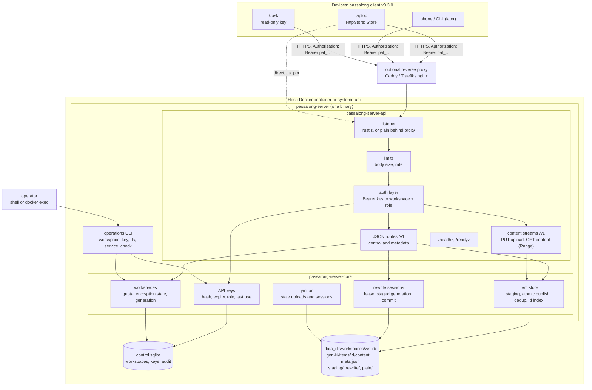
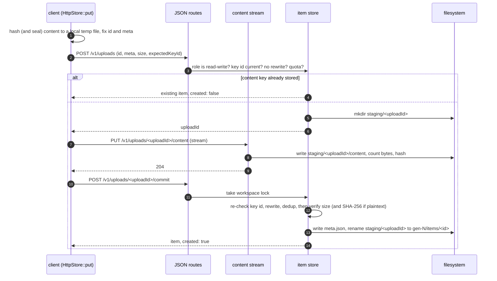
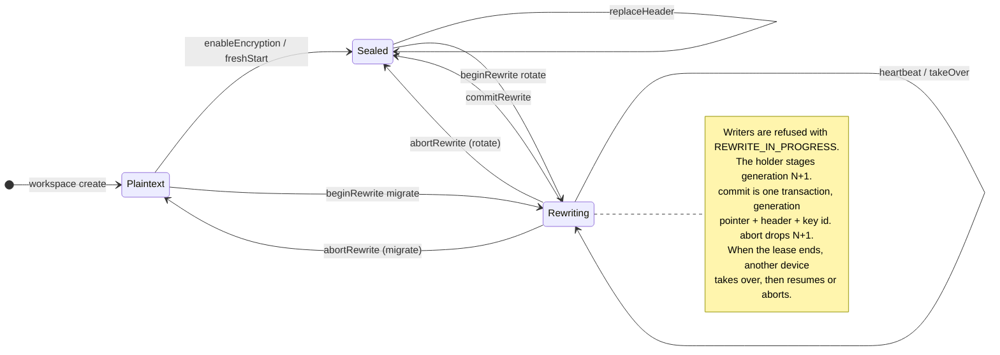

# Architecture

> **Partly built.** No server exists yet. The rules of workspaces, uploads,
> and rewrite sessions (PLAN-00001), and the filesystem shelf and SQLite
> control database under them, tested with the process killed at every
> boundary between the two (PLAN-00002), exist in `passalong-server-core`.
> Everything around them is still the design proposed by
> [IDEA-00001](ideas/00001-HTTPS_Server_Backend-r04.md) and becomes the
> description of the real system as plans deliver it.

passalong-server is a third place a passalong store can live, beside the
client's `ssh` and `local` backends. Devices reach it over HTTPS, a REST +
JSON API, with an API key; one server hosts many workspaces, each the store of one group of
devices.

## Crates

| Crate | Kind | Responsibility |
|---|---|---|
| `passalong-server-core` | library | Configuration, workspaces, API keys, the item store, rewrite sessions, the control database, telemetry. No HTTP or terminal dependencies. |
| `passalong-server-api` | library | REST routes and their OpenAPI document, content streams, the authentication layer, limits, TLS, health. No domain rules. |
| `passalong-server` (in `crates/passalong-server-cli/`) | binary `passalong-server` | `serve`, and the operations commands: `init`, `workspace`, `key`, `tls`, `service`, `check`. |

The daemon and the operations CLI are one binary and meet only in
`passalong-server-core` and the control database, so a rule about keys is
written once whether a request or an operator triggers it.

## Components



## Request flow

1. The listener accepts TLS (rustls), or plain HTTP in `mode = "plain"`.
2. Limits apply before anything is parsed. JSON bodies are capped at a
   small fixed size; only content streams are large, and those go to disk
   as they arrive. Failed authentications are rate-limited per client
   address.
3. The auth layer reads `Authorization: Bearer pal_<key id>_<secret>`, looks
   the key id up in the control database, compares the secret's SHA-256 in
   constant time, and rejects expired or revoked keys with a distinct,
   non-retryable error. It attaches the key's **workspace** and **role** to
   the request. No request names a workspace; the key is the only source.
   Keys are checked against the database on every request, so a revocation
   holds from the next request on. If the database cannot be read, the
   server [fails closed](#failing-closed).
4. A correlation id is opened for the request (the `X-Request-Id` the client
   sent, or a new one) and carried by every log line.
5. The route handler calls `passalong-server-core`.

## The envelope

The server stores items it does not understand. For every item it knows:

| Field | Source |
|---|---|
| `id` | Proposed by the client, `<ts>-<key>` as in the client's item schema; parsed strictly |
| `meta` | An opaque JSON document written by the client: the client's `meta.json`, schema 1 in a plaintext workspace, the sealed schema 2 in an encrypted one |
| `storedBytes` | Counted while streaming |
| `receivedAt` | The server's clock |
| `keyId` | The API key that uploaded it, for the audit trail |

The server never interprets `meta`, with one exception: in a plaintext
workspace it checks that the content's SHA-256 and size match `meta` and
that the id's content key matches the SHA-256. In an encrypted workspace it
cannot, and the client verifies on download, as it does today. Names,
previews, MIME types, and device names are never server-side fields, in
either kind of workspace. This is a standing rule (IDEA-00001-R03-INFO-02),
decided on 2026-09-18, and the reason the API is plain REST: with `meta`
opaque, a query language has nothing to select.

## Storing an item



An item appears only when complete, exactly as in the client's `FsStore`,
and deduplication is atomic because the check and the publish share the
workspace lock. The janitor removes staging folders older than
`staging.max_age_hours`.

Every step can be repeated. The upload id is the idempotency key: a
`beginUpload` sent again returns the live ticket without reserving quota
twice, a `PUT` sent again restarts the staging file, and a `commitUpload`
sent again returns the same outcome, from a tombstone the committed upload
leaves behind. So a connection that drops after the server committed, but
before the client heard, costs one small request, not a second upload. The
[API draft](api/README.md#replays) has the full table.

Item size is unbounded in the client: sizes are `u64`, and the `ssh` and
`local` backends set no limit. `limits.max_item_bytes` is therefore a limit
only this backend has. It can be switched off, the client can read it
before it uploads, and exceeding it has its own error.

The client hashes before it uploads because the id, which contains the
content key, is associated data of the sealed metadata. Text and clipboard
images are small; for a large file this costs one extra local read, not a
second upload.

## Storage layout

As built by PLAN-00002. One directory per workspace, one database for all:

```text
<data_dir>/
├── control.sqlite                 the ledger: see below; 0600
└── workspaces/<workspace id>/     0700, as every directory below
    ├── gen-<n>/items/<id>/
    │   ├── content                byte-identical to the client's file
    │   ├── meta.json              byte-identical to the client's file
    │   └── server.json            the key id it came under, and when
    ├── staging/<upload id>/content    uploads in progress
    └── trash/                     what is on its way out
```

The filesystem is the only record of items. Because `content` and
`meta.json` match the client's files, importing a store from the `ssh` or
`local` backend, or exporting one, is a copy that leaves `server.json` out.
The plain partition and a rewrite's next generation are ordinary `gen-<n>`
directories that the ledger points to.

Every path component is an `ItemId`, an `UploadId`, a `WorkspaceId`, or a
number: hex digits and at most one dash. Nothing a client sends reaches a
path any other way.

- **Publishing** is a rename of `staging/<upload id>/` onto
  `gen-<n>/items/<id>/`. `rename` refuses a non-empty directory, and an item
  always holds files, so of two publishes of one id the first wins and the
  second is told so, in one step. (An empty directory would be replaced; it
  is not an item, and is neither listed nor in the way.)
- **Removing** an item or a generation is a rename into `trash/`, so it
  disappears whole; emptying the trash may be cut short and is finished when
  the shelf is next opened.
- **Durability.** `content` is flushed before it may be published, and the
  directories after the rename; SQLite runs with `synchronous = FULL`. This
  is ordinary care. It is not tested, because a test can kill a process but
  cannot cut power, and nothing more is claimed.
- Content streams in and out in pieces of 64 KiB; no item is held in
  memory. Content longer than was announced is refused while it arrives.
- The data directory belongs on a local filesystem: WAL mode needs shared
  memory, which network filesystems do not give.

### The ledger

`control.sqlite`, WAL mode, schema version 1; a database of a newer version
is refused. `passalong_server_core::ledger::sqlite` has the DDL.

| Table | Holds |
|---|---|
| `workspaces` | Generation pointers; the seal readers go by (key id and header); the open rewrite session, if any: kind, new key id and header, holder, lease, staged generation |
| `generations` | Bytes published per live generation, as the quota counts them |
| `uploads` | Tickets: owner, proposed id, `meta`, size, expected key id, expiry |
| `tombstones` | Outcomes of finished uploads, kept for replays |
| `ended_rewrites` | New key ids of aborted rewrites, kept for good |
| `schema_version` | One row |

Every transaction begins `IMMEDIATE`. SQLite then queues writers, in this
process and in any other with the file open, for the busy timeout, and the
rules run *inside* the transaction: the database's write lock is the
workspace lock, also against the operations CLI. One thing SQLite does not
wait for is the switch to WAL mode when a database is new; the ledger waits
for that itself, or the CLI and the server starting together would fail.

## After a crash

The rules touch two stores, and a process can die between them. Two
orderings keep that harmless, and `tests/kill.rs` kills a child process at
every passage of every boundary to show it (181 kills at the time of
writing), with a control that fails when the repair is switched off:

- **Constructive shelf steps come before the record is stored.** A publish
  happens inside the transaction. Killed before the commit, the item is on
  the shelf and the record knows nothing of it: it is listed, since the
  shelf is the record of items, and the byte count is wrong until the
  workspace is next opened. The client's repeated `commitUpload` finds its
  staging place gone and its item there, finishes the record, and answers
  `created: true`, as the first would have.
- **Destructive shelf steps come after the transaction has committed.** The
  rules only *ask* for them. `commitRewrite` dropping the old generation
  before the record pointed to the new one would lose every item to a kill
  in between; the janitor removing an expired upload's staging place before
  its ticket was gone would leave a ticket that cannot be used. Killed after
  the commit and before the clean-up, there is rubbish nothing points to.

Opening a workspace **reconciles** it: each live generation's bytes are
taken from the shelf, and staging places without a ticket and generations
nothing points to are removed, with a warning in the log saying how much.
An upload id the record knows, as a ticket or as a remembered outcome, is
never handed out again, whatever the random source does.

## Failing closed

The control database is the single gate: every request is authenticated
against it. When it is locked beyond the busy timeout, unreadable, or
corrupt, the server answers 503 to every request that needs a key. It never
falls back to keys it remembers, because a remembered key may be one that
was revoked a minute ago. `/readyz` fails, so a proxy or orchestrator stops
routing; `/healthz` stays up, so nothing restart-loops a server whose disk
is the problem. The event is logged at Error once, not per request.

The operations CLI shares that database, so it refuses to run as any user
but the data directory's owner: a root-owned database or journal file is a
reliable way to lock the daemon out. With the project's image,
`docker compose exec` already runs as the container's user, uid 10001; the
rule matters for `sudo` on a native install, and for a container started
with `user: root` or exec'd with `--user 0`.

## Encryption

The server never holds a workspace's data key, its words, or plaintext. It
stores the header, the wrapped data key, as an opaque document, and knows
the current **key id**. Every write names the key id it was made under and
is refused atomically if that is not current. This replaces the client's
header check before and after every `put`.



- `enableEncryption` is accepted only while the workspace is empty;
  `freshStart` sets the items aside as the `plain` partition instead. Both
  are single atomic calls, like `replaceHeader`: in the client, too, set-up,
  a fresh start, and a change of words re-encrypt nothing, and only
  migration and rotation run its rewrite engine (PLAN-00001, D-02).
- `replaceHeader` is the change of words: the same data key wrapped anew,
  guarded by `expectedKeyId`; no item is touched.
- A `beginRewrite` that names the new key id of an aborted rewrite is
  refused with `REWRITE_ENDED`: it is a late duplicate, which would
  otherwise open a session nobody holds. The model test found this.

| Client command | Server operations |
|---|---|
| `encrypt` on an empty plaintext workspace | `enableEncryption` |
| `encrypt` fresh start | `freshStart`: one atomic call; the current generation becomes the `plain` partition by moving a pointer |
| `encrypt` migration | `beginRewrite(migrate)`, then for each item: download, seal, upload with `inRewrite`; read each back with `partition=staged` and verify; `commitRewrite` |
| `encrypt` change of words | `replaceHeader` with the same key id |
| `encrypt --rotate` | `beginRewrite(rotate)`, re-seal each item, `commitRewrite` |
| `encrypt --join` | `getWorkspace`: read `encryption.header` |
| `encrypt --recover` | `getRewrite`; `takeOverRewrite` if its lease expired; then resume it, or `abortRewrite` |
| `prune --plain` | list and delete with `partition=plain` |

Operation names are the `operationId`s of [the API draft](api/README.md).
The full session ships in server v0.1, by the user's decision of 2026-09-18;
doing migration and rotation on a `local` or `ssh` store and importing the
result is the fallback if the spike fails (IDEA-00001 §11, option E). Every
session request can be repeated: above all, a `commitRewrite` whose answer
was lost tells the client that the commit happened.

[The rewrite session](api/rewrite-session.md) has the crash table, the
replay table, and the invariants the model test checks after every request.

The session is the journal. Staged items are skipped on resume because ids
in the new generation are computed from each item's recorded SHA-256, as in
the client's migration.

## Mapping the client's `Store` trait

| `Store` method | API |
|---|---|
| `put` | `beginUpload`, `putUploadContent`, `commitUpload`; each repeatable |
| `list`, `list_after` | `listItems`: envelopes with `meta`, one round trip |
| `list_ids` | `listItemIds`, from the in-memory index |
| `get` | `getItem`, then `getItemContent` |
| `get_meta` | `getItem` |
| `exists` | `getItem`; 404 means no |
| `find_by_content_key` | `findByContentKey` |
| `resolve` | `resolveItem`: the client's prefix rules, on ids alone, so it works for sealed workspaces |
| `delete` | `deleteItem` |
| `clean_staging` | `cleanStaging`; the janitor does the same unasked |
| `probe_write` | `probeWrite`: checks the role, the rewrite state, and that staging is writable |
| `key_id`, `content_key` | Local to the client; the key id comes from the header at open |

See [the API draft](api/README.md) for the routes.

## Deployment

- **Nothing is published** while the licence is proprietary: no Docker Hub
  image, no binaries. Operators build from this repository, and a release
  tag only verifies that the build works.
- **Docker.** Built by `docker compose build` from `deploy/docker/`; amd64
  and arm64 both build in CI. Debian slim, uid
  10001, read-only root filesystem, one volume at
  `/var/lib/passalong-server`. `HEALTHCHECK` runs
  `passalong-server check --health`, so the image needs no curl. Operations
  run with `docker exec`, against the same data directory. See
  `deploy/docker/`.
- **systemd.** `passalong-server service install` creates the
  `passalong-server` user, writes the hardened system unit of
  `docs/service/passalong-server.service`, enables it, and starts it. A test
  keeps that file identical to the rendered template, as in the client.
- **TLS.** `listen.mode = "tls"` uses rustls with `tls.cert_file` and
  `tls.key_file`, re-read on change. `mode = "plain"` is refused on a
  non-loopback address unless `listen.behind_proxy = true`. There is no
  switch that weakens verification on either side; a self-signed
  certificate is trusted by the client through `tls_pin`.

## Security model

- **Server identity.** A publicly trusted certificate, or a pinned one
  (`tls_pin`, the SHA-256 of the certificate's public key), confirmed by
  fingerprint in `passalong init`. This mirrors the pinned SSH host key.
- **Client identity.** An API key: a public key id and a 256-bit secret,
  stored as a SHA-256, shown once. Keys expire, can be revoked, and are
  `read-write` or `read-only`.
- **Isolation.** The workspace comes from the key and nowhere else. Every
  path is built from a workspace id the server minted and an item id that
  passed strict parsing.
- **Zero knowledge of encrypted workspaces.** As in the client's security
  model: the server sees ids (so creation times and which items share
  content), counts, sizes, and access times. Nothing else.
- **Plaintext workspaces.** The operator can read every item, as with a
  plaintext store on any backend.
- **Logs.** Key ids, workspace ids, item ids, sizes, and outcomes. Never a
  key secret, content, `meta`, or a header.
- **Failure.** Closed: no database, no access. See
  [Failing closed](#failing-closed).
- **Administration.** Local only: whoever can run the CLI as the data
  directory's owner. Nothing is managed over the network in v0.1.

## Planned stack

Candidates, to be confirmed by the first plan with `just audit`; none is a
dependency yet.

| Need | Candidate |
|---|---|
| Async runtime | `tokio`, as the client |
| HTTP | `axum` on `hyper` |
| OpenAPI document | `utoipa`, or a hand-written `openapi.json` checked against the routes by a test |
| TLS | `rustls` with `ring`, as the client chose for `russh` |
| Control database | `rusqlite`, bundled SQLite, WAL |
| CLI, config, logs, errors | `clap`, `toml`, `serde`, `tracing`, `thiserror`, `anyhow`, as the client |
| Item model | `passalong-core` without default features, or a local module (IDEA-00001 INFO-01) |
