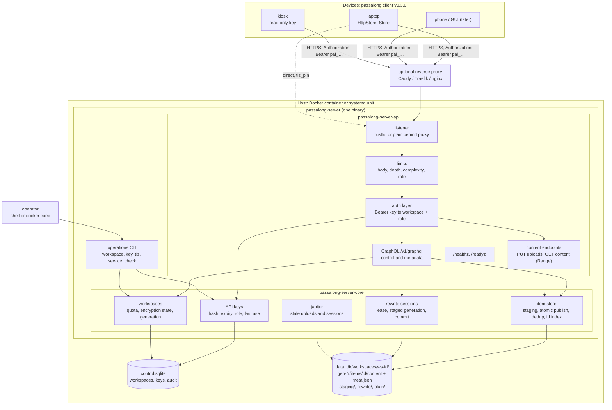
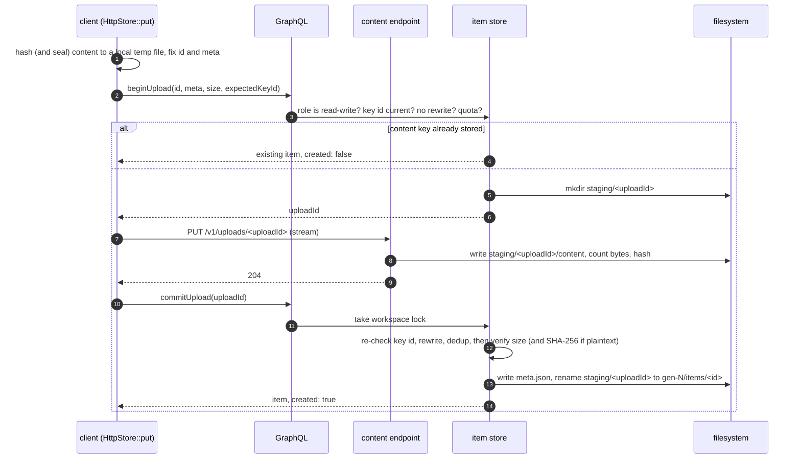
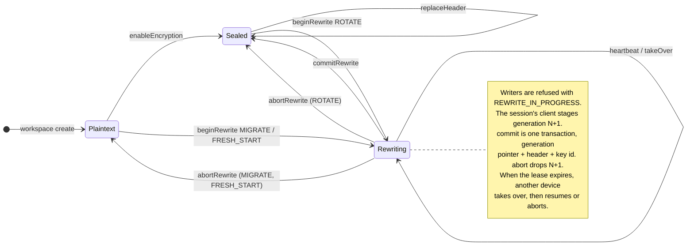

# Architecture

> **Draft for discussion.** Nothing here is implemented. This document
> records the design proposed by
> [IDEA-00001](ideas/00001-HTTPS_Server_Backend-r01.md) and becomes the
> description of the real system as plans deliver it.

passalong-server is a third place a passalong store can live, beside the
client's `ssh` and `local` backends. Devices reach it over HTTPS with an API
key; one server hosts many workspaces, each the store of one group of
devices.

## Crates

| Crate | Kind | Responsibility |
|---|---|---|
| `passalong-server-core` | library | Configuration, workspaces, API keys, the item store, rewrite sessions, the control database, telemetry. No HTTP or terminal dependencies. |
| `passalong-server-api` | library | GraphQL schema, content endpoints, the authentication layer, limits, TLS, health. No domain rules. |
| `passalong-server` (in `crates/passalong-server-cli/`) | binary `passalong-server` | `serve`, and the operations commands: `init`, `workspace`, `key`, `tls`, `service`, `check`. |

The daemon and the operations CLI are one binary and meet only in
`passalong-server-core` and the control database, so a rule about keys is
written once whether a request or an operator triggers it.

## Components



## Request flow

1. The listener accepts TLS (rustls), or plain HTTP in `mode = "plain"`.
2. Limits apply before anything is parsed: body size, then, for GraphQL,
   query depth and complexity. Failed authentications are rate-limited per
   client address.
3. The auth layer reads `Authorization: Bearer pal_<key id>_<secret>`, looks
   the key id up in the control database, compares the secret's SHA-256 in
   constant time, and rejects expired or revoked keys with a distinct,
   non-retryable error. It attaches the key's **workspace** and **role** to
   the request. No request names a workspace; the key is the only source.
4. A correlation id is opened for the request (the `X-Request-Id` the client
   sent, or a new one) and carried by every log line.
5. The resolver or content handler calls `passalong-server-core`.

## The envelope

The server stores items it does not understand. For every item it knows:

| Field | Source |
|---|---|
| `id` | Proposed by the client, `<ts>-<key>` as in the client's item schema; parsed strictly |
| `meta` | An opaque JSON document written by the client: the client's `meta.json`, schema 1 in a plaintext workspace, the sealed schema 2 in an encrypted one |
| `storedBytes` | Counted while streaming |
| `receivedAt` | The server's clock |
| `keyId` | The API key that uploaded it, for the audit trail |

The server never interprets `meta`, with one exception: in a plaintext
workspace it checks that the content's SHA-256 and size match `meta` and
that the id's content key matches the SHA-256. In an encrypted workspace it
cannot, and the client verifies on download, as it does today. Names,
previews, MIME types, and device names are never server-side fields.

## Storing an item



An item appears only when complete, exactly as in the client's `FsStore`,
and deduplication is atomic because the check and the publish share the
workspace lock. The janitor removes staging folders older than
`staging.max_age_hours`.

The client hashes before it uploads because the id, which contains the
content key, is associated data of the sealed metadata. Text and clipboard
images are small; for a large file this costs one extra local read, not a
second upload.

## Storage layout

```text
<data_dir>/
├── control.sqlite                 workspaces, API keys, audit trail
└── workspaces/<workspace id>/
    ├── gen-<n>/items/<id>/
    │   ├── content                byte-identical to the client's file
    │   └── meta.json              byte-identical to the client's file
    ├── plain/items/               after a fresh start: the earlier items
    ├── staging/<upload id>/       uploads in progress
    └── rewrite/<session id>/      the next generation, being staged
```

The filesystem is the only record of items. The control database holds
workspaces (id, name, quota, encryption state, current generation, key id,
header) and keys, never items; each workspace's id index is rebuilt from a
directory listing at start-up and kept in memory. Because `content` and
`meta.json` match the client's files, importing a store from the `ssh` or
`local` backend, or exporting one, is a copy.

## Encryption

The server never holds a workspace's data key, its words, or plaintext. It
stores the header, the wrapped data key, as an opaque document, and knows
the current **key id**. Every write names the key id it was made under and
is refused atomically if that is not current. This replaces the client's
header check before and after every `put`.



- `enableEncryption` is accepted only while the workspace is empty.
- `replaceHeader` is the change of words: the same data key wrapped anew,
  guarded by `expectedKeyId`; no item is touched.

| Client command | Server operations |
|---|---|
| `encrypt` on an empty plaintext workspace | `enableEncryption` |
| `encrypt` fresh start | `beginRewrite(FRESH_START)`, `commitRewrite`: an empty generation; the old one becomes the `PLAIN` partition |
| `encrypt` migration | `beginRewrite(MIGRATE)`, then for each item: download, seal, upload into the session; `commitRewrite` |
| `encrypt` change of words | `replaceHeader` with the same key id |
| `encrypt --rotate` | `beginRewrite(ROTATE)`, re-seal each item, `commitRewrite` |
| `encrypt --join` | read `workspace { encryption { header } }` |
| `encrypt --recover` | read the session; resume it, or `abortRewrite` |
| `prune --plain` | list and delete in the `PLAIN` partition |

The session is the journal. Staged items are skipped on resume because ids
in the new generation are computed from each item's recorded SHA-256, as in
the client's migration.

## Mapping the client's `Store` trait

| `Store` method | API |
|---|---|
| `put` | `beginUpload`, `PUT /v1/uploads/{id}`, `commitUpload` |
| `list`, `list_after` | `items(after:)`: envelopes with `meta`, one round trip |
| `list_ids` | `itemIds(after:)`, from the in-memory index |
| `get` | `item(id:)`, then `GET /v1/items/{id}/content` |
| `get_meta` | `item(id:)` |
| `exists` | `item(id:) { id }` |
| `find_by_content_key` | `itemByContentKey(key:)` |
| `resolve` | `resolveItem(input:)`: the client's prefix rules, on ids alone, so it works for sealed workspaces |
| `delete` | `deleteItem(id:, expectedKeyId:)` |
| `clean_staging` | `cleanStaging(olderThan:)`; the janitor does the same unasked |
| `probe_write` | `probeWrite`: checks the role, the rewrite state, and that staging is writable |
| `key_id`, `content_key` | Local to the client; the key id comes from the header at open |

See [the API draft](api/README.md) for the schema.

## Deployment

- **Docker.** `joelee/passalong-server`, amd64 and arm64, Debian slim, uid
  10001, read-only root filesystem, one volume at
  `/var/lib/passalong-server`. `HEALTHCHECK` runs
  `passalong-server check --health`, so the image needs no curl. Operations
  run with `docker exec`, against the same data directory. See
  `deploy/docker/`.
- **systemd.** `passalong-server service install` creates the
  `passalong-server` user, writes the hardened system unit of
  `docs/service/passalong-server.service`, enables it, and starts it. A test
  keeps that file identical to the rendered template, as in the client.
- **TLS.** `listen.mode = "tls"` uses rustls with `tls.cert_file` and
  `tls.key_file`, re-read on change. `mode = "plain"` is refused on a
  non-loopback address unless `listen.behind_proxy = true`. There is no
  switch that weakens verification on either side; a self-signed
  certificate is trusted by the client through `tls_pin`.

## Security model

- **Server identity.** A publicly trusted certificate, or a pinned one
  (`tls_pin`, the SHA-256 of the certificate's public key), confirmed by
  fingerprint in `passalong init`. This mirrors the pinned SSH host key.
- **Client identity.** An API key: a public key id and a 256-bit secret,
  stored as a SHA-256, shown once. Keys expire, can be revoked, and are
  `read-write` or `read-only`.
- **Isolation.** The workspace comes from the key and nowhere else. Every
  path is built from a workspace id the server minted and an item id that
  passed strict parsing.
- **Zero knowledge of encrypted workspaces.** As in the client's security
  model: the server sees ids (so creation times and which items share
  content), counts, sizes, and access times. Nothing else.
- **Plaintext workspaces.** The operator can read every item, as with a
  plaintext store on any backend.
- **Logs.** Key ids, workspace ids, item ids, sizes, and outcomes. Never a
  key secret, content, `meta`, or a header.
- **Administration.** Local only: whoever can run the CLI as the data
  directory's owner. Nothing is managed over the network in v0.1.

## Planned stack

Candidates, to be confirmed by the first plan with `just audit`; none is a
dependency yet.

| Need | Candidate |
|---|---|
| Async runtime | `tokio`, as the client |
| HTTP | `axum` on `hyper` |
| GraphQL | `async-graphql` |
| TLS | `rustls` with `ring`, as the client chose for `russh` |
| Control database | `rusqlite`, bundled SQLite, WAL |
| CLI, config, logs, errors | `clap`, `toml`, `serde`, `tracing`, `thiserror`, `anyhow`, as the client |
| Item model | `passalong-core` without default features, or a local module (IDEA-00001 INFO-01) |
