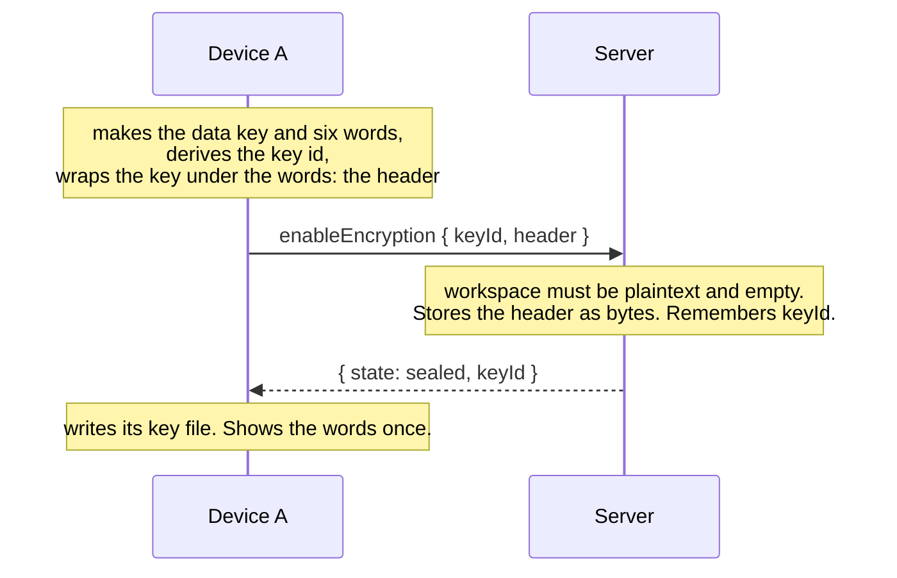
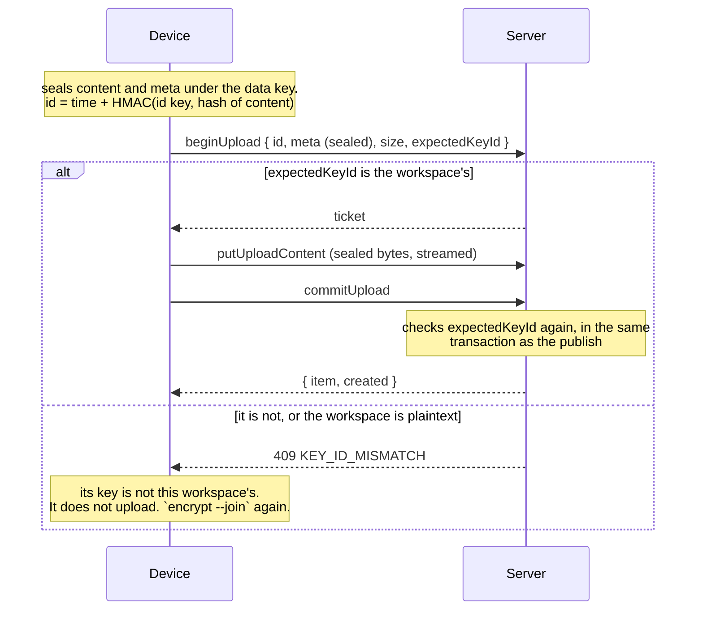
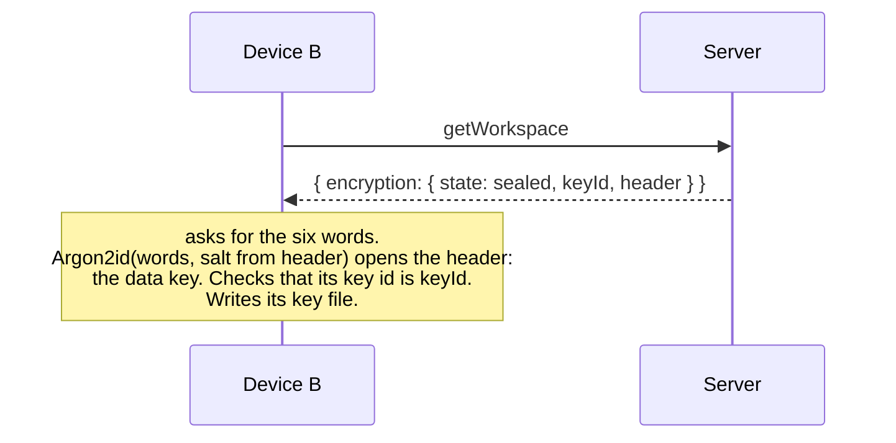
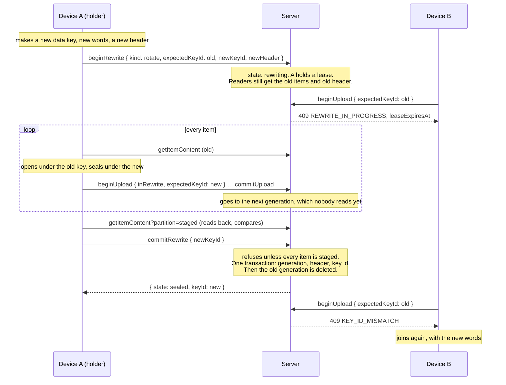

# Encryption: who knows what, and how it flows

This page follows a workspace's encryption from the first key to a change of
key, and says at every step what the server sees. The cryptography is the
passalong client's (`crates/passalong-core/src/crypto/` in the
[client](https://github.com/joelee/passalong)); the server's part is
bookkeeping. [Architecture](architecture.md#encryption) has the state
machine, [the rewrite session](api/rewrite-session.md) the crash table, and
[the client mapping](api/client-encryption-mapping.md) the function-by-function
correspondence.

## In one paragraph

Devices encrypt and decrypt. The server stores bytes it cannot read, under
ids it cannot interpret, and keeps one fact about the key: its **key id**, a
fingerprint that says *which* key without saying anything *about* it. Every
write names the key id it was made under, and the server refuses a write
whose key id is not the workspace's. That is how devices that do not know of
each other are kept from writing under different keys. The server also
keeps the workspace's **header**: the data key, encrypted under a key that
only the six words can make. It keeps it the way it keeps an item: as bytes.

## What there is

| Thing | Made by | What it is | Who holds it |
|---|---|---|---|
| **Data key** | The first device, at `passalong encrypt` | 32 random bytes. Every item of the workspace is sealed under keys derived from it | Devices only, in a key file readable by its owner |
| **Six words** | The same device | Six words of the EFF list, drawn at random: about 77 bits | The person. Shown once, typed on each new device |
| **Key id** | Any device, from the data key | The first 8 bytes of `HKDF-SHA256(data key, "passalong key id v1")`, as 16 hex digits. One-way: the id says nothing about the key, and the same key always gives the same id | Devices, and **the server** |
| **Header** | A device | The data key, sealed with AES-256-GCM under `Argon2id(six words, salt)`, plus the Argon2 settings, the salt, and the key id. Useless without the words | **The server**, as an opaque document; any device can fetch it |
| **Sealed item** | A device | Content in AES-256-GCM chunks under a per-item key; `meta` (name, kind, size, hash) sealed separately; an id whose second half is `HMAC(id key, SHA-256 of the content)` instead of the plain hash | **The server**, as bytes |

So the server holds two things that touch the key: the key id, which it
reads and compares, and the header, which it never opens and could not.

## What the server can and cannot tell

| It can tell | It cannot tell |
|---|---|
| Whether a workspace is plaintext, sealed, or being re-encrypted | The data key, the words, or anything derived from them but the key id |
| The key id, and so whether two writes claim the same key | Whether a write that *claims* a key id was really made under that key (see [the limit](#the-limit-of-the-key-id)) |
| Each item's id, its stored size, when it arrived, which API key sent it | An item's name, kind, real size, or content; whether two workspaces hold the same content |
| That two items of one workspace have equal content (equal id halves), which is what makes deduplication work | What that content is, even by guessing: the id half is keyed |

In a **plaintext** workspace the server sees everything, and additionally
checks at the commit that content matches the hash in `meta`. In a sealed
workspace it looks at nothing.

## The flows

### 1. A workspace becomes encrypted

An empty workspace is sealed with `enableEncryption`. One that has plaintext
items is either *migrated* (flow 5, with `kind: migrate`), which re-seals
them, or given a `freshStart`, which sets them aside as the read-only
`plain` partition and starts empty.

Nothing is remembered implicitly: a workspace is sealed by an explicit
request, never by the first upload that happens to carry a key id. Two
devices that both try get one winner; the other is told `KEY_ID_MISMATCH`.

### 2. A device sends an item

This is the rule that keeps a workspace under one key. It is checked twice,
because between `beginUpload` and `commitUpload` another device may have
changed the key: the second check is inside the transaction that publishes,
so an item can never land under a key that is no longer the workspace's.
`deleteItem` names the key id too. Reading needs none: a device that reads
what it cannot open finds out by itself.

A plaintext upload to a sealed workspace is refused the same way
(`expectedKeyId` absent is not the workspace's key id), and so is a sealed
upload to a plaintext one. Items of two kinds never mix.

### 3. A second device joins

The key travels from device A to device B **through the server, inside the
header, locked by the words**, and the words travel through the person.
That is the one sense in which key material is on the server at all.

### 4. The words change, the key does not

A person who suspects the words were seen, and not the key, wraps the same
data key under new words: `replaceHeader { expectedKeyId, header }`. No item
is touched, and every device that joined keeps working. The server no
longer has the header the old words opened. But a copy of that header taken
earlier, together with the old words, still gives the data key, and the
data key has not changed: if both may have leaked, only a change of key
(flow 5) helps.

### 5. The key changes

Needed when a device that had the key is lost or no longer trusted. New
words are not enough: that device has the data key itself. Every item must
be sealed again under a new key, and until that is done the workspace must
not be left half under one key and half under another. This is the
**rewrite session**:

If device A dies halfway, its lease runs out (ten minutes by default), and
any other device of the workspace may `takeOverRewrite` and then either
finish, which needs the new words and the header they unlock (the session
carries it as `newHeader`; the workspace's own `header` stays the old one
until the commit), or `abortRewrite`, which needs nothing
and leaves the workspace exactly as it was. The operator can abort from the
host as well. A rewrite that was aborted can never be reopened by a late
copy of its `beginRewrite`: its new key id is remembered as ended.

Turning a plaintext workspace into an encrypted one *with* its items is the
same session with `kind: migrate` and no old key.

## The limit of the key id

The key id is a **claim**, not a proof. A device that sends `expectedKeyId`
right and seals under some other key, by a bug or on purpose, is believed:
the server has nothing to check the content against, which is the point of
not having the key. What the rule prevents is the accident it was made for:
two honest devices, each sure of its own key, quietly filling one workspace
with items the other cannot read. An item sealed under the wrong key hurts
nobody's secrecy; it is an item nobody can open, and whoever holds a
read-write API key can do as much harm by deleting things.

## If the server is compromised

Assume the worst: someone has full control of the machine, reads every
file and every request, and can change what the server answers. For an
encrypted workspace, this is what that gives them, and what it does not.
It is reasoning from the design and the code, not the result of an outside
audit.

### What they cannot do

- **Read your items.** Not content, not names, not kinds, not true sizes.
  Everything is sealed with AES-256-GCM under keys derived from a 256-bit
  data key that was never on the server: not on its disk, not in its
  memory, not in its logs, not in its backups. There is nothing to steal
  that opens it.
- **Check a guess.** They cannot test "is this item that file?": the part
  of an item's id that stands for its content is a keyed hash, which only a
  holder of the data key can compute.
- **Change an item without you noticing.** Sealed content and sealed
  metadata are authenticated, and the metadata is bound to the item's id.
  Anything altered or swapped fails to open on your device; it cannot be
  made to open as something else.

### The one attack on the key, and why it fails

They do get the **header**: your data key, locked under the six words. They
can try words against it, away from the server, for as long as they like.
Six words drawn at random from 7,776 are about 2^77 possibilities, and each
try costs an Argon2id computation that needs 64 MiB of memory. At ten
thousand tries a second, which is generous, that is on the order of 10^19
seconds; the universe is about 4 × 10^17 seconds old.

That holds exactly as long as **the words are the ones passalong generated,
and nobody else has them**. Words you chose yourself, or wrote where others
can read them, are a different matter. And the words are for good: a copy
of the header taken today, plus the words learned later, gives the data
key, even after you have changed the words. If the words may have leaked,
change the **key** (`passalong encrypt --rotate`), not only the words.

### What they can see

Metadata about your use, not your data: how many items there are and when
each arrived; roughly how large each is; which device (which API key, with
its label) sent it, from which address; when devices fetch what; and that
two items of one workspace have the same content, without learning what it
is. They also see API keys as they arrive, which gains them nothing they do
not have already: a key opens this server, and they have the server.

### What they can do

- **Delete, withhold, or roll back.** They can lose items, hide new ones,
  or show a device the workspace as it was last week. Nothing in the
  protocol detects that. passalong moves things between your devices; it is
  not the only copy of anything you cannot afford to lose.
- **Keep what should be gone.** Deleting an item, and the clean-up after a
  change of key, are things the server is trusted to do. One that copies
  everything keeps the old items, sealed under the old key. Changing the
  key protects you from a lost *device*; against a server that has been
  copying all along it protects only what you store afterwards.
- **Store junk.** They can add items nobody can open. A nuisance; your
  devices refuse them.
- **Lie about the workspace.** The server is what tells a device "this
  workspace is plaintext" or "it is encrypted under this key". A device
  that holds a key must not believe the first: it never sends plaintext to
  that workspace, whatever the server says. That is a rule for the client,
  which the passalong client's other backends follow since v0.2.1 and its
  `https` backend is required to
  ([hand-over notes](handover-notes-v0.3.0-client.md)). A *new* device
  should be told by you, not by the server, whether to expect encryption.

### What is readable without any attack

- A **plaintext** workspace, entirely. Encryption is per workspace and is
  something you turn on.
- The **`plain` partition**: if a workspace was encrypted with a fresh
  start rather than migrated, its earlier plaintext items are still there,
  readable, until you delete them.
- **Remnants.** The server deletes files; it does not scrub disks. What was
  once plaintext on the server may survive in free blocks, snapshots, and
  backups. What matters and was ever stored in plaintext should be treated
  as having been readable there.

### In short

With an encrypted workspace, generated words kept to yourself, and a client
that never sends plaintext where it holds a key, taking the server yields
traffic patterns and the power to lose your data, and not the data.

## Questions this design answers, and the ones it leaves

- *Why a derived key id, not `SHA-256(key)`?* Both are one-way, and for 32
  random bytes both are safe. HKDF with its own label keeps the id apart from
  every other use of the key: no other value the client ever computes can
  equal it. Eight bytes are enough to tell keys apart; it is not a secret and
  nothing depends on it being hard to guess.
- *Why is the header on the server?* So that joining a device takes six
  words and nothing else. The price: whoever takes the server takes the
  header, and may try words against it offline, at Argon2id's cost per try,
  against about 77 bits. Keeping the header off the server would move key
  exchange to the person: carrying a key file or a long code to each device.
- *Could the server demand proof?* Yes, with a signing key derived from the
  data key whose public half is the key id's successor: every write signed,
  the server verifying without learning anything. It is not built. It would
  turn "a device with an API key wrote unreadable items" from possible into
  impossible, and nothing else.
- *Could a key change be cheaper?* Yes, by letting old items stay under the
  old key and sealing only new ones under the new: no re-encryption, but
  every device keeps every old key for ever, and a key that leaked still
  opens everything sealed before the change. The rewrite session costs a
  pass over the data and buys a workspace that the old key no longer opens.
