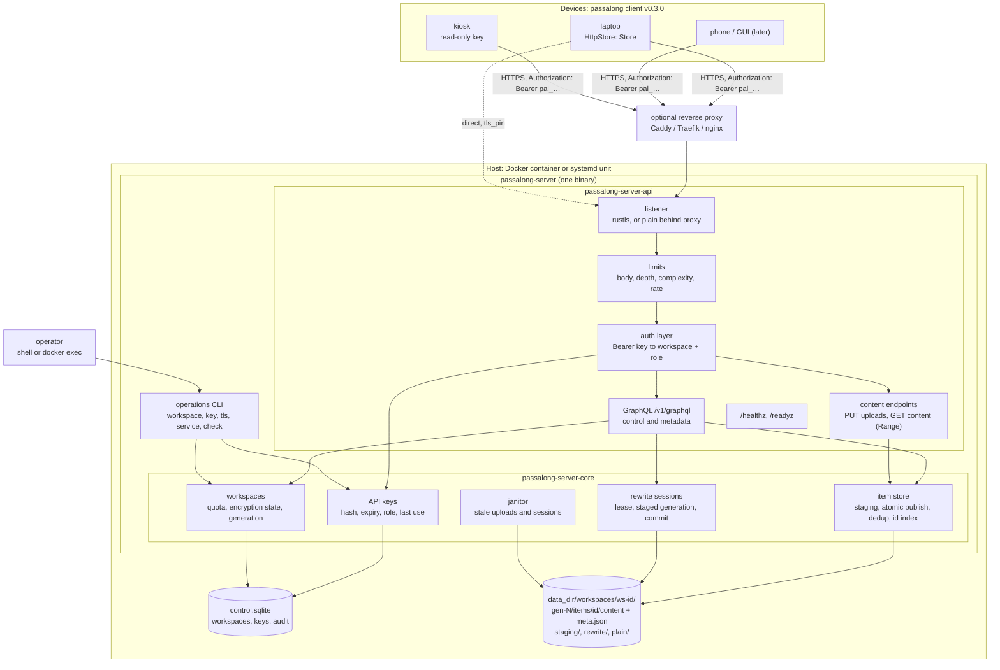
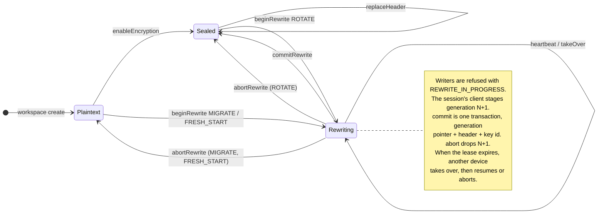

# Idea 00001 r01: HTTPS Server Backend

> [!abstract] Recommendation: `proceed-to-experiment`
> A standalone, multi-workspace HTTPS server is a coherent third backend for
> passalong and fits the client's design: `Store` was written to be
> implemented directly by "an HTTP API" (client `docs/architecture.md`,
> "Adding a backend"). The choice of an **item-level API** is sound but moves
> the hardest part of the client, changing a store's encryption, out of the
> reusable `RemoteFs` code and into a new client–server protocol. That
> protocol, and how a typed GraphQL schema coexists with a zero-knowledge
> server, are the two Major uncertainties. The next move is a paper-and-fake
> protocol spike that settles both before any delivery plan is written.

## 1. Seed Idea

### Original proposition

Replace the SSH server and the local file store as the only places a
passalong store can live with a purpose-built server:

1. HTTPS for transport.
2. Authentication by API key, with expiry.
3. One server, many client workspaces (separate stores).
4. Same stack as the client: a lightweight Rust application.
5. Runs in a Docker container, published on Docker Hub.
6. GraphQL preferred over REST.
7. Every passalong client feature as of v0.2.1.
8. Runs as a systemd service.
9. A server CLI for operations: install the service, create and delete API
   keys, and so on.
10. Proprietary licence until an open-source licence is chosen.

The client gains support for it in v0.3.0.

### Motivation and timing

The SSH backend asks a lot of the operator: an SSH account per store, key
distribution, host-key pinning, and a filesystem path. It cannot express
"this device may only read", "this access ends in 90 days", or "these three
stores live on one host under one service". The client's backlog already
lists "HTTP API backends behind the existing registry" and "several stores
per machine"; Android and GUI front-ends, also on the road map, are far
easier over HTTPS than over SFTP. v0.2.1 has just stabilised encryption and
Windows, so the `Store` surface is as settled as it has ever been.

## 2. Context and Intent

| Field | Detail |
|---|---|
| Intended outcome | A self-hosted server a passalong user runs with one `docker compose up` or one `service install`, then points any number of devices at with a URL and an API key |
| Target users or beneficiaries | Self-hosters and small teams running passalong across several devices; later the Android and GUI clients |
| Current stage | Discovery. Empty repository scaffolded 2026-09-18; no server code |
| Known constraints | Rust, same toolchain and process as the client; Linux only; Docker and systemd both first-class; proprietary for now |
| Non-negotiables | Feature parity with client v0.2.1, including encryption at rest with a server that never sees keys, words, or plaintext of an encrypted workspace |
| Related project context | Client `Store` trait (13 methods), `RemoteFs` trait, `FsStore`, the `encryption` module, and `BackendRegistry` |

Decisions taken by the user on 2026-09-18, before this report (see §17):
item-level API; built-in TLS **and** a plain mode for reverse proxies; Docker
and systemd both first-class; one API key bound to exactly one workspace.

## 3. Problem or Opportunity

Today a store is a directory tree, and every rule about it is enforced by
whichever client touches it. That has three consequences.

- **No access model.** Whoever can reach the directory can do everything.
  There is no read-only device, no expiry, no revocation short of removing an
  SSH key, and no audit of who did what.
- **Correctness rests on filesystem quirks.** Atomic publish depends on
  rename-never-replaces; the encryption lock is a directory rename; a sealed
  store re-reads its header before and after every `put` because nothing can
  check-and-write atomically (client `docs/architecture.md`, "Sends while the
  key changes"). A synced folder breaks these guarantees outright, and the
  client documents that it cannot fix it.
- **Operating cost.** Each store needs an OS account, a path, and keys. The
  client ships `deploy/ssh-server/` to soften this, but multi-store hosting
  remains manual.

A server that owns the store can enforce all three centrally: authorisation
per key, atomic compare-and-set on the workspace's key id, and one process
hosting many workspaces.

Evidence the problem exists: the client's own backlog ("More backends",
"Several stores per machine", "Connection reuse", "Parallel metadata reads",
"ssh-agent authentication") is largely a list of costs of the SSH transport.

## 4. Proposed Feature or Concept

### User-visible outcome

Operator:

```text
docker compose up -d
docker compose exec server passalong-server workspace create home
docker compose exec server passalong-server key create --workspace home --label laptop --expires 90d
  → pal_7f3k9q2m_…   (shown once)
```

Device (client v0.3.0): `passalong init` offers the `https` backend, asks for
the URL and the key, shows the server certificate's fingerprint for
confirmation when it is not publicly trusted, and writes:

```toml
[server]
kind = "https"

[server.https]
url = "https://pass.example.net:8443"
# Only for a certificate no public CA vouches for:
tls_pin = "sha256/…"
```

with the key in `.env` as `PASSALONG_API_KEY`, as the client's rules for
secrets require. Every command then behaves as it does over SSH.

### Principal use cases

- One household or team server; a workspace per person or per purpose.
- A read-only key for a kiosk or a shared machine that should only `load`.
- A 30-day key for a borrowed laptop; it stops working by itself.
- Revoking one lost device without touching the others.
- Android and GUI clients without an SSH stack.

### Important edge cases

- A key expires while `serve` runs unattended (MED-06).
- A device sends while another rotates the workspace's key (MAJ-01).
- A rewrite session's client dies half-way; another device must be able to
  resume or abort it, and nobody may write meanwhile.
- Two devices send identical content at the same instant (MED-05).
- An upload is cut off at 1.9 GiB of 2 GiB: nothing may appear, and the
  staging space must come back.
- The operator runs `key revoke` while the daemon runs (MED-04).
- Self-signed certificates on a home network (MED-02).

## 5. Desired Outcomes and Success Measures

| Outcome | Measure | Baseline | Target | Evidence needed |
|---|---|---:|---:|---|
| Parity | Client integration suite passing against the `https` backend | 0 % | 100 % of the suite that runs against `ssh` | Client CI job driving the server image |
| Zero knowledge | Plaintext, names, previews, keys, or words of an encrypted workspace present in server memory dumps, disk, or logs | n/a | none | Test that greps the data directory and logs after a scripted session |
| Isolation | Requests that read or affect another workspace | n/a | 0 in a fuzzed authz test matrix | Property test over (key, workspace, operation) |
| Time to first item | Minutes from an empty host to a first `passalong clipboard` | ~15 (SSH deploy guide) | < 5 | Timed walkthrough of `docs/usage.md` |
| `list` latency, 500 items, 50 ms RTT | Wall time | N round trips over SFTP | 1 round trip | Benchmark in both backends |
| Footprint | Idle RSS; image size | n/a | < 30 MiB; < 60 MiB | `docker stats`, `docker images` |

## 6. Scope and Non-goals

### In scope

- The server: API, authentication, workspaces, item storage, the rewrite
  protocol for encryption changes, TLS, limits, logging, health.
- The operations CLI in the same binary.
- Docker image (amd64, arm64) on Docker Hub; systemd system unit.
- The API contract in `docs/api/`, which client v0.3.0 implements.

### Out of scope

- A web UI, user accounts, passwords, OAuth, or SSO.
- Remote administration over the API. Keys and workspaces are managed only
  by the local CLI in v0.1.
- Server-side encryption, or the server ever holding a workspace's key.
- ACME. Certificates are files; a reverse proxy or certbot renews them.
- Clustering, replication, or an external database.
- The client work itself, which is planned in the client's repository.
- macOS and Windows servers.

## 7. Users and Stakeholders

| Stakeholder | Need or incentive | Impact | Involvement needed |
|---|---|---|---|
| Operator (self-hoster) | Five-minute install, safe defaults, backups that are a directory copy | High | Walkthrough testing |
| Device user | Nothing changes except `init` | High | None |
| Client maintainers (@joelee) | A contract small enough to implement once and keep stable | High | Owns the v0.3.0 plan |
| Future Android and GUI clients | HTTPS, no SFTP | Medium | None yet |
| Open-source client community | A documented API, so the Apache-2.0 client is not tied to a closed server | Medium | Licence decision (MED-03) |

## 8. Assumption Ledger

| ID | Statement | Classification | Impact if wrong | Evidence status | Confidence | Cheapest test |
|---|---|---|---|---|---|---|
| A-01 | `Store` can be implemented over HTTP without changing its signature | Feasibility | Client refactor grows | Trait read in full; every method maps (see `docs/api/README.md`) except `key_id` and `content_key`, which are local | High | Spike `HttpStore` against a fake |
| A-02 | The client's encryption admin can be split into "what changes" and "how the store applies it" | Feasibility | v0.3.0 slips or drops parity | Unverified: `encryption/{admin,rewrite,header_change}.rs` are written against `RemoteFs` | Low | Read those modules; sketch an `EncryptionAdmin` trait (§14) |
| A-03 | A mature Rust GraphQL server library with subscriptions and an axum integration fits the licence and duplicate-version policy of `deny.toml` | Dependency | Fall back to REST+JSON | Unverified in this session (no web research, no `cargo deny` run) | Medium | Add the dependency on a branch; `just audit` |
| A-04 | SQLite in WAL mode lets the CLI write while the daemon reads, across `docker exec` | Operations | Need a control socket instead | Known SQLite behaviour; untested on bind mounts and network filesystems | Medium | Two-process test on a bind mount |
| A-05 | Operators accept managing keys only from the host shell | Adoption | Need an admin API early | Matches the user's requirement 9 | High | None |
| A-06 | Polling `itemIds` every pull interval is cheap enough for v0.1 | Performance | Need subscriptions sooner | One indexed lookup per poll per device | High | Load test, 50 devices |
| A-07 | The server may depend on `passalong-core` (Apache-2.0) for `ItemId` and `ItemMeta` | Legal/maintainability | Duplicate ~300 lines | Apache-2.0 permits proprietary use with notice | High | None; see INFO-01 |

## 9. Research and Fact Check

| Claim | Finding | Status | Evidence | Checked on |
|---|---|---|---|---|
| The client anticipates an HTTP backend implementing `Store` directly | True | Verified | Client `docs/architecture.md`, "Adding a backend", route 2; `store/mod.rs` module doc | 2026-09-18 |
| Encryption changes rely on `RemoteFs` primitives (rename as lock, journal folders) | True | Verified | Client `docs/architecture.md`, "Changing encryption"; `fs/mod.rs` `rename`, `create_dir` | 2026-09-18 |
| In a sealed store the storage sees ids, counts, sizes, and timing only | True | Verified | Client `docs/architecture.md`, "Security model"; `SealedMetaFile` in `fs_store.rs` | 2026-09-18 |
| A sealed item's id is associated data of its sealed metadata, so the id must exist before sealing | True | Verified | Client `docs/architecture.md`, "Items" | 2026-09-18 |
| Item ids are safe path components | True | Verified | `ItemId::parse` accepts hex and one `-` only | 2026-09-18 |
| Client secrets belong in `.env`, not `config.toml` | True | Verified | Client `AGENTS.md`, "Config and secrets" | 2026-09-18 |
| Suitable GraphQL, HTTP, TLS, and SQLite crates exist under permissive licences | Likely | Unverified | From general knowledge; no version or licence checked | not checked |

### Evidence limitations

No web research and no dependency audit were done. The client's
`encryption/` sources were not read line by line; statements about them rest
on its architecture document. No measurements exist. Crate names in
`docs/architecture.md` are candidates, not verified choices.

## 10. Challenge Review

### Strongest version of the idea

A server that owns the store can do atomically what the client today can
only approximate. "Re-read the header before and after every put" becomes
one compare-and-set on the workspace's key id. "A directory rename is the
lock, and a recovery older than ten minutes may be taken over" becomes a
lease with a heartbeat. `list` over a slow link becomes one request. Access
becomes per device, expiring, revocable, optionally read-only. None of that
weakens the encryption: the server stores sealed bytes and never sees a
key. And one small binary serves both Docker and systemd users.

### Formal findings

#### IDEA-00001-R01-MAJ-01: Changing encryption needs a new protocol, not a new transport

> [!warning] Major
> - **Confidence:** High
> - **Category:** Architecture / Feasibility
> - **Evidence:** Set-up, fresh start, change of words, migration, rotation, `--join`, and `--recover` are implemented over `RemoteFs`: a journal written to `.rewrite-<random>/`, a rename that is the lock, item moves into `.rewrite/source/`, header-folder swaps (client `docs/architecture.md`, "Changing encryption"). An item-level API exposes none of those primitives.
> - **Failure scenario:** v0.3.0 ships `https` with plaintext workspaces and `encrypt` "not supported by this backend", breaking requirement 7; or the protocol is improvised during implementation and a rotation interrupted at the wrong step leaves a workspace whose items are split between two keys with no journal to recover from.
> - **Impact:** Parity, data safety, and most of the v0.3.0 client effort.
> - **Mitigation or test:** Design the protocol first, server-side, around **generations** (§12): a workspace's items live in a numbered generation; a rewrite session holds a lease, stages the next generation while writers are refused, and commits by switching the generation pointer in one transaction. Abort drops the staged generation. The server is the journal. Verify with a model test that kills the client at every step (§14).
> - **References:** Client `docs/architecture.md`; assumption A-02.

#### IDEA-00001-R01-MAJ-02: A typed item schema and a zero-knowledge server pull in opposite directions

> [!warning] Major
> - **Confidence:** High
> - **Category:** Architecture / Privacy
> - **Evidence:** In an encrypted store `meta.json` is `{"schema":2,"id","nonce","sealed"}`; name, MIME type, size, SHA-256, device, and preview are inside `sealed`. The attraction of an item-level GraphQL API, `items { name mime size preview }`, exists only for plaintext workspaces.
> - **Failure scenario:** The schema is designed around plaintext fields; encrypted workspaces become a second-class path with nullable everything, or, worse, a later "convenience" has clients send plaintext names so the server can filter, and the security model quietly changes.
> - **Impact:** Privacy guarantee; schema churn after the first client release.
> - **Mitigation or test:** Make the **envelope** the only shape: the server knows `id`, `storedBytes`, `receivedAt`, and the uploading key's id, and carries `meta` as an opaque document the client wrote, byte-identical to the client's `meta.json` in both modes. Plaintext workspaces get one server-side check the sealed ones cannot have (the content's SHA-256 and size match `meta`). Nothing else differs. State in `docs/api/` that the server never interprets `meta` beyond that check.
> - **References:** Client `fs_store.rs`, `SealedMetaFile`; client `docs/architecture.md`, "Security model".

#### IDEA-00001-R01-MED-01: GraphQL is the wrong tool for the bytes, and a new attack surface for the rest

> [!note] Medium
> - **Confidence:** High
> - **Category:** Architecture / Security
> - **Evidence:** Items reach 2 GiB and the client streams them without buffering (`Store::put` doc). GraphQL responses are JSON; multipart upload extensions exist but there is no streaming download, no `Range`, no resume.
> - **Failure scenario:** Content is base64 in JSON and the server buffers gigabytes; or an unauthenticated deeply nested query burns CPU.
> - **Impact:** Memory exhaustion; denial of service.
> - **Mitigation or test:** Hybrid. GraphQL carries control and metadata; two plain endpoints carry bytes: `PUT /v1/uploads/{uploadId}` and `GET /v1/items/{id}/content` with `Range`. Authenticate before parsing the query; cap depth, complexity, and body size; disable introspection unless configured. Since the API is small, record honestly that REST would also do (§11); GraphQL earns its place through the single-round-trip `list`, a typed SDL contract shared by two repositories, and later subscriptions.
> - **References:** Client `store/mod.rs`.

#### IDEA-00001-R01-MED-02: Self-hosted TLS needs a trust story as strong as the pinned SSH host key

> [!note] Medium
> - **Confidence:** High
> - **Category:** Security / Adoption
> - **Evidence:** The SSH backend pins the host key with "no trust-on-first-use and no `known_hosts` fallback". Many passalong servers will sit on a LAN address no public CA will certify.
> - **Failure scenario:** Users with self-signed certificates reach for a "skip verification" switch, and the HTTPS backend is weaker than the SSH one it replaces.
> - **Impact:** Man-in-the-middle exposure of API keys and plaintext workspaces.
> - **Mitigation or test:** Never offer a skip switch. Offer `tls_pin` (SPKI SHA-256) in the client, `passalong-server tls self-signed` and `tls fingerprint` on the server, and a fingerprint confirmation in `passalong init`, mirroring the SSH flow. Publicly trusted certificates need no pin.
> - **References:** Client `docs/architecture.md`, "Security model".

#### IDEA-00001-R01-MED-03: "Proprietary" and "published on Docker Hub" conflict until terms exist

> [!note] Medium
> - **Confidence:** Medium
> - **Category:** Compliance
> - **Evidence:** The placeholder `LICENSE` grants nothing. A public image is distribution: people who pull it have no right to run it, and the image must still carry the notices of its Apache-2.0, MIT, and BSD dependencies.
> - **Failure scenario:** A public image ships with no usable terms and no third-party notices.
> - **Impact:** Legal ambiguity for users; licence non-compliance towards dependencies; awkwardness for an Apache-2.0 client whose newest backend is closed.
> - **Mitigation or test:** Before the first public push choose one: keep the Docker Hub repository private; or add a short binary-use grant; or settle the open-source licence first. Generate `THIRD-PARTY-NOTICES` in the image build regardless. Keep `docs/api/` publishable so the client is never bound to one implementation. Not legal advice.
> - **References:** `LICENSE`; `deny.toml`.

#### IDEA-00001-R01-MED-04: The CLI and the daemon share state, and revocation must be immediate

> [!note] Medium
> - **Confidence:** Medium
> - **Category:** Operations / Security
> - **Evidence:** Requirement 9 has the CLI create and delete keys while the daemon serves. With Docker the CLI runs by `docker exec` in the same container.
> - **Failure scenario:** The daemon caches keys, so a revoked key works until restart; or the CLI and daemon corrupt a hand-rolled state file; or the CLI runs as root and leaves a root-owned database the daemon cannot open.
> - **Impact:** A lost device keeps access; outages after routine administration.
> - **Mitigation or test:** One control database (SQLite, WAL, busy timeout) that both open through `passalong-server-core`; authenticate every request against it, without a cache, or with one bounded to about a second; the CLI refuses to run as a user other than the data directory's owner. The alternative, a Unix control socket, is cleaner but makes the CLI useless when the daemon is down.
> - **References:** Assumption A-04.

#### IDEA-00001-R01-MED-05: Who mints the id, and deduplication must become atomic

> [!note] Medium
> - **Confidence:** High
> - **Category:** Data
> - **Evidence:** An id is `<sender's clock>-<content key>`; in a sealed store the content key is keyed and the id is associated data of the sealed metadata, so the client must fix the id before upload. `FsStore::put` checks for the content key, then publishes: two steps.
> - **Failure scenario:** Two devices send the same text within the same second window; both pass the check; two items appear. Or the server mints ids and sealed metadata no longer authenticates.
> - **Impact:** Duplicate items; `serve` echo loops that deduplication exists to stop.
> - **Mitigation or test:** The client proposes the id. `commitUpload` runs under a per-workspace lock: if the content key exists, discard the upload and return the existing item with `created: false`. For plaintext workspaces the server also recomputes the content key. Clock skew stays an ordering-only concern, as today; the envelope's `receivedAt` gives a true order for anyone who wants it.
> - **References:** Client `docs/architecture.md`, "Identifiers" and "Storing an item".

#### IDEA-00001-R01-MED-06: Expiring keys fail silently on unattended devices

> [!note] Medium
> - **Confidence:** High
> - **Category:** Adoption / Operations
> - **Evidence:** `serve` runs as a background service. Requirement 2 adds expiry.
> - **Failure scenario:** A key expires; `serve` retries with back-off for ever; the user notices days later that nothing has synced.
> - **Impact:** Silent data-flow loss, the worst failure for a sync tool.
> - **Mitigation or test:** `viewer { key { expiresAt } }` in the API; the client's `check` and `serve` warn from 14 days out; an expired or revoked key gets a distinct, non-retryable error so `serve` stops retrying and says why; `key list` on the server shows last use and time to expiry; `key extend` avoids redistributing a secret.
> - **References:** Client `docs/architecture.md`, "serve".

#### IDEA-00001-R01-LOW-01: Subscriptions are tempting and can wait

> [!tip] Low
> - **Confidence:** Medium
> - **Category:** Maintainability
> - **Evidence:** Pull mode polls `list_ids`. GraphQL subscriptions would make it instant, but need WebSocket or SSE through every reverse proxy, plus reconnection logic in the client.
> - **Failure scenario:** v0.1 spends its complexity budget on push before parity exists.
> - **Impact:** Schedule.
> - **Mitigation or test:** v0.1 answers `itemIds(after:)` from an in-memory index; add `itemsChanged` later without breaking anything.
> - **References:** Assumption A-06.

#### IDEA-00001-R01-LOW-02: Two repositories, one contract

> [!tip] Low
> - **Confidence:** High
> - **Category:** Maintainability
> - **Evidence:** The client is Apache-2.0 and public; the server is proprietary, so they cannot share a crate from this repository.
> - **Failure scenario:** The schema drifts; a server release breaks released clients.
> - **Impact:** Broken installs.
> - **Mitigation or test:** `docs/api/schema.graphql` is exported from code and a test fails on drift; the API is versioned in the path (`/v1`); `viewer { server { version apiVersion } }` lets the client refuse clearly; CI runs released client binaries against the server image, as the client's `test-compat` does for old stores; `README.md` keeps a compatibility table.
> - **References:** Client `justfile`, `test-compat`.

#### IDEA-00001-R01-INFO-01: The server may reuse `passalong-core`

> [!info] Info
> - **Confidence:** High
> - **Category:** Maintainability
> - **Evidence:** `passalong-core` is Apache-2.0 on crates.io and builds with `--no-default-features`, without the desktop clipboard. `ItemId::parse` and `ItemMeta` are exactly the validation the server needs for plaintext workspaces.
> - **Failure scenario:** None required.
> - **Impact:** Less duplicated validation, at the cost of coupling server releases to a client crate and pulling in its cryptography dependencies unused.
> - **Mitigation or test:** Decide during the spike; a 300-line local `model` module is the alternative.
> - **References:** Client `Cargo.toml`; assumption A-07.

### Failure modes and unintended consequences

- The server becomes a place where plaintext workspaces concentrate many
  people's clipboards. Default `workspace create` to "encryption expected"
  and have the client's `init` offer encryption first, as it does today.
- Operators back up `data_dir` while the server runs; SQLite and half-staged
  uploads make naive copies inconsistent. Document `passalong-server backup`
  or a stop-copy-start procedure.
- An item-level API invites feature creep (search, tags, sharing links).
  Each one needs plaintext. The envelope rule (MAJ-02) is the brake.

### Conditions to revise, park, or reject

- **Revise** if the spike shows the client's encryption admin cannot be
  separated from `RemoteFs` at acceptable cost: fall back to the hybrid
  option in §11 for encryption changes only.
- **Park** if v0.2.2 (S3) changes `Store` materially; design against the
  settled trait.
- **Reject** only if no permissively licensed GraphQL stack passes
  `deny.toml` **and** REST is unacceptable, which is unlikely.

## 11. Options and Trade-offs

| Option | Benefits | Costs and risks | Reversibility | Evidence needed |
|---|---|---|---|---|
| **A. Item-level API (chosen)** | Atomic server-side rules; one-round-trip `list`; per-operation authorisation; quotas and retention per item; natural for Android and GUI | New encryption-change protocol (MAJ-01); largest client change; envelope discipline needed (MAJ-02) | Low once clients ship | Spike in §14 |
| B. Filesystem-level API (`RemoteFs` over HTTPS) | Client adds one small `HttpFs`; all encryption code reused as is; store layout identical to SSH | Keeps the filesystem races the server could remove; chatty; authorisation only per path; poor fit for GraphQL | High | None; known to work by construction |
| C. Hybrid: item-level, plus filesystem-level for encryption changes only | Parity sooner | Two APIs, two security reviews; the worst races remain exactly where they matter most | Medium | Same spike |
| D. REST+JSON instead of GraphQL, item-level | Fewer dependencies; trivially cacheable and debuggable with curl; content endpoints are REST anyway | No typed shared contract without OpenAPI tooling; no subscriptions path; against stated preference | High before the first client release | `just audit` comparison |

The user chose A on 2026-09-18. Recorded dissent: B is the cheaper route to
v0.3.0 parity and would have carried no Major finding. A is the better
long-term shape, because it is the only option that *removes* the client's
documented race conditions rather than transporting them. The residual risk
of A is schedule and the encryption protocol, which §14 targets.

## 12. Recommended Concept

One binary, `passalong-server`, three crates: `passalong-server-core`
(domain, no HTTP), `passalong-server-api` (GraphQL, content endpoints, auth,
TLS), and the CLI, which hosts `serve` and the operations commands. The CLI
and the daemon meet only in the core crate and the control database.



**Authentication.** A key is `pal_<key id>_<secret>`: a public id for lookup
and logs, and 256 random bits. The database stores only a SHA-256 of the
secret, compared in constant time; a slow password hash adds nothing for a
full-entropy secret. A key row has workspace, role (`read-write` or
`read-only`), label, creation, expiry, revocation, and last use. The key
selects the workspace, so no request names one and a mistyped workspace is
impossible.

**Items.** The envelope of MAJ-02. Upload is three steps: `beginUpload`
(proposed id, meta, expected key id, size) reserves quota and returns an
upload id; `PUT /v1/uploads/{uploadId}` streams to staging; `commitUpload`
verifies, deduplicates, and publishes under the workspace lock. An abandoned
upload is invisible and the janitor reclaims it. Files on disk are
byte-identical to the client's `content` and `meta.json`, so importing an
existing SSH or local store, and exporting back, is a copy.

**Encryption.** The server stores the header (the wrapped data key) as an
opaque document and knows only the current key id. Every write names the key
id it was made under and is refused atomically on mismatch, which replaces
the client's check-before-and-after.



- `enableEncryption` is accepted only while the workspace is empty.
- `replaceHeader` is the change of words: the same data key wrapped anew,
  guarded by `expectedKeyId`; no item is touched.

`encrypt --join` is a header read. `encrypt --recover` is "resume or abort
the session whose lease expired". A fresh start commits an empty generation
and keeps the old one reachable as the `PLAIN` partition, which
`prune --plain` lists and deletes.

**Deployment.** `serve` is the only long-running mode. Docker runs it as uid
10001 with a read-only root and one volume; `service install` writes the
hardened system unit in `docs/service/`. TLS is rustls with re-read
certificate files, or `mode = "plain"`, refused on a non-loopback address
unless `behind_proxy = true`.

## 13. Dependencies, Risks, and Safeguards

| Item | Type | Likelihood | Impact | Mitigation, test, or owner |
|---|---|---|---|---|
| Client encryption admin not separable from `RemoteFs` | Dependency | Medium | High | Spike (§14); fallback option C |
| GraphQL stack fails `deny.toml` (licence or duplicate versions) | Dependency | Low | Medium | `just audit` on a branch; fallback option D |
| Cross-workspace access bug | Security | Low | Critical | Workspace comes only from the key; every path built from validated ids; property-tested authz matrix |
| Disk exhaustion through uploads | Security | Medium | High | Quota reserved at `beginUpload`; size enforced while streaming; janitor |
| Key leaked from a client `.env` | Security | Medium | Medium, or Low for sealed workspaces | Expiry by default at `key create`; revoke; read-only role; last-use display |
| Backup taken while running | Operations | High | Medium | Documented procedure or `backup` command |
| `Store` changes in client v0.2.2 (S3) | Dependency | Medium | Low | Freeze the contract after v0.2.2 |
| Public image before licence terms | Compliance | Medium | Medium | MED-03; private repository until decided |

## 14. Highest-value Next Experiment

- **Hypothesis:** The whole of `Store`, and every mode of `passalong
  encrypt`, can be expressed in an item-level API with a generation-based
  rewrite session, with no state in which an interrupted client leaves a
  workspace unrecoverable, and with the client's encryption admin reusable
  behind one new trait.
- **Method:** (1) Write `docs/api/schema.graphql` and the two content
  endpoints in full. (2) In this repository, implement the workspace state
  machine of §12 in `passalong-server-core` against an in-memory store, test
  first, with a model test that interrupts a scripted client after every
  step of every rewrite kind and asserts that resume or abort always ends in
  a consistent workspace. (3) In the client repository, read
  `encryption/{admin,rewrite,header_change}.rs` and sketch the
  `EncryptionAdmin` trait with its `RemoteFs` and HTTP implementations,
  without implementing them.
- **Inputs or participants:** @joelee for the client-side sketch review.
- **Success threshold:** Every `Store` method and `encrypt` mode mapped; the
  model test passes; the trait sketch touches no sealing code, only
  orchestration.
- **Failure threshold:** A rewrite kind needs filesystem semantics the
  session cannot express, or the client refactor reaches into `crypto/`.
- **Expected effort:** Three to five days.
- **Risks and safeguards:** Spike code is kept only if written test first to
  the repository's standard; otherwise it is discarded.
- **Evidence to capture:** The schema, the model test, the trait sketch, and
  a table of rewrite steps with the state after a crash at each.
- **Decision enabled:** Accept this idea and write PLAN-00001, or revise
  towards option C.

## 15. Open Questions and Loose Ends

### Blocking

- [ ] Does the rewrite-session design cover fresh start and the `PLAIN`
      partition, and `encrypt --recover` when the recovering device is not
      the one that began? (MAJ-01)
- [ ] Is the envelope acceptable, that is, the server never offers typed
      item fields, even for plaintext workspaces? (MAJ-02)
- [ ] Licence terms, or a private Docker Hub repository, before the first
      public image? (MED-03)

### Important but non-blocking

- [ ] Client config naming: `kind = "https"` with `[server.https]`, and
      `PASSALONG_API_KEY` in `.env`?
- [ ] Depend on `passalong-core`, or keep a local model module? (INFO-01)
- [ ] Default expiry at `key create`: 90 days unless `--never`?
- [ ] Does a read-only key need a third role, "send-only", for a device
      that should contribute but never read?
- [ ] Server-side retention per workspace (age and count work on sealed
      workspaces too, since ids carry time), or leave it to `passalong prune`?
- [ ] The client's list cache exists for SSH latency; is it needed at all
      for `https`?

### Later considerations

- [ ] `itemsChanged` subscription to replace polling.
- [ ] `workspace import` and `export` for stores from the `ssh` and `local`
      backends.
- [ ] Remote administration with an admin-scoped key.
- [ ] A static musl build and a distroless image.
- [ ] Metrics endpoint.
- [ ] ACME.

## 16. Feedback Incorporated

Not applicable: initial draft.

## 17. Decision Log

| Date | Decision or change | Rationale | Owner |
|---|---|---|---|
| 2026-09-18 | Item-level API, mirroring `Store`, rather than a filesystem-level or hybrid API | User's choice; the agent had recommended filesystem-level for a smaller v0.3.0. Residual risk recorded in §11 and MAJ-01 | @joelee |
| 2026-09-18 | TLS: built-in rustls and a plain mode behind a reverse proxy | Docker users usually have a proxy already; others need safe defaults | @joelee |
| 2026-09-18 | Docker and systemd both first-class, one binary | Requirement 5 and 8 | @joelee |
| 2026-09-18 | One API key is bound to exactly one workspace | Smallest blast radius; client config needs only a URL and a key | @joelee |
| 2026-09-18 | Server version starts at v0.1.0, independent of the client's | The API version, not the server's SemVer, is the compatibility contract | Agent, proposed |

## 18. Recommended Next Actions

1. Review this report; answer the three blocking questions, or ask for an
   `r02`.
2. Run the experiment in §14 on a `feature/` branch.
3. On success, accept the idea (a new revision, by the user's decision) and
   write PLAN-00001 for server v0.1.0 here, and the v0.3.0 backend plan in
   the client repository, both citing IDEA-00001.

## 19. Revision History

| Revision | Status | Kind | Supersedes | Summary |
|---|---|---|---|---|
| r01 | draft | initial | none | First analysis after the repository scaffold and four user decisions |

## References

None. No external research was used; every source is a file in this
repository or in the client repository at v0.2.1.

## Confidence

**Medium.** The client's storage and security design was read closely and
the mapping of `Store` to an item-level API is well supported. The
encryption-change protocol, the largest risk, is a design proposal that has
not been tested against the client's actual `encryption/` code, and no
dependency has been audited against `deny.toml`.
