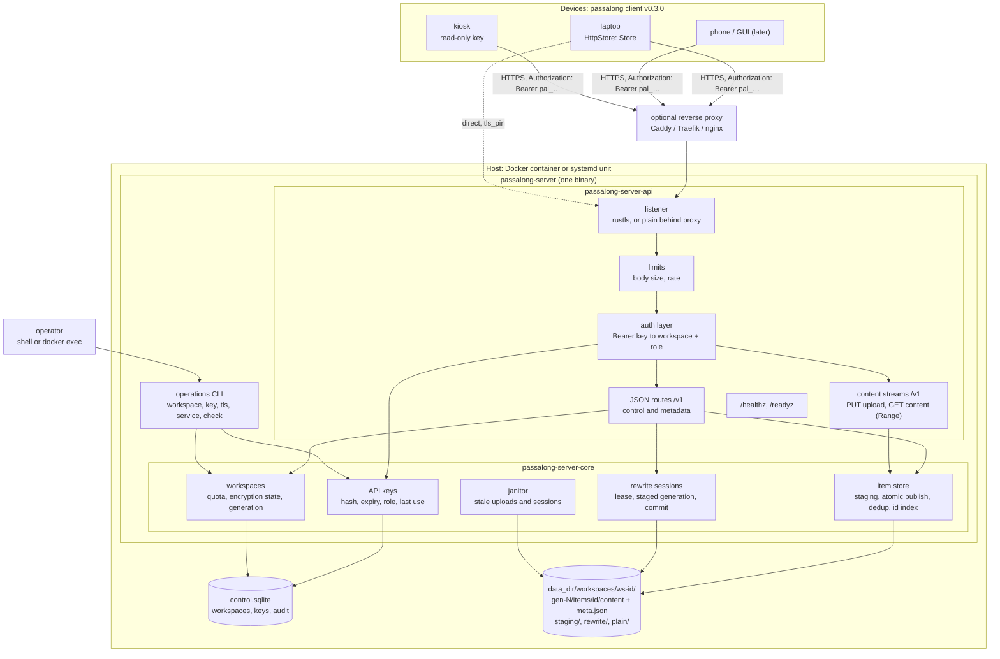
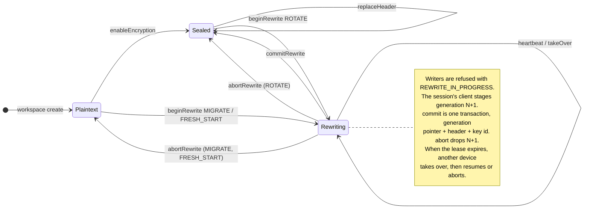

# Idea 00001 r03: HTTPS Server Backend

> [!abstract] Recommendation: `proceed-to-experiment`
> A standalone, multi-workspace HTTPS server is a coherent third backend for
> passalong and fits the client's design: `Store` was written to be
> implemented directly by "an HTTP API" (client `docs/architecture.md`,
> "Adding a backend"). Four decisions of 2026-09-18 shape r03: the API is
> **REST + JSON**, not GraphQL; the server **never exposes typed item
> fields**; **nothing is published**, neither image nor binary, while the
> licence is proprietary; and server v0.1 carries the **full rewrite
> session** for encryption changes. They resolve one Major and one Medium
> finding and reduce another Medium to Low. One Major remains: the rewrite
> protocol is a design that has not met the client's `encryption/` code. The
> next move is unchanged, a protocol spike built to settle exactly that.

## 1. Seed Idea

### Original proposition

Replace the SSH server and the local file store as the only places a
passalong store can live with a purpose-built server:

1. HTTPS for transport.
2. Authentication by API key, with expiry.
3. One server, many client workspaces (separate stores).
4. Same stack as the client: a lightweight Rust application.
5. Runs in a Docker container, published on Docker Hub.
6. GraphQL preferred over REST.
7. Every passalong client feature as of v0.2.1.
8. Runs as a systemd service.
9. A server CLI for operations: install the service, create and delete API
   keys, and so on.
10. Proprietary licence until an open-source licence is chosen.

The client gains support for it in v0.3.0.

Amended by the user on 2026-09-18 (§17): requirement 5 becomes "runs in a
Docker container", with nothing published to Docker Hub for now; requirement
6 becomes REST + JSON. The others stand.

### Motivation and timing

The SSH backend asks a lot of the operator: an SSH account per store, key
distribution, host-key pinning, and a filesystem path. It cannot express
"this device may only read", "this access ends in 90 days", or "these three
stores live on one host under one service". The client's backlog already
lists "HTTP API backends behind the existing registry" and "several stores
per machine"; Android and GUI front-ends, also on the road map, are far
easier over HTTPS than over SFTP. v0.2.1 has just stabilised encryption and
Windows, so the `Store` surface is as settled as it has ever been.

## 2. Context and Intent

| Field | Detail |
|---|---|
| Intended outcome | A self-hosted server a passalong user runs with one `docker compose up` or one `service install`, then points any number of devices at with a URL and an API key |
| Target users or beneficiaries | Self-hosters and small teams running passalong across several devices; later the Android and GUI clients |
| Current stage | Discovery. Empty repository scaffolded 2026-09-18; no server code |
| Known constraints | Rust, same toolchain and process as the client; Linux only; Docker and systemd both first-class; proprietary for now |
| Non-negotiables | Feature parity with client v0.2.1, including encryption at rest with a server that never sees keys, words, or plaintext of an encrypted workspace |
| Related project context | Client `Store` trait (14 methods, plus `newest_id`, deprecated since 0.1.3 and deliberately unmapped), `RemoteFs` trait, `FsStore`, the `encryption` module, and `BackendRegistry` |

Decisions taken by the user on 2026-09-18 (see §17). Before r01: item-level
API; built-in TLS **and** a plain mode for reverse proxies; Docker and
systemd both first-class; one API key bound to exactly one workspace. After
r02: REST + JSON; the envelope; the full rewrite session in v0.1; no
publishing, and a release that only verifies the build.

## 3. Problem or Opportunity

Today a store is a directory tree, and every rule about it is enforced by
whichever client touches it. That has three consequences.

- **No access model.** Whoever can reach the directory can do everything.
  There is no read-only device, no expiry, no revocation short of removing an
  SSH key, and no audit of who did what.
- **Correctness rests on filesystem quirks.** Atomic publish depends on
  rename-never-replaces; the encryption lock is a directory rename; a sealed
  store re-reads its header before and after every `put` because nothing can
  check-and-write atomically (client `docs/architecture.md`, "Sends while the
  key changes"). A synced folder breaks these guarantees outright, and the
  client documents that it cannot fix it.
- **Operating cost.** Each store needs an OS account, a path, and keys. The
  client ships `deploy/ssh-server/` to soften this, but multi-store hosting
  remains manual.

A server that owns the store can enforce all three centrally: authorisation
per key, atomic compare-and-set on the workspace's key id, and one process
hosting many workspaces.

Evidence the problem exists: the client's own backlog ("More backends",
"Several stores per machine", "Connection reuse", "Parallel metadata reads",
"ssh-agent authentication") is largely a list of costs of the SSH transport.

## 4. Proposed Feature or Concept

### User-visible outcome

Operator:

```text
docker compose up -d
docker compose exec server passalong-server workspace create home
docker compose exec server passalong-server key create --workspace home --label laptop --expires 90d
  → pal_7f3k9q2m_…   (shown once)
```

Device (client v0.3.0): `passalong init` offers the `https` backend, asks for
the URL and the key, shows the server certificate's fingerprint for
confirmation when it is not publicly trusted, and writes:

```toml
[server]
kind = "https"

[server.https]
url = "https://pass.example.net:8443"
# Only for a certificate no public CA vouches for:
tls_pin = "sha256/…"
```

with the key in `.env` as `PASSALONG_API_KEY`, as the client's rules for
secrets require. Every command then behaves as it does over SSH.

### Principal use cases

- One household or team server; a workspace per person or per purpose.
- A read-only key for a kiosk or a shared machine that should only `load`.
- A 30-day key for a borrowed laptop; it stops working by itself.
- Revoking one lost device without touching the others.
- Android and GUI clients without an SSH stack.

### Important edge cases

- A key expires while `serve` runs unattended (MED-04).
- A device sends while another rotates the workspace's key (MAJ-01).
- A rewrite session's client dies half-way; another device must be able to
  resume or abort it, and nobody may write meanwhile.
- Two devices send identical content at the same instant (MED-03).
- A large upload is cut off shortly before its end: nothing may appear, and
  the staging space must come back (LOW-03).
- The connection drops after the server committed an upload but before the
  client saw the answer: the retry must return the same outcome, not an
  error and not a second item (MED-05).
- The control database is locked or damaged while requests arrive (MED-02).
- The operator runs `key revoke` while the daemon runs (MED-02).
- Self-signed certificates on a home network (MED-01).

## 5. Desired Outcomes and Success Measures

| Outcome | Measure | Baseline | Target | Evidence needed |
|---|---|---:|---:|---|
| Parity | Client integration suite passing against the `https` backend | 0 % | 100 % of the suite that runs against `ssh` | Client CI job driving the server image |
| Zero knowledge | Plaintext, names, previews, keys, or words of an encrypted workspace present in server memory dumps, disk, or logs | n/a | none | Test that greps the data directory and logs after a scripted session |
| Isolation | Requests that read or affect another workspace | n/a | 0 in a fuzzed authz test matrix | Property test over (key, workspace, operation) |
| Time to first item | Minutes from an empty host to a first `passalong clipboard` | ~15 (SSH deploy guide) | < 5 | Timed walkthrough of `docs/usage.md` |
| `list` latency, 500 items, 50 ms RTT | Wall time | N round trips over SFTP | 1 round trip | Benchmark in both backends |
| Footprint | Idle RSS; image size | n/a | < 30 MiB; < 60 MiB | `docker stats`, `docker images` |

## 6. Scope and Non-goals

### In scope

- The server: API, authentication, workspaces, item storage, the rewrite
  protocol for encryption changes, TLS, limits, logging, health.
- The operations CLI in the same binary.
- Docker image (amd64, arm64), built from this repository and not
  published; systemd system unit.
- The API contract in `docs/api/`, which client v0.3.0 implements.

### Out of scope

- A web UI, user accounts, passwords, OAuth, or SSO.
- Remote administration over the API. Keys and workspaces are managed only
  by the local CLI in v0.1.
- Server-side encryption, or the server ever holding a workspace's key.
- ACME. Certificates are files; a reverse proxy or certbot renews them.
- Clustering, replication, or an external database.
- The client work itself, which is planned in the client's repository.
- macOS and Windows servers.
- Publishing an image or binaries anywhere, until a licence is chosen.

## 7. Users and Stakeholders

| Stakeholder | Need or incentive | Impact | Involvement needed |
|---|---|---|---|
| Operator (self-hoster) | Five-minute install, safe defaults, backups that are a directory copy | High | Walkthrough testing |
| Device user | Nothing changes except `init` | High | None |
| Client maintainers (@joelee) | A contract small enough to implement once and keep stable | High | Owns the v0.3.0 plan |
| Future Android and GUI clients | HTTPS, no SFTP | Medium | None yet |
| Open-source client community | A documented API, so the Apache-2.0 client is not tied to a closed server | Medium | Licence decision, when distribution resumes |

## 8. Assumption Ledger

| ID | Statement | Classification | Impact if wrong | Evidence status | Confidence | Cheapest test |
|---|---|---|---|---|---|---|
| A-01 | `Store` can be implemented over HTTP without changing its signature | Feasibility | Client refactor grows | Trait read in full; every method maps (see `docs/api/README.md`) except `key_id` and `content_key`, which are local | High | Spike `HttpStore` against a fake |
| A-02 | The client's encryption admin can be split into "what changes" and "how the store applies it" | Feasibility | v0.3.0 slips or drops parity | Unverified: `encryption/{admin,rewrite,header_change}.rs` are written against `RemoteFs` | Low | Read those modules; sketch an `EncryptionAdmin` trait (§14) |
| A-03 | An HTTP stack for REST + JSON, with an OpenAPI document exported from code, fits the licence and duplicate-version policy of `deny.toml` | Dependency | Write `openapi.json` by hand and check it against the routes in a test | Unverified in this session (no web research, no `cargo deny` run); a smaller dependency tree than the GraphQL stack r02 assumed | Medium | Add the dependencies on a branch; `just audit` |
| A-04 | SQLite in WAL mode lets the CLI write while the daemon reads, across `docker exec` | Operations | Need a control socket instead | Known SQLite behaviour; untested on bind mounts and network filesystems | Medium | Two-process test on a bind mount |
| A-05 | Operators accept managing keys only from the host shell | Adoption | Need an admin API early | Matches the user's requirement 9 | High | None |
| A-06 | Polling the item ids every pull interval is cheap enough for v0.1 | Performance | Need push sooner | One indexed lookup per poll per device | High | Load test, 50 devices |
| A-07 | The server may depend on `passalong-core` (Apache-2.0) for `ItemId` and `ItemMeta` | Legal/maintainability | Duplicate ~300 lines | Apache-2.0 permits proprietary use with notice | High | None; see INFO-01 |

## 9. Research and Fact Check

| Claim | Finding | Status | Evidence | Checked on |
|---|---|---|---|---|
| The client anticipates an HTTP backend implementing `Store` directly | True | Verified | Client `docs/architecture.md`, "Adding a backend", route 2; `store/mod.rs` module doc | 2026-09-18 |
| Encryption changes rely on `RemoteFs` primitives (rename as lock, journal folders) | True | Verified | Client `docs/architecture.md`, "Changing encryption"; `fs/mod.rs` `rename`, `create_dir` | 2026-09-18 |
| In a sealed store the storage sees ids, counts, sizes, and timing only | True | Verified | Client `docs/architecture.md`, "Security model"; `SealedMetaFile` in `fs_store.rs` | 2026-09-18 |
| A sealed item's id is associated data of its sealed metadata, so the id must exist before sealing | True | Verified | Client `docs/architecture.md`, "Items" | 2026-09-18 |
| Item ids are safe path components | True | Verified | `ItemId::parse` accepts hex and one `-` only | 2026-09-18 |
| Client secrets belong in `.env`, not `config.toml` | True | Verified | Client `AGENTS.md`, "Config and secrets" | 2026-09-18 |
| `Store::put` streams content without buffering the whole of it | True | Verified | Client `store/mod.rs`, doc comment of `put` | 2026-09-18 |
| The client limits the size of an item | False: sizes are `u64` and nothing caps them. r01's "Items reach 2 GiB" had no source; the figure was this repository's own proposed `limits.max_item_bytes` | Corrected | Client `model.rs`, `ItemMeta.size` and `ContentDigest.size`; no size limit in the client's documents | 2026-09-18 |
| `Store` has 14 methods in use | True: 15 in the trait, one of them the deprecated `newest_id` | Verified | Client `store/mod.rs` | 2026-09-18 |
| `docker compose exec` runs a command as root | Not for this image: exec uses the container's configured user, here `USER passalong-server` (uid 10001), unless `user:` or `--user` overrides it | Partly verified | `Dockerfile` and `deploy/docker/compose.yaml` read; Docker's behaviour from general knowledge, not tested in this session | 2026-09-18 |
| Suitable HTTP, OpenAPI, TLS, and SQLite crates exist under permissive licences | Likely | Unverified | From general knowledge; no version or licence checked | not checked |

### Evidence limitations

No web research and no dependency audit were done. Docker's choice of user
for `exec` was not tested against a running container. The client's
`encryption/` sources were not read line by line; statements about them rest
on its architecture document. No measurements exist. Crate names in
`docs/architecture.md` are candidates, not verified choices.

## 10. Challenge Review

### Strongest version of the idea

A server that owns the store can do atomically what the client today can
only approximate. "Re-read the header before and after every put" becomes
one compare-and-set on the workspace's key id. "A directory rename is the
lock, and a recovery older than ten minutes may be taken over" becomes a
lease with a heartbeat. `list` over a slow link becomes one request. Access
becomes per device, expiring, revocable, optionally read-only. None of that
weakens the encryption: the server stores sealed bytes and never sees a
key. And one small binary serves both Docker and systemd users.

### Formal findings

#### IDEA-00001-R03-MAJ-01: Changing encryption needs a new protocol, not a new transport

> [!warning] Major
> - **Confidence:** High
> - **Category:** Architecture / Feasibility
> - **Evidence:** Set-up, fresh start, change of words, migration, rotation, `--join`, and `--recover` are implemented over `RemoteFs`: a journal written to `.rewrite-<random>/`, a rename that is the lock, item moves into `.rewrite/source/`, header-folder swaps (client `docs/architecture.md`, "Changing encryption"). An item-level API exposes none of those primitives.
> - **Failure scenario:** v0.3.0 ships `https` with plaintext workspaces and `encrypt` "not supported by this backend", breaking requirement 7; or the protocol is improvised during implementation and a rotation interrupted at the wrong step leaves a workspace whose items are split between two keys with no journal to recover from.
> - **Impact:** Parity, data safety, and most of the v0.3.0 client effort.
> - **Mitigation or test:** Design the protocol first, server-side, around **generations** (§12): a workspace's items live in a numbered generation; a rewrite session holds a lease, stages the next generation while writers are refused, and commits by switching the generation pointer in one transaction. Abort drops the staged generation. The server is the journal. Verify with a model test that kills the client at every step (§14).
> - **Decision (2026-09-18):** The user chose the full rewrite session for server v0.1, over a staged alternative the agent offered: enable-on-empty, change of words, and `--join` natively, with migration, rotation, fresh start, and recovery done on a `local` or `ssh` store and brought in by `workspace import`. The staged route would have lowered this finding to Medium at the price of parity; it remains the fallback if the spike fails. The finding therefore stays Major, and the spike of §14 is designed to resolve it.
> - **Added in r03:** The session's own requests need replay semantics as much as uploads do (MED-05). A lost answer to `commitRewrite` is the worst case in the whole API: the client must be able to ask again and learn that the commit happened, not see `NOT_FOUND` for a session that no longer exists and conclude that it must start over. Proposed: `commitRewrite` and `abortRewrite` whose effect is already in place answer with the current encryption state; `beginRewrite` repeated by the session's holder returns the live session. The model test replays every session request after every step.
> - **References:** Client `docs/architecture.md`; assumption A-02.

#### IDEA-00001-R03-MED-01: Self-hosted TLS needs a trust story as strong as the pinned SSH host key

> [!note] Medium
> - **Confidence:** High
> - **Category:** Security / Adoption
> - **Evidence:** The SSH backend pins the host key with "no trust-on-first-use and no `known_hosts` fallback". Many passalong servers will sit on a LAN address no public CA will certify.
> - **Failure scenario:** Users with self-signed certificates reach for a "skip verification" switch, and the HTTPS backend is weaker than the SSH one it replaces.
> - **Impact:** Man-in-the-middle exposure of API keys and plaintext workspaces.
> - **Mitigation or test:** Never offer a skip switch. Offer `tls_pin` (SPKI SHA-256) in the client, `passalong-server tls self-signed` and `tls fingerprint` on the server, and a fingerprint confirmation in `passalong init`, mirroring the SSH flow. Publicly trusted certificates need no pin.
> - **References:** Client `docs/architecture.md`, "Security model".

#### IDEA-00001-R03-MED-02: The CLI and the daemon share state, and revocation must be immediate

> [!note] Medium
> - **Confidence:** Medium
> - **Category:** Operations / Security
> - **Evidence:** Requirement 9 has the CLI create and delete keys while the daemon serves. With Docker the CLI runs by `docker exec` in the same container. Every request is authenticated against the control database, which makes it the single gate, and r01 did not say what happens when it cannot be read.
> - **Failure scenario:** The daemon caches keys, so a revoked key works until restart; or the CLI and daemon corrupt a hand-rolled state file; or the CLI runs as root and leaves a root-owned database the daemon cannot open; or the database is locked or damaged and the daemon, to stay available, serves from whatever it last knew, including a key revoked a minute ago.
> - **Impact:** A lost device keeps access; outages after routine administration.
> - **Mitigation or test:** One control database (SQLite, WAL, busy timeout) that both open through `passalong-server-core`; authenticate every request against it, without a cache, or with one bounded to about a second; the CLI refuses to run as a user other than the data directory's owner. **Fail closed:** when the database is locked past the busy timeout, unreadable, or corrupt, the daemon refuses with 503 and never falls back to remembered authentication; `/readyz` fails while `/healthz` stays up, so an orchestrator stops routing without restart-looping a server whose disk is the problem. The owner rule bites mostly on native installs, where `sudo passalong-server …` is the natural mistake. With the project's image, `docker compose exec` already runs as uid 10001, because exec uses the container's user and the `Dockerfile` sets one; the rule then guards against an operator's `user: root` or `--user 0`. The usage documents must say why the CLI refused, and the compose file must never override `user:`. The alternative, a Unix control socket, is cleaner but makes the CLI useless when the daemon is down.
> - **References:** Assumption A-04; review finding R4; `Dockerfile`; `deploy/docker/compose.yaml`.

#### IDEA-00001-R03-MED-03: Who mints the id, and deduplication must become atomic

> [!note] Medium
> - **Confidence:** High
> - **Category:** Data
> - **Evidence:** An id is `<sender's clock>-<content key>`; in a sealed store the content key is keyed and the id is associated data of the sealed metadata, so the client must fix the id before upload. `FsStore::put` checks for the content key, then publishes: two steps.
> - **Failure scenario:** Two devices send the same text within the same second window; both pass the check; two items appear. Or the server mints ids and sealed metadata no longer authenticates.
> - **Impact:** Duplicate items; `serve` echo loops that deduplication exists to stop.
> - **Mitigation or test:** The client proposes the id. `commitUpload` runs under a per-workspace lock: if the content key exists, discard the upload and return the existing item with `created: false`. For plaintext workspaces the server also recomputes the content key. Clock skew stays an ordering-only concern, as today; the envelope's `receivedAt` gives a true order for anyone who wants it.
> - **References:** Client `docs/architecture.md`, "Identifiers" and "Storing an item".

#### IDEA-00001-R03-MED-04: Expiring keys fail silently on unattended devices

> [!note] Medium
> - **Confidence:** High
> - **Category:** Adoption / Operations
> - **Evidence:** `serve` runs as a background service. Requirement 2 adds expiry.
> - **Failure scenario:** A key expires; `serve` retries with back-off for ever; the user notices days later that nothing has synced.
> - **Impact:** Silent data-flow loss, the worst failure for a sync tool.
> - **Mitigation or test:** `GET /v1/viewer` returns the key's `expiresAt`; the client's `check` and `serve` warn from 14 days out; an expired or revoked key gets a distinct, non-retryable error so `serve` stops retrying and says why; `key list` on the server shows last use and time to expiry; `key extend` avoids redistributing a secret.
> - **References:** Client `docs/architecture.md`, "serve".

#### IDEA-00001-R03-MED-05: Upload replay semantics are unspecified

> [!note] Medium
> - **Confidence:** High
> - **Category:** Data / Operations
> - **Evidence:** Upload is three requests (`beginUpload`, the content `PUT`, `commitUpload`; §12 maps the operation names to routes), and r01 defined none of them under retry. `serve` retries failed uploads with back-off (client `docs/architecture.md`, "serve"), so replays are the normal case on a poor link, not an exotic one.
> - **Failure scenario:** `commitUpload` succeeds; the response is lost; the client retries. The staging folder is gone, so the server answers `NOT_FOUND`; `serve` treats the send as failed and uploads the whole item again, to be deduplicated only at the end. Or a lost `beginUpload` response leaves a quota reservation nobody will use until the janitor runs, and on a nearly full workspace the retry is refused with `QUOTA_EXCEEDED`.
> - **Impact:** Wasted transfers of large items, spurious errors in `serve`, and quota refused for space that is not used.
> - **Mitigation or test:** The `uploadId` is the idempotency key. Proposed semantics, for the spike to confirm: (1) a committed upload leaves a tombstone holding its `PutOutcome`; `commitUpload` replayed within the retention window returns that same outcome, including the original `created` value. (2) A `PUT` repeated before commit truncates and restarts the staging file; after commit it answers success and discards the body. (3) `beginUpload` replayed by the same API key with the same id and size returns the live ticket instead of reserving again. (4) After the tombstone expires the answer is `NOT_FOUND`, and the client settles it with `GET /v1/items/{id}`, which is also its recovery when it has lost the `uploadId` altogether. (5) `abortUpload` and `deleteItem` are idempotent. The model test of §14 replays every request of the upload after every step.
> - **References:** Review finding R3; client `docs/architecture.md`, "serve".

#### IDEA-00001-R03-LOW-01: Push is tempting and can wait

> [!tip] Low
> - **Confidence:** Medium
> - **Category:** Maintainability
> - **Evidence:** Pull mode polls `list_ids`. Server push would make it instant. With REST the natural form is one server-sent-events stream, `GET /v1/events`, which passes ordinary reverse proxies more easily than the WebSocket a GraphQL subscription would have needed, but still needs reconnection and resume logic in the client.
> - **Failure scenario:** v0.1 spends its complexity budget on push before parity exists.
> - **Impact:** Schedule.
> - **Mitigation or test:** v0.1 answers `GET /v1/item-ids?after=` from an in-memory index; add the event stream later without breaking anything.
> - **References:** Assumption A-06.

#### IDEA-00001-R03-LOW-02: Two repositories, one contract

> [!tip] Low
> - **Confidence:** High
> - **Category:** Maintainability
> - **Evidence:** The client is Apache-2.0 and public; the server is proprietary, so they cannot share a crate from this repository.
> - **Failure scenario:** The schema drifts; a server release breaks released clients.
> - **Impact:** Broken installs.
> - **Mitigation or test:** `docs/api/openapi.json` is exported from code and a test fails on drift; the API is versioned in the path (`/v1`); `GET /v1/viewer` names the server's version and API version, so the client can refuse clearly; CI runs released client binaries against the server image, as the client's `test-compat` does for old stores; `README.md` keeps a compatibility table.
> - **References:** Client `justfile`, `test-compat`.

#### IDEA-00001-R03-LOW-03: Ordinary HTTP hygiene, and an item-size limit the other backends lack

> [!tip] Low
> - **Confidence:** High
> - **Category:** Security / Adoption
> - **Evidence:** Successor of IDEA-00001-R02-MED-01, reclassified after the move to REST + JSON on 2026-09-18. What made it Medium is gone: there is no split between a query language and byte endpoints, no query depth or complexity to bound, and no introspection. What remains is true of any HTTP server. Item size is unbounded in the client (`ItemMeta.size` is a `u64`; the `ssh` and `local` backends set no limit), and content is streamed without buffering (`Store::put` doc).
> - **Failure scenario:** A JSON body is parsed before the key is checked, or without a size limit; or a user moving from SSH meets `ITEM_TOO_LARGE` on a file that used to go through.
> - **Impact:** Denial of service by unauthenticated requests; a surprising parity gap.
> - **Mitigation or test:** Authenticate before reading a body; cap JSON bodies at a small fixed size, since only content streams are large and those go to disk; rate-limit failed authentications. `limits.max_item_bytes` has its own error, is readable from `GET /v1/viewer` before an upload starts, and can be `"unlimited"`; its default is an output of the spike.
> - **References:** Client `store/mod.rs`, `model.rs`; IDEA-00001-R02-MED-01.

#### IDEA-00001-R03-INFO-01: The server may reuse `passalong-core`

> [!info] Info
> - **Confidence:** High
> - **Category:** Maintainability
> - **Evidence:** `passalong-core` is Apache-2.0 on crates.io and builds with `--no-default-features`, without the desktop clipboard. `ItemId::parse` and `ItemMeta` are exactly the validation the server needs for plaintext workspaces.
> - **Failure scenario:** None required.
> - **Impact:** Less duplicated validation, at the cost of coupling server releases to a client crate and pulling in its cryptography dependencies unused.
> - **Mitigation or test:** Decide during the spike; a 300-line local `model` module is the alternative.
> - **References:** Client `Cargo.toml`; assumption A-07.

#### IDEA-00001-R03-INFO-02: The envelope is a standing rule

> [!info] Info
> - **Confidence:** High
> - **Category:** Privacy / Architecture
> - **Evidence:** Successor of IDEA-00001-R02-MAJ-02, resolved on 2026-09-18 by the user's decision: the server never exposes typed item fields, in either kind of workspace. It knows `id`, `storedBytes`, `receivedAt`, and the uploading key; `meta` is an opaque document, byte-identical to the client's `meta.json`. Its one look inside is the check, in a plaintext workspace, that the content's SHA-256 and size match.
> - **Failure scenario:** None while the rule holds. It is recorded because the pressure against it returns with every feature request for search, filtering, or previews on the server.
> - **Impact:** None.
> - **Mitigation or test:** State the rule in `docs/api/`; a test asserts that no response type carries a field taken from `meta`. The decision also removed the main reason for GraphQL, typed field selection, and led to REST + JSON.
> - **References:** Client `fs_store.rs`, `SealedMetaFile`; IDEA-00001-R02-MAJ-02.

### Failure modes and unintended consequences

- The server becomes a place where plaintext workspaces concentrate many
  people's clipboards. Default `workspace create` to "encryption expected"
  and have the client's `init` offer encryption first, as it does today.
- Operators back up `data_dir` while the server runs; SQLite and half-staged
  uploads make naive copies inconsistent. Document `passalong-server backup`
  or a stop-copy-start procedure.
- An item-level API invites feature creep (search, tags, sharing links).
  Each one needs plaintext. The envelope rule (INFO-02) is the brake.

### Conditions to revise, park, or reject

- **Revise** if the spike shows the client's encryption admin cannot be
  separated from `RemoteFs` at acceptable cost, or the rewrite session
  cannot express a rewrite kind: fall back to the staged route of §11,
  option E, and add the session in a later server release.
- **Park** if v0.2.2 (S3) changes `Store` materially; design against the
  settled trait.
- **Reject** only if an item-level API proves unable to keep the server
  zero-knowledge, which nothing so far suggests.

## 11. Options and Trade-offs

| Option | Benefits | Costs and risks | Reversibility | Evidence needed |
|---|---|---|---|---|
| **A. Item-level API (chosen)** | Atomic server-side rules; one-round-trip `list`; per-operation authorisation; quotas and retention per item; natural for Android and GUI | New encryption-change protocol (MAJ-01); largest client change; envelope discipline needed (INFO-02) | Low once clients ship | Spike in §14 |
| B. Filesystem-level API (`RemoteFs` over HTTPS) | Client adds one small `HttpFs`; all encryption code reused as is; store layout identical to SSH | Keeps the filesystem races the server could remove; chatty; authorisation only per path; poor fit for GraphQL | High | None; known to work by construction |
| C. Hybrid: item-level, plus filesystem-level for encryption changes only | Parity sooner | Two APIs, two security reviews; the worst races remain exactly where they matter most | Medium | Same spike |
| D. REST + JSON instead of GraphQL, item-level **(chosen 2026-09-18, with A)** | One style for control and bytes; `Range` and resume for free; works through any proxy; debuggable with curl; a lighter dependency tree; no query-language attack surface | The contract needs OpenAPI and a drift test to be as firm as an SDL; push becomes server-sent events | High before the first client release | `just audit` |
| E. Staged encryption: native enable-on-empty, change of words, and `--join`; the rest on a `local` or `ssh` store, then `workspace import` | No new distributed protocol in v0.1; reuses the client's tested code | Parity by workaround: needs shell access to the server; bends requirement 7 | High: the session can be added later without an API break | None |
| F. A proprietary lightweight protocol | Compact; no HTTP framework | Custom framing over TLS loses the reverse-proxy mode, `Range`, mature libraries, and an easy path for Android and GUI clients, and puts a hand-written parser on the security boundary; custom RPC over HTTP is REST with worse tooling | Low | None |

The user chose A on 2026-09-18. Recorded dissent: B is the cheaper route to
v0.3.0 parity and would have carried no Major finding. A is the better
long-term shape, because it is the only option that *removes* the client's
documented race conditions rather than transporting them.

After r02 the user chose D over GraphQL, on the agent's recommendation:
once the envelope was accepted there was almost nothing left for a query
language to select. F was considered and not pursued. E was offered as a way
to lower MAJ-01 and declined in favour of the full rewrite session; recorded
residual risk: the largest piece of new design stays on the critical path of
v0.1, and E remains the fallback.

## 12. Recommended Concept

One binary, `passalong-server`, three crates: `passalong-server-core`
(domain, no HTTP), `passalong-server-api` (REST routes, content streams, auth,
TLS), and the CLI, which hosts `serve` and the operations commands. The CLI
and the daemon meet only in the core crate and the control database.



**Protocol.** REST + JSON under `/v1`, described by an OpenAPI document that
is exported from the code and checked for drift. This report keeps naming
operations (`beginUpload`, `commitRewrite`); they are the `operationId`s of
routes such as `POST /v1/uploads` and `POST /v1/rewrite/commit`, mapped in
`docs/api/`. Errors are `application/problem+json` with a stable `code`.

**Authentication.** A key is `pal_<key id>_<secret>`: a public id for lookup
and logs, and 256 random bits. The database stores only a SHA-256 of the
secret, compared in constant time; a slow password hash adds nothing for a
full-entropy secret. A key row has workspace, role (`read-write` or
`read-only`), label, creation, expiry, revocation, and last use. The key
selects the workspace, so no request names one and a mistyped workspace is
impossible.

**Items.** The envelope of INFO-02. Upload is three steps: `beginUpload`
(proposed id, meta, expected key id, size) reserves quota and returns an
upload id; `PUT /v1/uploads/{uploadId}` streams to staging; `commitUpload`
verifies, deduplicates, and publishes under the workspace lock. An abandoned
upload is invisible and the janitor reclaims it. Every step is safe to
repeat, with the upload id as the idempotency key (MED-05). Files on disk are
byte-identical to the client's `content` and `meta.json`, so importing an
existing SSH or local store, and exporting back, is a copy.

**Encryption.** The server stores the header (the wrapped data key) as an
opaque document and knows only the current key id. Every write names the key
id it was made under and is refused atomically on mismatch, which replaces
the client's check-before-and-after.



- `enableEncryption` is accepted only while the workspace is empty.
- `replaceHeader` is the change of words: the same data key wrapped anew,
  guarded by `expectedKeyId`; no item is touched.

`encrypt --join` is a header read (`GET /v1/workspace`). `encrypt --recover` is "resume or abort
the session whose lease expired". A fresh start commits an empty generation
and keeps the old one reachable as the `PLAIN` partition, which
`prune --plain` lists and deletes.

**Deployment.** `serve` is the only long-running mode. Nothing is published:
the operator builds the image, or the binary, from this repository. Docker runs it as uid
10001 with a read-only root and one volume; `service install` writes the
hardened system unit in `docs/service/`. TLS is rustls with re-read
certificate files, or `mode = "plain"`, refused on a non-loopback address
unless `behind_proxy = true`.

## 13. Dependencies, Risks, and Safeguards

| Item | Type | Likelihood | Impact | Mitigation, test, or owner |
|---|---|---|---|---|
| Client encryption admin not separable from `RemoteFs` | Dependency | Medium | High | Spike (§14); fallback option C |
| HTTP or OpenAPI crates fail `deny.toml` (licence or duplicate versions) | Dependency | Low | Low | `just audit` on a branch; a hand-written `openapi.json` checked by a test |
| Cross-workspace access bug | Security | Low | Critical | Workspace comes only from the key; every path built from validated ids; property-tested authz matrix |
| Disk exhaustion through uploads | Security | Medium | High | Quota reserved at `beginUpload`; size enforced while streaming; janitor |
| Control database locked, unreadable, or corrupt | Operations | Low | High | Fail closed with 503; `/readyz` fails, `/healthz` stays up; never serve remembered authentication (MED-02) |
| Lost responses during upload | Data | High on poor links | Medium | Replay semantics keyed on the upload id (MED-05) |
| Server item-size limit surprises users of a backend that had none | Adoption | Medium | Low | Distinct error, readable limit, "unlimited" setting; default decided in the spike (LOW-03) |
| Key leaked from a client `.env` | Security | Medium | Medium, or Low for sealed workspaces | Expiry by default at `key create`; revoke; read-only role; last-use display |
| Backup taken while running | Operations | High | Medium | Documented procedure or `backup` command |
| `Store` changes in client v0.2.2 (S3) | Dependency | Medium | Low | Freeze the contract after v0.2.2 |
| Distribution resumes before licence terms exist | Compliance | Low | Medium | Nothing is published (decision of 2026-09-18). Reopen IDEA-00001-R02-MED-03 before any image or binary leaves the repository |

## 14. Highest-value Next Experiment

- **Hypothesis:** The whole of `Store`, and every mode of `passalong
  encrypt`, can be expressed in an item-level API with a generation-based
  rewrite session, with no state in which an interrupted client leaves a
  workspace unrecoverable, and with the client's encryption admin reusable
  behind one new trait.
- **Method:** (1) Write `docs/api/openapi.json` in full, including the
  replay semantics of every request, those of the rewrite session above all
  (MAJ-01, MED-05), and a decided default for `maxItemBytes` (LOW-03). (2) In this repository, implement the workspace state
  machine of §12 in `passalong-server-core` against an in-memory store, test
  first, with a model test that interrupts a scripted client after every
  step of every rewrite kind and asserts that resume or abort always ends in
  a consistent workspace; the same test replays every request of an upload
  after every step and asserts one item, one outcome, and no quota leaked. (3) In the client repository, read
  `encryption/{admin,rewrite,header_change}.rs` and sketch the
  `EncryptionAdmin` trait with its `RemoteFs` and HTTP implementations,
  without implementing them.
- **Inputs or participants:** @joelee for the client-side sketch review.
- **Success threshold:** Every `Store` method and `encrypt` mode mapped;
  every request's replay behaviour stated; the model test passes; the trait sketch touches no sealing code, only
  orchestration.
- **Failure threshold:** A rewrite kind needs filesystem semantics the
  session cannot express, or the client refactor reaches into `crypto/`.
- **Expected effort:** Three to five days.
- **Risks and safeguards:** Spike code is kept only if written test first to
  the repository's standard; otherwise it is discarded.
- **Evidence to capture:** The OpenAPI document, the model test, the trait sketch, a
  table of rewrite steps with the state after a crash at each, a table of
  upload requests with the answer to a replay at each, and the reasoning
  for the `maxItemBytes` default.
- **Decision enabled:** Accept this idea and write PLAN-00001, or revise
  towards option E.

## 15. Open Questions and Loose Ends

### Blocking

- [ ] Does the rewrite-session design cover fresh start and the `PLAIN`
      partition, `encrypt --recover` by a device other than the one that
      began, and a lost answer to every one of its requests? (MAJ-01) The
      spike of §14 answers this; nothing else blocks acceptance.

Resolved since r02: the envelope is accepted (INFO-02), and nothing is
published, so no licence terms are needed yet.

### Important but non-blocking

- [ ] Client config naming: `kind = "https"` with `[server.https]`, and
      `PASSALONG_API_KEY` in `.env`?
- [ ] Depend on `passalong-core`, or keep a local model module? (INFO-01)
- [ ] Default expiry at `key create`: 90 days unless `--never`?
- [ ] Does a read-only key need a third role, "send-only", for a device
      that should contribute but never read?
- [ ] Server-side retention per workspace (age and count work on sealed
      workspaces too, since ids carry time), or leave it to `passalong prune`?
- [ ] The default for `limits.max_item_bytes`, and whether "unlimited" is
      allowed: the other backends have no limit (LOW-03). Decided in the
      spike.
- [ ] The client's list cache exists for SSH latency; is it needed at all
      for `https`?
- [ ] With a build-only release, how does a systemd host get its binary:
      `cargo build` on the host, or a documented `just` recipe that builds
      and installs? Docker hosts build the image with compose.

### Later considerations

- [ ] A server-sent-events stream to replace polling (LOW-01).
- [ ] `workspace import` and `export` for stores from the `ssh` and `local`
      backends.
- [ ] Remote administration with an admin-scoped key.
- [ ] A static musl build and a distroless image.
- [ ] Metrics endpoint.
- [ ] ACME.
- [ ] Publishing an image or binaries, once a licence is chosen. This
      reopens IDEA-00001-R02-MED-03, including `THIRD-PARTY-NOTICES`.

## 16. Feedback Incorporated

The user's answers to r02, 2026-09-18.

| Feedback or prior finding | Disposition | Change in this revision | Rationale |
|---|---|---|---|
| "v0.3.0 clients implement the new protocol and stay backward compatible with the old one. Does this solve MAJ-01?" | not-accepted as a resolution | MAJ-01 unchanged in severity | Keeping the `ssh` and `local` backends was always the plan, and does not supply what MAJ-01 lacks: a way to change a workspace's encryption through an item-level API. The agent offered a nearby route that would have lowered the finding (§11, option E) |
| Full rewrite session in server v0.1, not option E | accepted (user decision) | MAJ-01 records the decision and the dissent; E becomes the fallback in §10 and §14; session replay semantics added to MAJ-01 and the spike | The user's call on parity. Residual risk recorded in §11 |
| "Scrap the Docker Hub publishing for now. Maintain proprietary licence" | accepted | IDEA-00001-R02-MED-03 resolved; §1, §6, §12, §13, §15 amended | With no distribution there are no terms to grant and no notices to ship. It returns the day anything is published |
| Release output: build-only | accepted | §2; a new non-blocking question on how systemd hosts get a binary | Consistent with publishing nothing |
| The envelope: the server never exposes typed item fields | accepted | IDEA-00001-R02-MAJ-02 resolved; kept as INFO-02, a standing rule | This was the mitigation r01 proposed; it needed only the decision |
| "Can MAJ-02 and MED-01 be resolved by replacing GraphQL?" | partially-accepted | r02's MED-01 becomes LOW-03; r02's MAJ-02 is resolved by the envelope, not by the protocol | GraphQL did not cause MAJ-02: a REST response with `name` and `preview` has the same problem. It did cause most of MED-01 |
| REST + JSON confirmed | accepted | §1, §8 (A-03), §9, §11 (option D chosen), §12 diagram and "Protocol", §13, §14, LOW-01, LOW-02 | Recommended by the agent once the envelope left a query language nothing to select |
| A proprietary lightweight protocol | not-accepted | §11, option F | Loses the reverse-proxy mode, `Range`, mature libraries, and an easy path for other clients; adds a hand-written parser on the security boundary. The user did not pursue it |

Prior formal findings, reassessed:

| r02 finding | Classification | r03 finding |
|---|---|---|
| IDEA-00001-R02-MAJ-01 | still-open | IDEA-00001-R03-MAJ-01, with the decision for the full session and session replay semantics |
| IDEA-00001-R02-MAJ-02 | resolved | Envelope accepted; kept as IDEA-00001-R03-INFO-02 |
| IDEA-00001-R02-MED-01 | partially-resolved | IDEA-00001-R03-LOW-03: the GraphQL part is gone; HTTP hygiene and the item-size limit remain |
| IDEA-00001-R02-MED-02 | still-open | IDEA-00001-R03-MED-01, unchanged |
| IDEA-00001-R02-MED-03 | resolved | Nothing is published. Reopens with any distribution (§15, later considerations) |
| IDEA-00001-R02-MED-04 | still-open | IDEA-00001-R03-MED-02, unchanged |
| IDEA-00001-R02-MED-05 | still-open | IDEA-00001-R03-MED-03, unchanged |
| IDEA-00001-R02-MED-06 | still-open | IDEA-00001-R03-MED-04, route names only |
| IDEA-00001-R02-MED-07 | still-open | IDEA-00001-R03-MED-05, route names only |
| IDEA-00001-R02-LOW-01 | still-open | IDEA-00001-R03-LOW-01, rewritten for server-sent events |
| IDEA-00001-R02-LOW-02 | still-open | IDEA-00001-R03-LOW-02, OpenAPI in place of the SDL |
| IDEA-00001-R02-INFO-01 | still-open | IDEA-00001-R03-INFO-01, unchanged |

## 17. Decision Log

| Date | Decision or change | Rationale | Owner |
|---|---|---|---|
| 2026-09-18 | Item-level API, mirroring `Store`, rather than a filesystem-level or hybrid API | User's choice; the agent had recommended filesystem-level for a smaller v0.3.0. Residual risk recorded in §11 and MAJ-01 | @joelee |
| 2026-09-18 | TLS: built-in rustls and a plain mode behind a reverse proxy | Docker users usually have a proxy already; others need safe defaults | @joelee |
| 2026-09-18 | Docker and systemd both first-class, one binary | Requirement 5 and 8 | @joelee |
| 2026-09-18 | One API key is bound to exactly one workspace | Smallest blast radius; client config needs only a URL and a key | @joelee |
| 2026-09-18 | r01 committed (`f3e7961`), then reviewed; findings R1 to R5 lead to r02 | Review evidence must live in history, not only in a working tree | @joelee |
| 2026-09-18 | REST + JSON replaces GraphQL; a proprietary protocol is not pursued | The envelope leaves a query language nothing to select; one style for control and bytes; smaller attack surface and dependency tree | @joelee, on the agent's recommendation |
| 2026-09-18 | The envelope: the server never exposes typed item fields | Keeps the server zero-knowledge under every future feature request | @joelee |
| 2026-09-18 | Full rewrite session in server v0.1; the staged route (option E) declined | Parity with client v0.2.1 without operator shell access. Dissent and residual risk in §11 | @joelee |
| 2026-09-18 | No Docker Hub publishing; licence stays proprietary; a release tag only verifies the build | No distribution, so no terms and no notices needed yet | @joelee |
| 2026-09-18 | Server version starts at v0.1.0, independent of the client's | The API version, not the server's SemVer, is the compatibility contract | Agent, proposed |

## 18. Recommended Next Actions

1. Run the experiment in §14 on a `feature/` branch. It is now the only
   thing between this idea and a decision.
2. On success, accept the idea (a new revision, by the user's decision) and
   write PLAN-00001 for server v0.1.0 here, and the v0.3.0 backend plan in
   the client repository, both citing IDEA-00001.
3. On failure, revise towards option E and keep the session for a later
   server release.

## 19. Revision History

| Revision | Status | Kind | Supersedes | Summary |
|---|---|---|---|---|
| r01 | draft | initial | none | First analysis after the repository scaffold and four user decisions |
| r03 | revised | feedback | r02 | Four user decisions: REST + JSON, the envelope, the full rewrite session, no publishing. r02's MAJ-02 and MED-03 resolved, its MED-01 reduced to Low, one blocking question left |
| r02 | revised | feedback | r01 | Review findings R1 to R5: unsourced item size removed, method count corrected, upload replay semantics added as MED-05, control database fails closed |

## References

None. No external research was used; every source is a file in this
repository or in the client repository at v0.2.1.

## Confidence

**Medium.** The client's storage and security design was read closely, and
the decisions since r02 removed the findings that rested on choices rather
than on unknowns. What is left is the unknown that mattered from the start:
the rewrite session has not been tested against the client's `encryption/`
code, and no dependency has been audited against `deny.toml`. Confidence
rises only with the spike.
