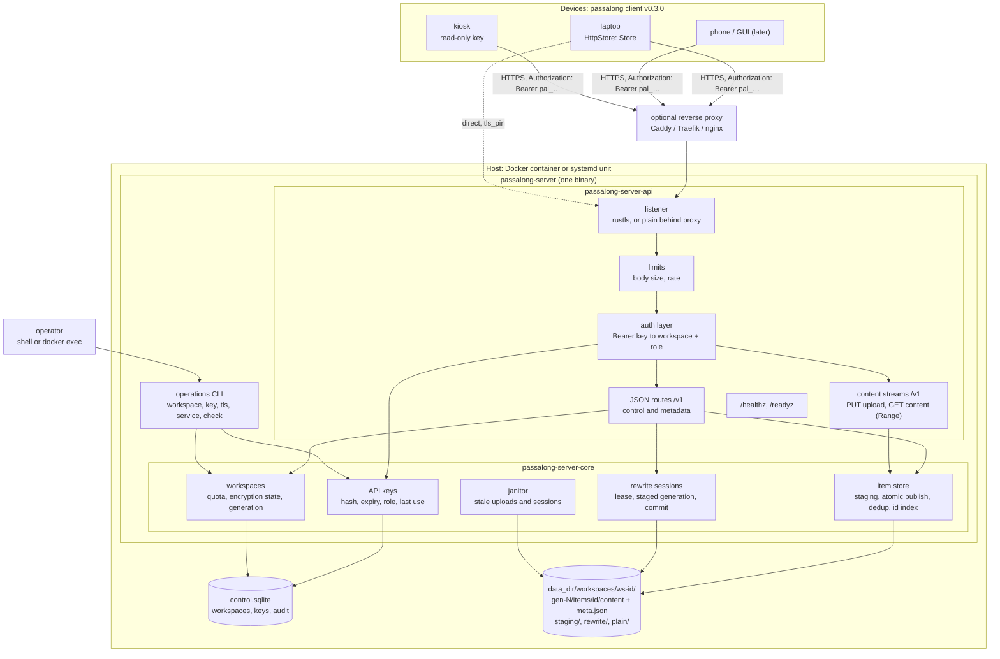
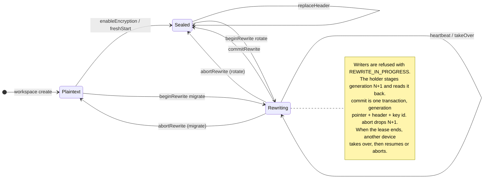

# Idea 00001 r04: HTTPS Server Backend

> [!abstract] Recommendation: `proceed-to-experiment`; status `accepted`
> Accepted by the user on 2026-09-18, after the protocol spike (PLAN-00001)
> met every success threshold of r03 §14 and neither failure threshold. The
> rewrite session expresses migration and rotation and survives a client
> that stops or repeats at any of 59 requests, in 210 variants with five
> invariants checked after each; the client's refactor does not reach into
> `crypto/`. The one Major finding is resolved. What the spike could not
> show, that the same rules hold over a real filesystem and a real database
> with a crash between the two, is carried into planning as the leading
> Medium. Next: PLAN-00002, server v0.1.0.

## 1. Seed Idea

### Original proposition

Replace the SSH server and the local file store as the only places a
passalong store can live with a purpose-built server:

1. HTTPS for transport.
2. Authentication by API key, with expiry.
3. One server, many client workspaces (separate stores).
4. Same stack as the client: a lightweight Rust application.
5. Runs in a Docker container, published on Docker Hub.
6. GraphQL preferred over REST.
7. Every passalong client feature as of v0.2.1.
8. Runs as a systemd service.
9. A server CLI for operations: install the service, create and delete API
   keys, and so on.
10. Proprietary licence until an open-source licence is chosen.

The client gains support for it in v0.3.0.

Amended by the user on 2026-09-18 (§17): requirement 5 becomes "runs in a
Docker container", with nothing published to Docker Hub for now; requirement
6 becomes REST + JSON. The others stand.

### Motivation and timing

The SSH backend asks a lot of the operator: an SSH account per store, key
distribution, host-key pinning, and a filesystem path. It cannot express
"this device may only read", "this access ends in 90 days", or "these three
stores live on one host under one service". The client's backlog already
lists "HTTP API backends behind the existing registry" and "several stores
per machine"; Android and GUI front-ends, also on the road map, are far
easier over HTTPS than over SFTP. v0.2.1 has just stabilised encryption and
Windows, so the `Store` surface is as settled as it has ever been.

## 2. Context and Intent

| Field | Detail |
|---|---|
| Intended outcome | A self-hosted server a passalong user runs with one `docker compose up` or one `service install`, then points any number of devices at with a URL and an API key |
| Target users or beneficiaries | Self-hosters and small teams running passalong across several devices; later the Android and GUI clients |
| Current stage | Accepted. The rules of workspaces, uploads, and rewrite sessions exist as a tested in-memory model in `passalong-server-core`, and the contract as `docs/api/openapi.json`; no server yet |
| Known constraints | Rust, same toolchain and process as the client; Linux only; Docker and systemd both first-class; proprietary for now |
| Non-negotiables | Feature parity with client v0.2.1, including encryption at rest with a server that never sees keys, words, or plaintext of an encrypted workspace |
| Related project context | Client `Store` trait (14 methods, plus `newest_id`, deprecated since 0.1.3 and deliberately unmapped), `RemoteFs` trait, `FsStore`, the `encryption` module, and `BackendRegistry` |

Decisions taken by the user on 2026-09-18 (see §17). Before r01: item-level
API; built-in TLS **and** a plain mode for reverse proxies; Docker and
systemd both first-class; one API key bound to exactly one workspace. After
r02: REST + JSON; the envelope; the full rewrite session in v0.1; no
publishing, and a release that only verifies the build.

## 3. Problem or Opportunity

Today a store is a directory tree, and every rule about it is enforced by
whichever client touches it. That has three consequences.

- **No access model.** Whoever can reach the directory can do everything.
  There is no read-only device, no expiry, no revocation short of removing an
  SSH key, and no audit of who did what.
- **Correctness rests on filesystem quirks.** Atomic publish depends on
  rename-never-replaces; the encryption lock is a directory rename; a sealed
  store re-reads its header before and after every `put` because nothing can
  check-and-write atomically (client `docs/architecture.md`, "Sends while the
  key changes"). A synced folder breaks these guarantees outright, and the
  client documents that it cannot fix it.
- **Operating cost.** Each store needs an OS account, a path, and keys. The
  client ships `deploy/ssh-server/` to soften this, but multi-store hosting
  remains manual.

A server that owns the store can enforce all three centrally: authorisation
per key, atomic compare-and-set on the workspace's key id, and one process
hosting many workspaces.

Evidence the problem exists: the client's own backlog ("More backends",
"Several stores per machine", "Connection reuse", "Parallel metadata reads",
"ssh-agent authentication") is largely a list of costs of the SSH transport.

## 4. Proposed Feature or Concept

### User-visible outcome

Operator:

```text
docker compose up -d
docker compose exec server passalong-server workspace create home
docker compose exec server passalong-server key create --workspace home --label laptop --expires 90d
  → pal_7f3k9q2m_…   (shown once)
```

Device (client v0.3.0): `passalong init` offers the `https` backend, asks for
the URL and the key, shows the server certificate's fingerprint for
confirmation when it is not publicly trusted, and writes:

```toml
[server]
kind = "https"

[server.https]
url = "https://pass.example.net:8443"
# Only for a certificate no public CA vouches for:
tls_pin = "sha256/…"
```

with the key in `.env` as `PASSALONG_API_KEY`, as the client's rules for
secrets require. Every command then behaves as it does over SSH.

### Principal use cases

- One household or team server; a workspace per person or per purpose.
- A read-only key for a kiosk or a shared machine that should only `load`.
- A 30-day key for a borrowed laptop; it stops working by itself.
- Revoking one lost device without touching the others.
- Android and GUI clients without an SSH stack.

### Important edge cases

- A key expires while `serve` runs unattended (MED-04).
- A device sends while another rotates the workspace's key (MED-01).
- A rewrite session's client dies half-way; another device must be able to
  resume or abort it, and nobody may write meanwhile.
- Two devices send identical content at the same instant (LOW-05).
- A large upload is cut off shortly before its end: nothing may appear, and
  the staging space must come back (LOW-03).
- The connection drops after the server committed an upload but before the
  client saw the answer: the retry must return the same outcome, not an
  error and not a second item (INFO-03).
- The control database is locked or damaged while requests arrive (MED-03).
- The operator runs `key revoke` while the daemon runs (MED-03).
- Self-signed certificates on a home network (MED-02).

## 5. Desired Outcomes and Success Measures

| Outcome | Measure | Baseline | Target | Evidence needed |
|---|---|---:|---:|---|
| Parity | Client integration suite passing against the `https` backend | 0 % | 100 % of the suite that runs against `ssh` | Client CI job driving the server image |
| Zero knowledge | Plaintext, names, previews, keys, or words of an encrypted workspace present in server memory dumps, disk, or logs | n/a | none | Test that greps the data directory and logs after a scripted session |
| Isolation | Requests that read or affect another workspace | n/a | 0 in a fuzzed authz test matrix | Property test over (key, workspace, operation) |
| Time to first item | Minutes from an empty host to a first `passalong clipboard` | ~15 (SSH deploy guide) | < 5 | Timed walkthrough of `docs/usage.md` |
| `list` latency, 500 items, 50 ms RTT | Wall time | N round trips over SFTP | 1 round trip | Benchmark in both backends |
| Footprint | Idle RSS; image size | n/a | < 30 MiB; < 60 MiB | `docker stats`, `docker images` |

## 6. Scope and Non-goals

### In scope

- The server: API, authentication, workspaces, item storage, the rewrite
  protocol for encryption changes, TLS, limits, logging, health.
- The operations CLI in the same binary.
- Docker image (amd64, arm64), built from this repository and not
  published; systemd system unit.
- The API contract in `docs/api/`, which client v0.3.0 implements.

### Out of scope

- A web UI, user accounts, passwords, OAuth, or SSO.
- Remote administration over the API. Keys and workspaces are managed only
  by the local CLI in v0.1.
- Server-side encryption, or the server ever holding a workspace's key.
- ACME. Certificates are files; a reverse proxy or certbot renews them.
- Clustering, replication, or an external database.
- The client work itself, which is planned in the client's repository.
- macOS and Windows servers.
- Publishing an image or binaries anywhere, until a licence is chosen.

## 7. Users and Stakeholders

| Stakeholder | Need or incentive | Impact | Involvement needed |
|---|---|---|---|
| Operator (self-hoster) | Five-minute install, safe defaults, backups that are a directory copy | High | Walkthrough testing |
| Device user | Nothing changes except `init` | High | None |
| Client maintainers (@joelee) | A contract small enough to implement once and keep stable | High | Owns the v0.3.0 plan |
| Future Android and GUI clients | HTTPS, no SFTP | Medium | None yet |
| Open-source client community | A documented API, so the Apache-2.0 client is not tied to a closed server | Medium | Licence decision, when distribution resumes |

## 8. Assumption Ledger

| ID | Statement | Classification | Impact if wrong | Evidence status | Confidence | Cheapest test |
|---|---|---|---|---|---|---|
| A-01 | `Store` can be implemented over HTTP without changing its signature | Feasibility | Client refactor grows | Trait read in full; every method maps (`docs/architecture.md`, "Mapping the client's `Store` trait") except `key_id` and `content_key`, which are local; the operations behind them are modelled and tested | High | Implement `HttpStore` in the client's v0.3.0 plan |
| A-02 | The client's encryption admin can be split into "what changes" and "how the store applies it" | Feasibility | v0.3.0 slips or drops parity | **Verified by the spike**: every public function of the five modules is mapped; the rewrite engine is already "source store to target store"; what must be shared is the file formats private to `fs_store.rs`, nothing in `crypto/` | High | Done: `docs/api/client-encryption-mapping.md` |
| A-03 | An HTTP stack for REST + JSON, with an OpenAPI document exported from code, fits the licence and duplicate-version policy of `deny.toml` | Dependency | Write `openapi.json` by hand and check it against the routes in a test | Unverified in this session (no web research, no `cargo deny` run); a smaller dependency tree than the GraphQL stack r02 assumed | Medium | Add the dependencies on a branch; `just audit` |
| A-04 | SQLite in WAL mode lets the CLI write while the daemon reads, across `docker exec` | Operations | Need a control socket instead | Known SQLite behaviour; untested on bind mounts and network filesystems | Medium | Two-process test on a bind mount |
| A-05 | Operators accept managing keys only from the host shell | Adoption | Need an admin API early | Matches the user's requirement 9 | High | None |
| A-06 | Polling the item ids every pull interval is cheap enough for v0.1 | Performance | Need push sooner | One indexed lookup per poll per device | High | Load test, 50 devices |
| A-07 | The server may depend on `passalong-core` (Apache-2.0) for `ItemId` and `ItemMeta` | Legal/maintainability | Duplicate ~300 lines | Apache-2.0 permits proprietary use with notice | High | None; see INFO-01 |

## 9. Research and Fact Check

| Claim | Finding | Status | Evidence | Checked on |
|---|---|---|---|---|
| The client anticipates an HTTP backend implementing `Store` directly | True | Verified | Client `docs/architecture.md`, "Adding a backend", route 2; `store/mod.rs` module doc | 2026-09-18 |
| Encryption changes rely on `RemoteFs` primitives (rename as lock, journal folders) | True | Verified | Client `docs/architecture.md`, "Changing encryption"; `fs/mod.rs` `rename`, `create_dir` | 2026-09-18 |
| In a sealed store the storage sees ids, counts, sizes, and timing only | True | Verified | Client `docs/architecture.md`, "Security model"; `SealedMetaFile` in `fs_store.rs` | 2026-09-18 |
| A sealed item's id is associated data of its sealed metadata, so the id must exist before sealing | True | Verified | Client `docs/architecture.md`, "Items" | 2026-09-18 |
| Item ids are safe path components | True | Verified | `ItemId::parse` accepts hex and one `-` only | 2026-09-18 |
| Client secrets belong in `.env`, not `config.toml` | True | Verified | Client `AGENTS.md`, "Config and secrets" | 2026-09-18 |
| `Store::put` streams content without buffering the whole of it | True | Verified | Client `store/mod.rs`, doc comment of `put` | 2026-09-18 |
| The client limits the size of an item | False: sizes are `u64` and nothing caps them. r01's "Items reach 2 GiB" had no source; the figure was this repository's own proposed `limits.max_item_bytes` | Corrected | Client `model.rs`, `ItemMeta.size` and `ContentDigest.size`; no size limit in the client's documents | 2026-09-18 |
| `Store` has 14 methods in use | True: 15 in the trait, one of them the deprecated `newest_id` | Verified | Client `store/mod.rs` | 2026-09-18 |
| `docker compose exec` runs a command as root | Not for this image: exec uses the container's configured user, here `USER passalong-server` (uid 10001), unless `user:` or `--user` overrides it | Partly verified | `Dockerfile` and `deploy/docker/compose.yaml` read; Docker's behaviour from general knowledge, not tested in this session | 2026-09-18 |
| In the client, set-up, a fresh start, and a change of words are header changes that re-encrypt nothing; only `Migrate` and `Rotate` are `RewriteKind`s | True | Verified | Client `encryption/admin.rs`, `set_up`, `fresh_start`, `change_words`; `encryption/rewrite.rs`, `RewriteKind` | 2026-09-18 |
| The client's rewrite engine copies from a source store to a target store, then verifies each item by reading it back | True | Verified | Client `encryption/rewrite.rs`, `run`, `verify` | 2026-09-18 |
| Every crypto primitive an HTTPS backend needs is public in the client's `crypto/` | True | Verified | Client `crypto/mod.rs`, `Sealer`; `crypto/stream.rs`, `sealed_len` | 2026-09-18 |
| The rewrite session keeps a workspace consistent under interruption and replay | True, for the rules, over an in-memory store | Verified by test | `crates/passalong-server-core/tests/model.rs`: 210 variants, I1 to I5 | 2026-09-18 |
| `docs/api/openapi.json` is a valid OpenAPI 3.1 document | True | Verified | `@redocly/cli lint`, no warning; `tests/openapi.rs` | 2026-09-18 |
| Suitable HTTP, OpenAPI, TLS, and SQLite crates exist under permissive licences | Likely | Unverified | From general knowledge; no version or licence checked | not checked |

### Evidence limitations

No web research and no dependency audit were done. Docker's choice of user
for `exec` was not tested against a running container. The spike's model
has no I/O: nothing about the filesystem, the database, HTTP, or TLS has
been tested. The client's
`encryption/` sources were not read line by line; statements about them rest
on its architecture document. No measurements exist. Crate names in
`docs/architecture.md` are candidates, not verified choices.

## 10. Challenge Review

### Strongest version of the idea

A server that owns the store can do atomically what the client today can
only approximate. "Re-read the header before and after every put" becomes
one compare-and-set on the workspace's key id. "A directory rename is the
lock, and a recovery older than ten minutes may be taken over" becomes a
lease with a heartbeat. `list` over a slow link becomes one request. Access
becomes per device, expiring, revocable, optionally read-only. None of that
weakens the encryption: the server stores sealed bytes and never sees a
key. And one small binary serves both Docker and systemd users.

### Formal findings

#### IDEA-00001-R04-MED-01: The model proved the rules, not the storage under them

> [!note] Medium
> - **Confidence:** High
> - **Category:** Architecture / Data
> - **Evidence:** Successor of IDEA-00001-R03-MAJ-01, which the protocol spike (PLAN-00001) resolved: the rewrite session expresses migration and rotation, survives a client that stops or repeats at every one of 59 requests in 210 variants, and needs nothing from the client's `crypto/`. But the model holds a workspace in memory and reaches it through `&mut self`. In the server, "one step" is a control-database transaction plus a directory rename, which are two steps, in an order that matters.
> - **Failure scenario:** `commitUpload` renames the item into place and the process dies before the transaction that records its bytes and its tombstone; or `commitRewrite`'s transaction commits and the old generation is never removed; or two requests for one workspace run at once because the lock is per process and the CLI is another process.
> - **Impact:** Counters that drift from the disk, replays answered `NOT_FOUND` for uploads that succeeded, rubbish on disk.
> - **Mitigation or test:** The spike prepared for this. `ItemShelf` offers only operations a POSIX filesystem performs in one step. The janitor already removes generations and staging places nothing points to, and the model test runs with a removal cut short. For v0.1.0: fix the order (filesystem first, then the transaction, so a crash leaves rubbish and never a record without an item), let `commitUpload` find an item already published under its id and finish the record, recompute counters from the shelf at start-up, and run the same model test against the filesystem shelf and the real database with the process killed between the two steps.
> - **References:** `docs/plans/00001-Protocol_Spike.md`, completion summary; `crates/passalong-server-core/src/shelf.rs`; `docs/api/rewrite-session.md`.

#### IDEA-00001-R04-MED-02: Self-hosted TLS needs a trust story as strong as the pinned SSH host key

> [!note] Medium
> - **Confidence:** High
> - **Category:** Security / Adoption
> - **Evidence:** The SSH backend pins the host key with "no trust-on-first-use and no `known_hosts` fallback". Many passalong servers will sit on a LAN address no public CA will certify.
> - **Failure scenario:** Users with self-signed certificates reach for a "skip verification" switch, and the HTTPS backend is weaker than the SSH one it replaces.
> - **Impact:** Man-in-the-middle exposure of API keys and plaintext workspaces.
> - **Mitigation or test:** Never offer a skip switch. Offer `tls_pin` (SPKI SHA-256) in the client, `passalong-server tls self-signed` and `tls fingerprint` on the server, and a fingerprint confirmation in `passalong init`, mirroring the SSH flow. Publicly trusted certificates need no pin.
> - **References:** Client `docs/architecture.md`, "Security model".

#### IDEA-00001-R04-MED-03: The CLI and the daemon share state, and revocation must be immediate

> [!note] Medium
> - **Confidence:** Medium
> - **Category:** Operations / Security
> - **Evidence:** Requirement 9 has the CLI create and delete keys while the daemon serves. With Docker the CLI runs by `docker exec` in the same container. Every request is authenticated against the control database, which makes it the single gate, and r01 did not say what happens when it cannot be read.
> - **Failure scenario:** The daemon caches keys, so a revoked key works until restart; or the CLI and daemon corrupt a hand-rolled state file; or the CLI runs as root and leaves a root-owned database the daemon cannot open; or the database is locked or damaged and the daemon, to stay available, serves from whatever it last knew, including a key revoked a minute ago.
> - **Impact:** A lost device keeps access; outages after routine administration.
> - **Mitigation or test:** One control database (SQLite, WAL, busy timeout) that both open through `passalong-server-core`; authenticate every request against it, without a cache, or with one bounded to about a second; the CLI refuses to run as a user other than the data directory's owner. **Fail closed:** when the database is locked past the busy timeout, unreadable, or corrupt, the daemon refuses with 503 and never falls back to remembered authentication; `/readyz` fails while `/healthz` stays up, so an orchestrator stops routing without restart-looping a server whose disk is the problem. The owner rule bites mostly on native installs, where `sudo passalong-server …` is the natural mistake. With the project's image, `docker compose exec` already runs as uid 10001, because exec uses the container's user and the `Dockerfile` sets one; the rule then guards against an operator's `user: root` or `--user 0`. The usage documents must say why the CLI refused, and the compose file must never override `user:`. The alternative, a Unix control socket, is cleaner but makes the CLI useless when the daemon is down.
> - **References:** Assumption A-04; review finding R4; `Dockerfile`; `deploy/docker/compose.yaml`.

#### IDEA-00001-R04-MED-04: Expiring keys fail silently on unattended devices

> [!note] Medium
> - **Confidence:** High
> - **Category:** Adoption / Operations
> - **Evidence:** `serve` runs as a background service. Requirement 2 adds expiry.
> - **Failure scenario:** A key expires; `serve` retries with back-off for ever; the user notices days later that nothing has synced.
> - **Impact:** Silent data-flow loss, the worst failure for a sync tool.
> - **Mitigation or test:** `GET /v1/viewer` returns the key's `expiresAt`; the client's `check` and `serve` warn from 14 days out; an expired or revoked key gets a distinct, non-retryable error so `serve` stops retrying and says why; `key list` on the server shows last use and time to expiry; `key extend` avoids redistributing a secret.
> - **References:** Client `docs/architecture.md`, "serve".

#### IDEA-00001-R04-LOW-01: Push is tempting and can wait

> [!tip] Low
> - **Confidence:** Medium
> - **Category:** Maintainability
> - **Evidence:** Pull mode polls `list_ids`. Server push would make it instant. With REST the natural form is one server-sent-events stream, `GET /v1/events`, which passes ordinary reverse proxies more easily than the WebSocket a GraphQL subscription would have needed, but still needs reconnection and resume logic in the client.
> - **Failure scenario:** v0.1 spends its complexity budget on push before parity exists.
> - **Impact:** Schedule.
> - **Mitigation or test:** v0.1 answers `GET /v1/item-ids?after=` from an in-memory index; add the event stream later without breaking anything.
> - **References:** Assumption A-06.

#### IDEA-00001-R04-LOW-02: Two repositories, one contract

> [!tip] Low
> - **Confidence:** High
> - **Category:** Maintainability
> - **Evidence:** The client is Apache-2.0 and public; the server is proprietary, so they cannot share a crate from this repository.
> - **Failure scenario:** The schema drifts; a server release breaks released clients.
> - **Impact:** Broken installs.
> - **Mitigation or test:** Done in part by the spike: `docs/api/openapi.json` exists, passes an independent lint, and `tests/openapi.rs` keeps its operations and error codes equal to `docs/api/README.md`. Still to do: once the routes exist, `docs/api/openapi.json` is exported from code and a test fails on drift; the API is versioned in the path (`/v1`); `GET /v1/viewer` names the server's version and API version, so the client can refuse clearly; CI runs released client binaries against the server image, as the client's `test-compat` does for old stores; `README.md` keeps a compatibility table.
> - **References:** Client `justfile`, `test-compat`.

#### IDEA-00001-R04-LOW-03: Ordinary HTTP hygiene, and an item-size limit the other backends lack

> [!tip] Low
> - **Confidence:** High
> - **Category:** Security / Adoption
> - **Evidence:** Successor of IDEA-00001-R02-MED-01, reclassified after the move to REST + JSON on 2026-09-18. What made it Medium is gone: there is no split between a query language and byte endpoints, no query depth or complexity to bound, and no introspection. What remains is true of any HTTP server. Item size is unbounded in the client (`ItemMeta.size` is a `u64`; the `ssh` and `local` backends set no limit), and content is streamed without buffering (`Store::put` doc).
> - **Failure scenario:** A JSON body is parsed before the key is checked, or without a size limit; or a user moving from SSH meets `ITEM_TOO_LARGE` on a file that used to go through.
> - **Impact:** Denial of service by unauthenticated requests; a surprising parity gap.
> - **Mitigation or test:** Authenticate before reading a body; cap JSON bodies at a small fixed size, since only content streams are large and those go to disk; rate-limit failed authentications. `limits.max_item_bytes` has its own error, is readable from `GET /v1/viewer` before an upload starts, and can be `"unlimited"`; its default was decided by the spike: `"unlimited"`, because the quota, enforced before a byte is sent, is the bound that matters (`docs/configuration.md`).
> - **References:** Client `store/mod.rs`, `model.rs`; IDEA-00001-R02-MED-01.

#### IDEA-00001-R04-LOW-04: A session nobody recovers shuts writers out

> [!tip] Low
> - **Confidence:** High
> - **Category:** Operations
> - **Evidence:** A rewrite whose holder died stays open after its lease ends, until some device takes it over. Until then every writer gets `REWRITE_IN_PROGRESS`. The client has the same behaviour today with a stale `.rewrite/` lock.
> - **Failure scenario:** A laptop dies mid-rotation; every `serve` retries quietly for days.
> - **Impact:** Silent loss of data flow, as in MED-04.
> - **Mitigation or test:** `serve` and `check` say so when they meet `REWRITE_IN_PROGRESS` past `leaseExpiresAt`, naming `encrypt --recover`; `passalong-server workspace show` shows the session, and an operator command aborts it, which needs no key.
> - **References:** `docs/api/rewrite-session.md`, "The lease".

#### IDEA-00001-R04-LOW-05: The plaintext content check is not in the model

> [!tip] Low
> - **Confidence:** High
> - **Category:** Data
> - **Evidence:** Successor of IDEA-00001-R03-MED-03, mostly resolved: the client proposes the id, and the model deduplicates under the workspace lock, shown by test for two uploads of the same content committing in either order. What the model leaves out, having no hash function, is the one look the server takes at a plaintext workspace: that the content's SHA-256 and size match `meta` and the id's content key.
> - **Failure scenario:** v0.1.0 forgets the check, and a client bug stores plaintext content under the wrong id.
> - **Impact:** Deduplication misses; downloads that fail the client's own check.
> - **Mitigation or test:** A requirement of the v0.1.0 plan, with `CONTENT_MISMATCH` already in the contract.
> - **References:** `docs/architecture.md`, "The envelope".

#### IDEA-00001-R04-LOW-06: The server cannot tell a wrong header from a right one

> [!tip] Low
> - **Confidence:** High
> - **Category:** Data
> - **Evidence:** Headers are opaque. `commitRewrite` installs whatever `beginRewrite` was given, and the old generation is gone afterwards.
> - **Failure scenario:** A client bug sends a header that does not wrap the key the items were sealed under; after the commit nobody can join.
> - **Impact:** Loss of the workspace's items.
> - **Mitigation or test:** The client unwraps the header it is about to send with the words, once, before `beginRewrite`, and reads staged items back under the new key before `commitRewrite` (`partition=staged`). Both are client-side and cost nothing on the server.
> - **References:** `docs/api/rewrite-session.md`, "What the server still cannot check".

#### IDEA-00001-R04-INFO-01: The server may reuse `passalong-core`

> [!info] Info
> - **Confidence:** High
> - **Category:** Maintainability
> - **Evidence:** `passalong-core` is Apache-2.0 on crates.io and builds with `--no-default-features`, without the desktop clipboard. `ItemId::parse` and `ItemMeta` are exactly the validation the server needs for plaintext workspaces.
> - **Failure scenario:** None required.
> - **Impact:** Less duplicated validation, at the cost of coupling server releases to a client crate and pulling in its cryptography dependencies unused.
> - **Mitigation or test:** Decide during the spike; a 300-line local `model` module is the alternative.
> - **References:** Client `Cargo.toml`; assumption A-07.

#### IDEA-00001-R04-INFO-02: The envelope is a standing rule

> [!info] Info
> - **Confidence:** High
> - **Category:** Privacy / Architecture
> - **Evidence:** Successor of IDEA-00001-R02-MAJ-02, resolved on 2026-09-18 by the user's decision: the server never exposes typed item fields, in either kind of workspace. It knows `id`, `storedBytes`, `receivedAt`, and the uploading key; `meta` is an opaque document, byte-identical to the client's `meta.json`. Its one look inside is the check, in a plaintext workspace, that the content's SHA-256 and size match.
> - **Failure scenario:** None while the rule holds. It is recorded because the pressure against it returns with every feature request for search, filtering, or previews on the server.
> - **Impact:** None.
> - **Mitigation or test:** State the rule in `docs/api/`; a test asserts that no response type carries a field taken from `meta`. The decision also removed the main reason for GraphQL, typed field selection, and led to REST + JSON.
> - **References:** Client `fs_store.rs`, `SealedMetaFile`; IDEA-00001-R02-MAJ-02.

#### IDEA-00001-R04-INFO-03: What the spike found and fixed

> [!info] Info
> - **Confidence:** High
> - **Category:** Reliability
> - **Evidence:** Successor of IDEA-00001-R03-MED-05, resolved: every request's replay is specified (`x-passalong-replay` in `openapi.json`), implemented in the model, and tested. The model test and the work around it found four things. (1) A late duplicate of `beginRewrite` reopened an aborted rewrite and shut writers out; fixed with `REWRITE_ENDED`, the user's option A. (2) Uploads of a rewrite were exempt from the quota without a bound; they now have an allowance equal to it, so a workspace can hold twice its quota while a rewrite is open. (3) A fresh start needs no session (PLAN-00001 D-02). (4) The client's `verify` needs to read staged items back; added as `partition=staged`, for the holder alone.
> - **Failure scenario:** None open.
> - **Impact:** None.
> - **Mitigation or test:** `crates/passalong-server-core/tests/model.rs`.
> - **References:** `docs/plans/00001-Protocol_Spike.md`, work log.

### Failure modes and unintended consequences

- The server becomes a place where plaintext workspaces concentrate many
  people's clipboards. Default `workspace create` to "encryption expected"
  and have the client's `init` offer encryption first, as it does today.
- Operators back up `data_dir` while the server runs; SQLite and half-staged
  uploads make naive copies inconsistent. Document `passalong-server backup`
  or a stop-copy-start procedure.
- An item-level API invites feature creep (search, tags, sharing links).
  Each one needs plaintext. The envelope rule (INFO-02) is the brake.

### Conditions to revise, park, or reject

- **Revise** if v0.1.0 cannot make the rules hold over the filesystem and
  the control database with a crash between the two (MED-01).
- **Park** if v0.2.2 (S3) changes `Store` materially; design against the
  settled trait.
- **Reject** only if an item-level API proves unable to keep the server
  zero-knowledge, which nothing so far suggests.

## 11. Options and Trade-offs

| Option | Benefits | Costs and risks | Reversibility | Evidence needed |
|---|---|---|---|---|
| **A. Item-level API (chosen)** | Atomic server-side rules; one-round-trip `list`; per-operation authorisation; quotas and retention per item; natural for Android and GUI | New encryption-change protocol (MED-01); largest client change; envelope discipline needed (INFO-02) | Low once clients ship | Spike in §14 |
| B. Filesystem-level API (`RemoteFs` over HTTPS) | Client adds one small `HttpFs`; all encryption code reused as is; store layout identical to SSH | Keeps the filesystem races the server could remove; chatty; authorisation only per path; poor fit for GraphQL | High | None; known to work by construction |
| C. Hybrid: item-level, plus filesystem-level for encryption changes only | Parity sooner | Two APIs, two security reviews; the worst races remain exactly where they matter most | Medium | Same spike |
| D. REST + JSON instead of GraphQL, item-level **(chosen 2026-09-18, with A)** | One style for control and bytes; `Range` and resume for free; works through any proxy; debuggable with curl; a lighter dependency tree; no query-language attack surface | The contract needs OpenAPI and a drift test to be as firm as an SDL; push becomes server-sent events | High before the first client release | `just audit` |
| E. Staged encryption: native enable-on-empty, change of words, and `--join`; the rest on a `local` or `ssh` store, then `workspace import` | No new distributed protocol in v0.1; reuses the client's tested code | Parity by workaround: needs shell access to the server; bends requirement 7 | High: the session can be added later without an API break | None |
| F. A proprietary lightweight protocol | Compact; no HTTP framework | Custom framing over TLS loses the reverse-proxy mode, `Range`, mature libraries, and an easy path for Android and GUI clients, and puts a hand-written parser on the security boundary; custom RPC over HTTP is REST with worse tooling | Low | None |

The user chose A on 2026-09-18. Recorded dissent: B is the cheaper route to
v0.3.0 parity and would have carried no Major finding. A is the better
long-term shape, because it is the only option that *removes* the client's
documented race conditions rather than transporting them.

After r02 the user chose D over GraphQL, on the agent's recommendation:
once the envelope was accepted there was almost nothing left for a query
language to select. F was considered and not pursued. E was offered as a way
to lower MED-01 and declined in favour of the full rewrite session; recorded
residual risk: the largest piece of new design stays on the critical path of
v0.1, and E remains the fallback.

## 12. Recommended Concept

One binary, `passalong-server`, three crates: `passalong-server-core`
(domain, no HTTP), `passalong-server-api` (REST routes, content streams, auth,
TLS), and the CLI, which hosts `serve` and the operations commands. The CLI
and the daemon meet only in the core crate and the control database.



**Protocol.** REST + JSON under `/v1`, described by an OpenAPI document that
is exported from the code and checked for drift. This report keeps naming
operations (`beginUpload`, `commitRewrite`); they are the `operationId`s of
routes such as `POST /v1/uploads` and `POST /v1/rewrite/commit`, mapped in
`docs/api/`. Errors are `application/problem+json` with a stable `code`.

**Authentication.** A key is `pal_<key id>_<secret>`: a public id for lookup
and logs, and 256 random bits. The database stores only a SHA-256 of the
secret, compared in constant time; a slow password hash adds nothing for a
full-entropy secret. A key row has workspace, role (`read-write` or
`read-only`), label, creation, expiry, revocation, and last use. The key
selects the workspace, so no request names one and a mistyped workspace is
impossible.

**Items.** The envelope of INFO-02. Upload is three steps: `beginUpload`
(proposed id, meta, expected key id, size) reserves quota and returns an
upload id; `PUT /v1/uploads/{uploadId}` streams to staging; `commitUpload`
verifies, deduplicates, and publishes under the workspace lock. An abandoned
upload is invisible and the janitor reclaims it. Every step is safe to
repeat, with the upload id as the idempotency key (INFO-03). Files on disk are
byte-identical to the client's `content` and `meta.json`, so importing an
existing SSH or local store, and exporting back, is a copy.

**Encryption.** The server stores the header (the wrapped data key) as an
opaque document and knows only the current key id. Every write names the key
id it was made under and is refused atomically on mismatch, which replaces
the client's check-before-and-after.



- `enableEncryption` is accepted only while the workspace is empty;
  `freshStart` sets the items aside as the `plain` partition instead. Both
  are single atomic calls, like `replaceHeader`, because in the client, too,
  they re-encrypt nothing (PLAN-00001 D-02).
- A `beginRewrite` that names the new key id of an aborted rewrite is
  refused with `REWRITE_ENDED`.

`encrypt --join` is a header read (`GET /v1/workspace`). `encrypt --recover` is "resume or abort
the session whose lease expired". A fresh start makes the current
generation the `plain` partition by moving one pointer; `prune --plain` lists
and deletes there. `docs/api/rewrite-session.md` has the protocol in full.

**Deployment.** `serve` is the only long-running mode. Nothing is published:
the operator builds the image, or the binary, from this repository. Docker runs it as uid
10001 with a read-only root and one volume; `service install` writes the
hardened system unit in `docs/service/`. TLS is rustls with re-read
certificate files, or `mode = "plain"`, refused on a non-loopback address
unless `behind_proxy = true`.

## 13. Dependencies, Risks, and Safeguards

| Item | Type | Likelihood | Impact | Mitigation, test, or owner |
|---|---|---|---|---|
| The rules do not hold over the real filesystem and database | Dependency | Low | High | MED-01: fixed order, idempotent commit, counters recomputed, the model test run against the real store with kills |
| HTTP or OpenAPI crates fail `deny.toml` (licence or duplicate versions) | Dependency | Low | Low | `just audit` on a branch; a hand-written `openapi.json` checked by a test |
| Cross-workspace access bug | Security | Low | Critical | Workspace comes only from the key; every path built from validated ids; property-tested authz matrix |
| Disk exhaustion through uploads | Security | Medium | High | Quota reserved at `beginUpload`; size enforced while streaming; janitor |
| Control database locked, unreadable, or corrupt | Operations | Low | High | Fail closed with 503; `/readyz` fails, `/healthz` stays up; never serve remembered authentication (MED-03) |
| Lost responses during upload | Data | High on poor links | Medium | Replay semantics keyed on the upload id (INFO-03) |
| Server item-size limit surprises users of a backend that had none | Adoption | Medium | Low | Distinct error, readable limit, "unlimited" setting; default decided in the spike (LOW-03) |
| Key leaked from a client `.env` | Security | Medium | Medium, or Low for sealed workspaces | Expiry by default at `key create`; revoke; read-only role; last-use display |
| Backup taken while running | Operations | High | Medium | Documented procedure or `backup` command |
| `Store` changes in client v0.2.2 (S3) | Dependency | Medium | Low | Freeze the contract after v0.2.2 |
| Distribution resumes before licence terms exist | Compliance | Low | Medium | Nothing is published (decision of 2026-09-18). Reopen IDEA-00001-R02-MED-03 before any image or binary leaves the repository |

## 14. Highest-value Next Experiment

The experiment r03 set is complete: PLAN-00001, the protocol spike,
2026-09-18.

| r03 §14 threshold | Result | Evidence |
|---|---|---|
| Success: every `Store` method and `encrypt` mode mapped | Met | `docs/architecture.md`; `docs/api/client-encryption-mapping.md` |
| Success: every request's replay behaviour stated | Met | `x-passalong-replay` on every operation that is not a `GET`, enforced by `tests/openapi.rs` |
| Success: the model test passes | Met, after it found a real flaw, fixed with `REWRITE_ENDED` | 210 variants over 59 requests in 9 scenarios; I1 to I5 after every request; also with a clean-up cut short |
| Success: the trait sketch touches no sealing code | Met | The `EncryptionAdmin` and `Rewrite` sketch |
| Failure: a rewrite kind needs filesystem semantics | Not met | A fresh start turned out to need no session at all |
| Failure: the client refactor reaches into `crypto/` | Not met | File formats private to `fs_store.rs` must be shared; `crypto/` is untouched |
| A default for `maxItemBytes` | `"unlimited"` | `docs/configuration.md`, "The item-size limit" |

45 unit, 4 model, and 8 contract tests; line coverage 99 %; `serde_json` the
only dependency, for tests.

The next experiment is the first slice of v0.1.0, and it is MED-01's test:

- **Hypothesis:** The rules hold unchanged over a filesystem `ItemShelf`
  and a SQLite control database, when the process is killed between a
  rename and the transaction that records it.
- **Method:** Implement both behind the traits the model introduced; run
  `tests/model.rs` against them; add a harness that kills the process at
  each boundary and restarts it.
- **Success threshold:** The same 210 variants pass, and after every kill
  and restart I1 to I5 hold once the janitor has passed.
- **Failure threshold:** An invariant needs a two-phase protocol between
  the filesystem and the database that the ordering rule cannot give.
- **Decision enabled:** Build the HTTP surface on top, or revisit how items
  are recorded.

## 15. Open Questions and Loose Ends

### Blocking

None. The question r03 left, whether the rewrite session covers a fresh
start, a recovery from another device, and a lost answer to every request,
is answered by the spike: a fresh start needs no session; a take-over by a
second key resumes or aborts at every step; every request has a tested
replay.

### Important but non-blocking

- [ ] Client config naming: `kind = "https"` with `[server.https]`, and
      `PASSALONG_API_KEY` in `.env`?
- [ ] Depend on `passalong-core`, or keep a local model module? (INFO-01)
      The spike wrote its own `ItemId`, about 40 lines; the question is now
      mostly about the plaintext content check (LOW-05).
- [ ] Default expiry at `key create`: 90 days unless `--never`?
- [ ] Does a read-only key need a third role, "send-only", for a device
      that should contribute but never read?
- [ ] Server-side retention per workspace (age and count work on sealed
      workspaces too, since ids carry time), or leave it to `passalong prune`?
- [ ] The client's list cache exists for SSH latency; is it needed at all
      for `https`?
- [ ] With a build-only release, how does a systemd host get its binary:
      `cargo build` on the host, or a documented `just` recipe that builds
      and installs? Docker hosts build the image with compose.

Settled since r03: `limits.max_item_bytes` defaults to `"unlimited"`.

### Later considerations

- [ ] A server-sent-events stream to replace polling (LOW-01).
- [ ] `workspace import` and `export` for stores from the `ssh` and `local`
      backends.
- [ ] Remote administration with an admin-scoped key.
- [ ] A static musl build and a distroless image.
- [ ] Metrics endpoint.
- [ ] ACME.
- [ ] Publishing an image or binaries, once a licence is chosen. This
      reopens IDEA-00001-R02-MED-03, including `THIRD-PARTY-NOTICES`.

## 16. Feedback Incorporated

The user's decisions of 2026-09-18, after the protocol spike.

| Feedback or prior finding | Disposition | Change in this revision | Rationale |
|---|---|---|---|
| "Accept IDEA-00001" | accepted (user decision) | `status: accepted`, `revision_kind: final`, `maturity: decision-ready` | Every success threshold of r03 §14 met, neither failure threshold; see §14 |
| PLAN-00001 D-02: a fresh start is one atomic call, not a session kind | accepted (user decision, at the plan's approval) | §12 diagram and text; `FRESH_START` is gone from the design | The client's `fresh_start` re-encrypts nothing; a lease for a change that takes milliseconds bought only states |
| The stale `beginRewrite`: option A, `REWRITE_ENDED` | accepted (user decision) | INFO-03; §12 | Found by the model test. The client makes a fresh data key for every attempt, so a real new attempt never names an old key id |
| "add `partition=staged`" | accepted (user decision) | INFO-03, LOW-06; implemented test first in the model and the contract | The client's `verify` reads every re-encrypted item back; verifying only before the upload would give up what the check is for |
| "Commit after you have completed all the remaining steps" | accepted | None here | Recorded for completeness: the spike is commits `6617fb1`, `8ebfec5`, `2e2b566` |

Prior formal findings, reassessed:

| r03 finding | Classification | r04 finding |
|---|---|---|
| IDEA-00001-R03-MAJ-01 | resolved | By the spike. Its residue, that a model is not a filesystem and a database, is IDEA-00001-R04-MED-01 |
| IDEA-00001-R03-MED-01 | still-open | IDEA-00001-R04-MED-02, unchanged: a design to implement, in the client as much as here |
| IDEA-00001-R03-MED-02 | still-open | IDEA-00001-R04-MED-03, unchanged: nothing of the control database exists yet |
| IDEA-00001-R03-MED-03 | partially-resolved | Ids and atomic deduplication are modelled and tested. The plaintext content check is IDEA-00001-R04-LOW-05 |
| IDEA-00001-R03-MED-04 | still-open | IDEA-00001-R04-MED-04, unchanged |
| IDEA-00001-R03-MED-05 | resolved | Specified, modelled, tested. Recorded in IDEA-00001-R04-INFO-03 |
| IDEA-00001-R03-LOW-01 | still-open | IDEA-00001-R04-LOW-01, unchanged |
| IDEA-00001-R03-LOW-02 | partially-resolved | IDEA-00001-R04-LOW-02: the document and its drift test exist; export from code and client compatibility runs remain |
| IDEA-00001-R03-LOW-03 | partially-resolved | IDEA-00001-R04-LOW-03: the item-size default is decided; HTTP hygiene waits for HTTP |
| IDEA-00001-R03-INFO-01 | still-open | IDEA-00001-R04-INFO-01, unchanged |
| IDEA-00001-R03-INFO-02 | still-open | IDEA-00001-R04-INFO-02; now also enforced by `tests/openapi.rs`, which fails if a response carries a field from `meta` |
| none | new | IDEA-00001-R04-LOW-04, -LOW-06, -INFO-03 |

## 17. Decision Log

| Date | Decision or change | Rationale | Owner |
|---|---|---|---|
| 2026-09-18 | Item-level API, mirroring `Store`, rather than a filesystem-level or hybrid API | User's choice; the agent had recommended filesystem-level for a smaller v0.3.0. Residual risk recorded in §11 and MED-01 | @joelee |
| 2026-09-18 | TLS: built-in rustls and a plain mode behind a reverse proxy | Docker users usually have a proxy already; others need safe defaults | @joelee |
| 2026-09-18 | Docker and systemd both first-class, one binary | Requirement 5 and 8 | @joelee |
| 2026-09-18 | One API key is bound to exactly one workspace | Smallest blast radius; client config needs only a URL and a key | @joelee |
| 2026-09-18 | r01 committed (`f3e7961`), then reviewed; findings R1 to R5 lead to r02 | Review evidence must live in history, not only in a working tree | @joelee |
| 2026-09-18 | REST + JSON replaces GraphQL; a proprietary protocol is not pursued | The envelope leaves a query language nothing to select; one style for control and bytes; smaller attack surface and dependency tree | @joelee, on the agent's recommendation |
| 2026-09-18 | The envelope: the server never exposes typed item fields | Keeps the server zero-knowledge under every future feature request | @joelee |
| 2026-09-18 | Full rewrite session in server v0.1; the staged route (option E) declined | Parity with client v0.2.1 without operator shell access. Dissent and residual risk in §11 | @joelee |
| 2026-09-18 | No Docker Hub publishing; licence stays proprietary; a release tag only verifies the build | No distribution, so no terms and no notices needed yet | @joelee |
| 2026-09-18 | PLAN-00001 approved; D-02: a fresh start is one atomic call | The API follows the client, where a fresh start re-encrypts nothing | @joelee |
| 2026-09-18 | `REWRITE_ENDED` (option A) for a `beginRewrite` that names an aborted rewrite's key | The model test found a late duplicate reopening an aborted rewrite | @joelee |
| 2026-09-18 | `partition=staged` on the read routes, for the session's holder alone | The client verifies by reading back | @joelee |
| 2026-09-18 | **IDEA-00001 accepted** | The spike met r03 §14's success thresholds and neither failure threshold | @joelee |
| 2026-09-18 | Server version starts at v0.1.0, independent of the client's | The API version, not the server's SemVer, is the compatibility contract | Agent, proposed |

## 18. Recommended Next Actions

1. Merge `feature/protocol-spike`.
2. PLAN-00002, server v0.1.0, citing this revision. Its first slice is the
   experiment of §14: the filesystem shelf and the control database under
   the model's rules, with a kill harness. Then API keys and the CLI, then
   the HTTP surface and TLS, then Docker and systemd.
3. In the client repository, the v0.3.0 backend plan, from
   `docs/api/openapi.json` and `docs/api/client-encryption-mapping.md`. It
   can start once PLAN-00002's first slice confirms the contract needs no
   change.

## 19. Revision History

| Revision | Status | Kind | Supersedes | Summary |
|---|---|---|---|---|
| r01 | draft | initial | none | First analysis after the repository scaffold and four user decisions |
| r04 | accepted | final | r03 | The protocol spike's verdict and the user's acceptance. MAJ-01 and MED-05 resolved; a fresh start needs no session; `REWRITE_ENDED`; `partition=staged`; the storage under the rules becomes the leading Medium |
| r03 | revised | feedback | r02 | Four user decisions: REST + JSON, the envelope, the full rewrite session, no publishing. r02's MAJ-02 and MED-03 resolved, its MED-01 reduced to Low, one blocking question left |
| r02 | revised | feedback | r01 | Review findings R1 to R5: unsourced item size removed, method count corrected, upload replay semantics added as MED-05, control database fails closed |

## References

None. No external research was used; every source is a file in this
repository or in the client repository at v0.2.1.

## Confidence

**Medium, rising.** The design's hardest part is no longer an argument: it
is code with a model test that tried to break it 210 ways and once
succeeded, and a function-by-function reading of the client code it has to
serve. What remains untested is everything with I/O in it: the filesystem,
the database, HTTP, TLS, and the client's side of the contract. No
dependency beyond `serde_json` has been audited against `deny.toml`.

