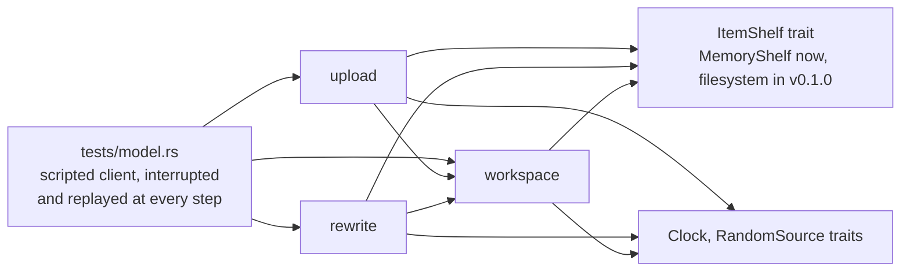

# Delivery Plan 00001: Protocol Spike

> [!abstract] Plan status: `approved`
> Runs the experiment of IDEA-00001 r03 §14: a complete OpenAPI contract, an
> in-memory model of uploads and encryption changes that survives a client
> interrupted or replaying at every step, and a function-by-function mapping
> of the client's encryption code onto the API. It builds no server. D-02
> was settled at approval: a fresh start is one atomic call.

## 1. Objective and outcome

IDEA-00001 r03 has one Major finding left, MAJ-01: the rewrite protocol is a
design that has not met the client's `encryption/` code, nor been tested
against interrupted and repeated requests. This plan produces the evidence
that decides it:

1. `docs/api/openapi.json`, complete, with the replay semantics of every
   request.
2. The workspace, upload, and rewrite-session rules as tested code in
   `passalong-server-core`, over an in-memory store, with a model test that
   interrupts and replays a scripted client at every step and asserts that
   the workspace stays consistent.
3. A mapping of every public function of the client's encryption admin code
   onto an API operation, showing what the v0.3.0 client must refactor.
4. A decided default for `limits.max_item_bytes`.

The outcome is a verdict against r03's thresholds: accept IDEA-00001 and
plan server v0.1.0, or revise towards its option E.

## 2. Source traceability

| Requirement | Source | Source location | Interpretation |
|---|---|---|---|
| PLAN-00001-REQ-01 | Idea | `docs/ideas/00001-HTTPS_Server_Backend-r03.md` §14 Method (1); IDEA-00001-R03-LOW-02 | The OpenAPI document, complete, with replay semantics |
| PLAN-00001-REQ-02 | Idea; Repository | r03 §12 "Encryption"; client `crates/passalong-core/src/encryption/admin.rs`, `set_up`, `fresh_start`, `change_words`, `join` | The workspace encryption state machine and its one-shot changes |
| PLAN-00001-REQ-03 | Idea | IDEA-00001-R03-MED-05, -MED-03 | The upload lifecycle: replays, quota, atomic deduplication |
| PLAN-00001-REQ-04 | Idea; Repository | IDEA-00001-R03-MAJ-01; client `encryption/rewrite.rs`, `migrate`, `rotate`, `finish`, `undo`, `run` | The rewrite session: lease, staging, commit, abort, take-over, replays |
| PLAN-00001-REQ-05 | Idea | r03 §14 Method (2), Success threshold | The interruption-and-replay model test |
| PLAN-00001-REQ-06 | Idea | r03 §14 Method (3); assumption A-02 | The client-side mapping and `EncryptionAdmin` sketch |
| PLAN-00001-REQ-07 | Idea | IDEA-00001-R03-LOW-03; r03 §15 | A decided default for `limits.max_item_bytes` |
| PLAN-00001-REQ-08 | Repository | `AGENTS.md`, "Non-negotiables", "Stack"; r03 §14 "Risks and safeguards" | Spike code meets the repository's standard, or is discarded |

## 3. Repository baseline

| Field | Value |
|---|---|
| Repository | `joelee/passalong-server` (from `Cargo.toml`; no Git remote is configured) |
| Branch | `main`; the plan is written on `feature/protocol-spike`, created from it |
| HEAD | `d33da2046634d655779a6ad960e96075adc3362c` |
| Working tree at publication | Clean, apart from this file as allocated |
| Applicable instructions | `AGENTS.md`; `docs/plans/AGENTS.md`; `docs/ideas/AGENTS.md` |
| Client baseline (read only) | `../passalong` at `785a276061c4b47400b16ff89982470d5489a65e`, tag `v0.2.1`, clean |

## 4. Scope

### In scope

- `docs/api/openapi.json`, and `docs/api/README.md` kept equal to it.
- New modules in `crates/passalong-server-core`: identifiers, clock and
  randomness traits, an in-memory item shelf, the workspace state machine,
  uploads, and rewrite sessions.
- A model test in `crates/passalong-server-core/tests/`.
- `docs/api/rewrite-session.md`: the crash table and the replay table.
- `docs/api/client-encryption-mapping.md`.
- `limits.max_item_bytes` in `docs/configuration.md` and
  `config.sample.toml`.
- `docs/architecture.md`, `docs/backlog.md`, and `CHANGELOG.md`, where the
  findings change them.

### Out of scope

- HTTP, TLS, authentication, API keys, the control database, the
  filesystem store, the CLI, Docker, and systemd: all of server v0.1.0.
- Any change to the client repository. It is read, never written.
- A new revision of IDEA-00001. The spike's verdict is its input; the user
  decides, and r04 follows the ideas guide.
- Third-party dependencies beyond `serde` and `serde_json`.

## 5. Constraints and preserved decisions

- The user's decisions of 2026-09-18 (r03 §17) stand: item-level API, REST +
  JSON, the envelope, the full rewrite session in v0.1, one key per
  workspace, nothing published.
- The server never interprets `meta`. The model stores it as opaque bytes.
- Nothing from this repository enters the client, and the reverse holds for
  code: the model is written from the client's documented behaviour, not
  copied from its sources (`AGENTS.md`, "Scope").
- Test first; external interfaces mocked: the clock and randomness are
  traits from the first commit (`AGENTS.md`, "Non-negotiables").
- Line coverage of at least 80 %; `unsafe` forbidden; no `println!` for logs.
- The model has no I/O, so it has no logging yet; log points are named in
  rustdoc where v0.1.0 will add them.

## 6. Assumptions

None. Unresolved matters are recorded as decisions and block approval when
material.

## 7. Decisions and blockers

| ID | Decision or blocker | Resolution | Owner | Status |
|---|---|---|---|---|
| PLAN-00001-D-01 | IDEA-00001 is `revised`, not `accepted`, and `docs/plans/AGENTS.md` wants an accepted source | The user's instruction of 2026-09-18, "start the protocol spike", authorises planning the experiment of r03 §14 from the non-accepted revision. It authorises nothing beyond the spike | @joelee | Resolved |
| PLAN-00001-D-02 | r03 makes a fresh start a rewrite-session kind (`FRESH_START`). The client does not: `fresh_start` is a journalled *header change* that re-encrypts nothing, like `set_up` and `change_words` (`encryption/admin.rs`, `run_change(.., HeaderChangeKind::FreshStart, ..)`); only `Migrate` and `Rotate` are `RewriteKind`s (`encryption/rewrite.rs`) | Proposed: the API follows the client. `freshStart` becomes one atomic call that moves the current generation to the `plain` partition and installs the header; sessions exist for `migrate` and `rotate` only. Fewer states, no lease for an operation that takes milliseconds, and the same shape as the code the client will call it from | @joelee | Resolved 2026-09-18T16:56:56Z: accepted. `freshStart` is one atomic call; sessions are for `migrate` and `rotate` only |
| PLAN-00001-D-03 | Where the spike's code lives | In `passalong-server-core` as real modules, kept only if they meet REQ-08; v0.1.0 then puts the filesystem and the database behind the traits the model introduces | Planner | Resolved |
| PLAN-00001-D-04 | A JSON parser is needed to test `openapi.json` | `serde` and `serde_json`, which the server needs in any case; `just audit` must pass with them. No other dependency | Planner | Resolved |

## 8. Affected architecture and components

Only `passalong-server-core` gains code. The API and CLI crates are
untouched.

| Path | Change |
|---|---|
| `crates/passalong-server-core/src/lib.rs` | Declares the modules below |
| `…/src/ids.rs` | `ItemId` (strict `<8 hex>-<12 hex>`), `KeyId`, `UploadId`, `ApiKeyId`; parsing only, no cryptography |
| `…/src/clock.rs`, `…/src/random.rs` | `Clock` and `RandomSource` traits with manual and seeded test doubles |
| `…/src/shelf.rs` | `ItemShelf`: the storage the rules need (stage, publish-if-absent, read, remove, move a generation aside), with `MemoryShelf` |
| `…/src/workspace.rs` | `Workspace`: encryption state, generation pointer, key id, header, quota; `enable_encryption`, `replace_header`, `fresh_start` |
| `…/src/upload.rs` | `begin`, `put_content`, `commit`, `abort`; tombstones; quota reservation |
| `…/src/rewrite.rs` | `begin`, `heartbeat`, `take_over`, `commit`, `abort`; staged generation; lease |
| `…/src/error.rs` | One error enum whose variants are the API's error codes |
| `…/tests/model.rs` | The interruption-and-replay model test |
| `…/tests/openapi.rs` | `openapi.json` parses, and agrees with `docs/api/README.md` |
| `docs/api/openapi.json`, `README.md`, `rewrite-session.md`, `client-encryption-mapping.md` | The contract and the evidence |
| `Cargo.toml`, `Cargo.lock`, `deny.toml` | `serde`, `serde_json` |

## 9. Requirement catalogue

### PLAN-00001-REQ-01 — Complete OpenAPI contract

- **Requirement:** `docs/api/openapi.json` is an OpenAPI 3.1 document holding
  every operation of `docs/api/README.md`, its request and response schemas,
  its error codes with HTTP statuses, and, for every operation that is not a
  `GET`, an `x-passalong-replay` field stating the answer to the same
  request sent again.
- **Rationale:** It is the only thing the client implements from; replay
  semantics left to prose get implemented differently on each side.
- **Source:** r03 §14 Method (1); IDEA-00001-R03-LOW-02, -MED-05.
- **Acceptance evidence:** `tests/openapi.rs`.

### PLAN-00001-REQ-02 — Workspace state machine and one-shot changes

- **Requirement:** A workspace is `Plaintext`, `Sealed`, or `Rewriting`, and
  holds a generation pointer, a key id, an opaque header, and a quota.
  `enable_encryption` succeeds only on an empty plaintext workspace;
  `replace_header` only with the current key id; `fresh_start` (subject to
  D-02) moves the current generation to the `plain` partition and installs
  the header in one step. Each, sent again once its effect is in place,
  answers the current state. Every write names the key id it was made under
  and is refused with `KEY_ID_MISMATCH` otherwise.
- **Rationale:** These are the changes the client makes without re-encrypting
  an item; they need atomicity, not a session.
- **Source:** r03 §12; client `encryption/admin.rs`.
- **Acceptance evidence:** Unit tests in `workspace.rs`; the model test.

### PLAN-00001-REQ-03 — Upload lifecycle with replays

- **Requirement:** `begin` reserves quota and returns a ticket, or the
  existing item when the content key is stored; repeated by the same key
  with the same id and size, it returns the live ticket and reserves
  nothing more. `put_content` may be repeated until commit and is
  acknowledged and ignored after. `commit` checks the size, deduplicates by
  content key, and publishes, all under the workspace lock; repeated, it
  returns the same outcome, including the original `created`, from a
  tombstone kept for a configured time, and `NOT_FOUND` after. `abort` is
  idempotent. Reserved quota is released on commit, abort, and expiry.
- **Rationale:** `serve` retries on poor links; lost answers are the normal
  case.
- **Source:** IDEA-00001-R03-MED-05, -MED-03.
- **Acceptance evidence:** Unit tests in `upload.rs`; invariants I4 and I5
  of the model test.

### PLAN-00001-REQ-04 — Rewrite session

- **Requirement:** `begin` (kinds `migrate` and `rotate`) takes a lease,
  records the new key id and header, and refuses other writers with
  `REWRITE_IN_PROGRESS`. The holder stages items into the next generation
  through the upload lifecycle; an id already staged is skipped. `commit`
  switches the generation pointer, header, and key id in one step and
  refuses unless every source item has a staged counterpart, by count.
  `abort` drops the staged generation and restores the state before
  `begin`. `heartbeat` extends the lease; `take_over` succeeds only once it
  expired, after which the former holder's requests are refused. `commit`
  and `abort` whose effect is in place answer the current state; `begin`
  repeated by the holder answers the live session.
- **Rationale:** IDEA-00001-R03-MAJ-01.
- **Source:** r03 §12; client `encryption/rewrite.rs`.
- **Acceptance evidence:** Unit tests in `rewrite.rs`; the model test.

### PLAN-00001-REQ-05 — Interruption-and-replay model test

- **Requirement:** A scripted client performs each scenario: upload; enable
  on empty; change of words; fresh start; migrate; rotate; abort of each
  rewrite; take-over by a second client. For every scenario and every
  request index *n*, the test runs the variants "stop after *n*" and "send
  request *n* twice", then lets a second client recover by resuming or
  aborting, and asserts after every request:
  - **I1** the workspace is in exactly one state, and a session exists
    exactly when that state is `Rewriting`;
  - **I2** every item of the current generation was uploaded under the key
    id the workspace names;
  - **I3** no content is lost: the set of content fingerprints after commit
    or abort equals the set before `begin`, plus completed uploads;
  - **I4** used plus reserved bytes equal the bytes the shelf holds;
  - **I5** each upload id has at most one outcome, and replays return it.
  The test prints how many variants it ran.
- **Rationale:** r03 §14's success threshold, made executable.
- **Source:** r03 §14 Method (2).
- **Acceptance evidence:** `cargo test -p passalong-server-core --test model`.

### PLAN-00001-REQ-06 — Client mapping and `EncryptionAdmin` sketch

- **Requirement:** `docs/api/client-encryption-mapping.md` lists every `pub`
  function of the client's `encryption/admin.rs`, `rewrite.rs`,
  `header_change.rs`, `journal.rs`, and `open.rs` at v0.2.1 with: what it
  does to the store; the API operation that replaces it, or "local only",
  or "not needed over HTTPS" with the reason; and whether the function's
  cryptography (`crypto/`, `Sealer`, `FsStore::sealed`) would have to
  change. It ends with a sketch, as Rust signatures in a code block, of an
  `EncryptionAdmin` trait with a `RemoteFs` and an HTTPS implementation,
  and a statement of r03's failure threshold: does the refactor reach into
  `crypto/`?
- **Rationale:** Assumption A-02 has confidence Low; this is its test.
- **Source:** r03 §14 Method (3).
- **Acceptance evidence:** The document; AC-05.

### PLAN-00001-REQ-07 — Default for `limits.max_item_bytes`

- **Requirement:** `docs/configuration.md` and `config.sample.toml` name a
  default and the reasoning, which weighs parity with the `ssh` and `local`
  backends (no limit), the workspace quota as the real bound, and exposure
  of a server reachable from the internet. No "undecided" or "PLACEHOLDER"
  remains.
- **Rationale:** IDEA-00001-R03-LOW-03.
- **Source:** r03 §15.
- **Acceptance evidence:** AC-06.

### PLAN-00001-REQ-08 — The repository's standard, or discard

- **Requirement:** Every production line is preceded by a failing test;
  `just check` passes with line coverage of at least 80 %; `just audit`
  passes; third-party dependencies are `serde` and `serde_json` only; the
  clock and randomness are injected.
- **Rationale:** r03 §14: spike code is kept only if written to the
  repository's standard.
- **Source:** `AGENTS.md`, "Non-negotiables".
- **Acceptance evidence:** AC-01, AC-02.

## 10. Delivery strategy

Bottom up, one module per step, each test first and each leaving
`just check` green: identifiers and test doubles, then the workspace, then
uploads, then the rewrite session, which uses both. The model test comes
after the modules so that it tests their composition, and before the
OpenAPI document so that what the document promises is what was shown to
hold. The client mapping is independent of the code and may run in
parallel with steps 2 to 5. Documents are reconciled last.

The checkpoint is after step 5: if an invariant cannot be made to hold, the
Builder stops and reports, because that is the spike's failure threshold
and the remaining steps would document a design that does not work.

## 11. Detailed implementation steps

### PLAN-00001-STEP-01 — Branch bookkeeping and dependencies

- **Objective:** Record the work and add the two dependencies.
- **Requirements:** `PLAN-00001-REQ-08`
- **Depends on:** None
- **Affected components:** `CHANGELOG.md`, `docs/backlog.md`, `Cargo.toml`,
  `Cargo.lock`, `crates/passalong-server-core/Cargo.toml`
- **Preconditions:** Plan approved; clean tree; branch
  `feature/protocol-spike`.
- **Test or evidence first:** `just audit` fails or passes on the baseline;
  record which, since the baseline has no third-party crates.
- **Implementation tasks:**
  1. `CHANGELOG.md`: a line under `Unreleased`.
  2. `docs/backlog.md`: mark the protocol spike as active under PLAN-00001.
  3. Add `serde` (derive) and `serde_json` to `[workspace.dependencies]`,
     and to the core crate, `serde_json` as a dev-dependency if nothing but
     tests needs it.
- **Documentation/configuration/operations:** None beyond the above.
- **Verification:** `just check`; `just audit`.
- **Completion criteria:** Both exit 0.
- **Rollback or recovery:** Revert the commit.
- **Builder stop conditions:** `just audit` rejects either crate's licence
  or reports a duplicate version.

### PLAN-00001-STEP-02 — Identifiers, test doubles, shelf, and workspace

- **Objective:** REQ-02.
- **Requirements:** `PLAN-00001-REQ-02`, `PLAN-00001-REQ-08`
- **Depends on:** `PLAN-00001-STEP-01`
- **Affected components:** `ids.rs`, `clock.rs`, `random.rs`, `shelf.rs`,
  `workspace.rs`, `error.rs`, `lib.rs`
- **Preconditions:** D-02 settled by the plan's approval.
- **Test or evidence first:** Tests for `ItemId::parse` (accepts only
  `<8 hex>-<12 hex>`, lower case; rejects `/`, `..`, upper case, wrong
  lengths); for each one-shot change, its success, each refusal, and its
  replay.
- **Implementation tasks:**
  1. `ids.rs`, `error.rs`, `clock.rs`, `random.rs`.
  2. `ItemShelf` and `MemoryShelf`, with publish-if-absent and
     move-generation-aside as single operations.
  3. `Workspace` and the three one-shot changes.
- **Documentation/configuration/operations:** Rustdoc on every public item,
  naming the API operation and error code it serves.
- **Verification:** `just check`.
- **Completion criteria:** Exit 0; coverage at least 80 %.
- **Rollback or recovery:** Revert the step's commits.
- **Builder stop conditions:** A one-shot change cannot be made atomic over
  the `ItemShelf` operations without an operation no filesystem offers.

### PLAN-00001-STEP-03 — Upload lifecycle

- **Objective:** REQ-03.
- **Requirements:** `PLAN-00001-REQ-03`, `PLAN-00001-REQ-08`
- **Depends on:** `PLAN-00001-STEP-02`
- **Affected components:** `upload.rs`
- **Preconditions:** Step 2 complete.
- **Test or evidence first:** One test per row of the "Replays" table of
  `docs/api/README.md` that concerns uploads; quota reserved once under a
  repeated `begin`; two uploads of the same content committed in either
  order yield one item and one `created: true`; size mismatch refused;
  expiry releases the reservation.
- **Implementation tasks:**
  1. Tickets, staging, reservation.
  2. `commit` with deduplication by content key under the workspace lock.
  3. Tombstones and their expiry by the injected clock.
- **Documentation/configuration/operations:** Rustdoc as in step 2.
- **Verification:** `just check`.
- **Completion criteria:** Exit 0; coverage at least 80 %.
- **Rollback or recovery:** Revert the step's commits.
- **Builder stop conditions:** A replay row cannot be honoured without
  state the server could not keep across a restart; report which.

### PLAN-00001-STEP-04 — Rewrite session

- **Objective:** REQ-04.
- **Requirements:** `PLAN-00001-REQ-04`, `PLAN-00001-REQ-08`
- **Depends on:** `PLAN-00001-STEP-03`
- **Affected components:** `rewrite.rs`, `workspace.rs`, `upload.rs`
- **Preconditions:** Step 3 complete.
- **Test or evidence first:** `begin` refused in the wrong state and with
  the wrong key id; writers refused while it is open; staging skips an id
  already staged; `commit` refused while an item is unstaged; `commit` and
  `abort` and their replays; `take_over` refused before expiry and granted
  after; the former holder refused after a take-over.
- **Implementation tasks:**
  1. Session, lease, heartbeat, take-over.
  2. Staging through `upload` with a session id.
  3. `commit` and `abort` as single shelf operations plus one workspace
     update.
- **Documentation/configuration/operations:** Rustdoc as in step 2.
- **Verification:** `just check`.
- **Completion criteria:** Exit 0; coverage at least 80 %.
- **Rollback or recovery:** Revert the step's commits.
- **Builder stop conditions:** A rewrite kind needs filesystem semantics
  the session cannot express. This is r03's failure threshold: stop and
  report.

### PLAN-00001-STEP-05 — Model test

- **Objective:** REQ-05.
- **Requirements:** `PLAN-00001-REQ-05`
- **Depends on:** `PLAN-00001-STEP-04`
- **Affected components:** `crates/passalong-server-core/tests/model.rs`
- **Preconditions:** Steps 2 to 4 complete.
- **Test or evidence first:** The test is the deliverable. Write the
  invariant checker first and show it failing against a deliberately broken
  double, so that a passing run means something.
- **Implementation tasks:**
  1. A scripted client as a list of requests per scenario.
  2. The driver: for each scenario and each *n*, "stop after *n*" and
     "repeat *n*", then recovery by a second client, checking I1 to I5
     after every request.
  3. Print the number of variants run.
- **Documentation/configuration/operations:** `docs/api/rewrite-session.md`:
  the crash table (state after a stop at each step, and what recovery
  does) and the replay table, taken from the test's scenarios.
- **Verification:**
  `cargo test -p passalong-server-core --test model -- --nocapture`
- **Completion criteria:** Passes; the printed count is at least the number
  of requests summed over the scenarios, times two.
- **Rollback or recovery:** None needed; the test changes no production
  code.
- **Builder stop conditions:** An invariant fails and the fix would change
  the protocol of `docs/api/README.md` in a way a client would notice.
  Report the variant, the invariant, and the options.

### PLAN-00001-STEP-06 — OpenAPI document

- **Objective:** REQ-01.
- **Requirements:** `PLAN-00001-REQ-01`
- **Depends on:** `PLAN-00001-STEP-05`
- **Affected components:** `docs/api/openapi.json`, `docs/api/README.md`,
  `crates/passalong-server-core/tests/openapi.rs`
- **Preconditions:** The protocol is as the model test left it.
- **Test or evidence first:** `tests/openapi.rs`: the file parses as JSON;
  `openapi` starts with `3.1`; the set of `operationId`s equals the set
  named in the route tables of `README.md`; every operation that is not a
  `GET` has `x-passalong-replay`; every error code of `README.md` appears
  in `components`.
- **Implementation tasks:**
  1. Write the document by hand.
  2. Reconcile `README.md` with D-02 and anything step 5 changed.
- **Documentation/configuration/operations:** As above.
- **Verification:** `just check`.
- **Completion criteria:** Exit 0.
- **Rollback or recovery:** Revert the step's commits.
- **Builder stop conditions:** None.

### PLAN-00001-STEP-07 — Client mapping and trait sketch

- **Objective:** REQ-06.
- **Requirements:** `PLAN-00001-REQ-06`
- **Depends on:** None; its conclusions are checked against step 5.
- **Affected components:** `docs/api/client-encryption-mapping.md`
- **Preconditions:** `../passalong` at tag `v0.2.1`, clean.
- **Test or evidence first:** The list of `pub` functions, produced by
  command from the client's sources, so that none is missed.
- **Implementation tasks:**
  1. Read the five modules in full.
  2. Fill the mapping table.
  3. Sketch the trait and state the verdict on `crypto/`.
- **Documentation/configuration/operations:** The document states the
  client commit it was written against.
- **Verification:** `scripts/check-links.sh`;
  `git -C ../passalong status --short` prints nothing.
- **Completion criteria:** Every listed function has a row.
- **Rollback or recovery:** Delete the document.
- **Builder stop conditions:** A function has no counterpart and cannot be
  local. Report it; it is a gap in the API.

### PLAN-00001-STEP-08 — Item-size default, documents, and verdict

- **Objective:** REQ-07, and the hand-off.
- **Requirements:** `PLAN-00001-REQ-07`, `PLAN-00001-REQ-08`
- **Depends on:** `PLAN-00001-STEP-06`, `PLAN-00001-STEP-07`
- **Affected components:** `docs/configuration.md`, `config.sample.toml`,
  `docs/architecture.md`, `docs/backlog.md`, `CHANGELOG.md`
- **Preconditions:** Steps 1 to 7 complete.
- **Test or evidence first:** `grep -rn "undecided\|PLACEHOLDER"` over both
  configuration files, which finds them now.
- **Implementation tasks:**
  1. Decide and document the default.
  2. Bring `docs/architecture.md` in line with D-02 and the findings.
  3. Update the backlog.
  4. Write the verdict against r03 §14's thresholds in the completion
     summary of the work log.
- **Documentation/configuration/operations:** As above.
- **Verification:** `just check`; `just audit`; the grep prints nothing.
- **Completion criteria:** All exit 0; every acceptance criterion checked.
- **Rollback or recovery:** Revert the step's commits.
- **Builder stop conditions:** None.

## 12. Cross-cutting concerns

| Area | Applicability | Planned action or reason not applicable | Step or requirement |
|---|---|---|---|
| Compatibility and APIs | Applicable | The contract is drafted here; nothing is released, so nothing can break yet. D-02 changes the draft | REQ-01, D-02 |
| Data and migration | Not applicable | The model holds data in memory only | — |
| Security and privacy | Applicable | Strict id parsing; `meta` opaque; no key material exists in the model beyond opaque headers and key ids | REQ-02, STEP-02 |
| Performance and scale | Not applicable | Nothing is measured; the model says nothing about throughput | — |
| Reliability and failure handling | Applicable | The subject of the spike | REQ-03, REQ-04, REQ-05 |
| Observability and operations | Not applicable | No I/O, so no logging yet; rustdoc names the log points | §5 |
| Dependencies and supply chain | Applicable | `serde`, `serde_json`; `just audit` | STEP-01 |
| Accessibility and UX | Not applicable | No user interface | — |
| Documentation and release | Applicable | API documents, architecture, configuration, backlog, changelog. No release | STEP-06 to STEP-08 |
| Deployment and rollback | Not applicable | Nothing is deployed | — |

## 13. Verification strategy

| Level | Evidence or command | When | Required result |
|---|---|---|---|
| Unit | `cargo test --workspace --all-targets --all-features` | Every step | Pass |
| Model | `cargo test -p passalong-server-core --test model -- --nocapture` | Step 5 on | Pass; variant count printed |
| Contract | `cargo test -p passalong-server-core --test openapi` | Step 6 on | Pass |
| Gates | `just check` | Every step | Exit 0; coverage at least 80 % |
| Supply chain | `just audit` | Steps 1 and 8 | Exit 0 |
| Isolation | `git -C ../passalong status --short` | Steps 7 and 8 | No output |

## 14. Acceptance criteria

- [ ] `PLAN-00001-AC-01` `just check` exits 0 on `feature/protocol-spike`,
      and the reported line coverage is at least 80 %.
- [ ] `PLAN-00001-AC-02` `just audit` exits 0, and the only third-party
      crates named in any `Cargo.toml` are `serde` and `serde_json`.
- [ ] `PLAN-00001-AC-03` The model test passes, covers the eight scenarios
      of REQ-05 in both variants for every request index, asserts I1 to I5
      after every request, and prints its variant count.
- [ ] `PLAN-00001-AC-04` `docs/api/openapi.json` is OpenAPI 3.1; its
      `operationId`s equal those of `docs/api/README.md`; every operation
      that is not a `GET` carries `x-passalong-replay`; a test enforces all
      three.
- [ ] `PLAN-00001-AC-05` `docs/api/client-encryption-mapping.md` has a row
      for every `pub` function of the five client modules at v0.2.1, names
      the client commit, contains the `EncryptionAdmin` sketch, and answers
      yes or no to "does the refactor reach into `crypto/`?".
- [ ] `PLAN-00001-AC-06` `docs/configuration.md` and `config.sample.toml`
      state a default for `limits.max_item_bytes` with its reasoning, and
      neither contains "undecided" or "PLACEHOLDER".
- [ ] `PLAN-00001-AC-07` `docs/api/rewrite-session.md` holds a crash table
      with a row for every request of the migrate and rotate scenarios, and
      a replay table with a row for every operation that is not a `GET`.
- [ ] `PLAN-00001-AC-08` `git -C ../passalong status --short` prints
      nothing, and its `HEAD` is unchanged from §3.
- [ ] `PLAN-00001-AC-09` The completion summary states, for each of r03
      §14's success and failure thresholds, whether it was met, with the
      evidence, and recommends "accept" or "revise towards option E".

## 15. Risks and mitigations

| Risk | Likelihood | Impact | Mitigation or test | Owner/step |
|---|---|---|---|---|
| An in-memory model proves atomicity that a filesystem cannot give | Medium | High | `ItemShelf` offers only operations a POSIX filesystem has: rename-if-absent of a directory, and a rename of a generation directory. Step 2's stop condition guards it | STEP-02 |
| The model test passes because its invariants are weak | Medium | High | The checker is first shown failing against a broken double | STEP-05 |
| The client's encryption admin is more entangled with `RemoteFs` than `rewrite.rs` suggests (`open.rs`, `header_change.rs` not yet read in full) | Medium | High | Step 7 reads all five modules; a gap stops the step | STEP-07 |
| The spike grows into server v0.1.0 | Medium | Medium | §4 "Out of scope"; no I/O in any module | Builder |
| `serde_json` brings a duplicate crate version under `multiple-versions = "deny"` | Low | Low | `just audit` in step 1; a `skip` entry with its reason, as the client does | STEP-01 |

## 16. Builder hand-off

- **Start condition:** User approval and a clean repository.
- **First step:** `PLAN-00001-STEP-01`.
- **Required sequence:** 1, 2, 3, 4, 5, 6, 8.
- **Parallel-safe work:** Step 7, any time after step 1.
- **Do not change:** approved scope, requirements, steps, acceptance
  criteria, or content outside Builder's permitted work-log area. Never
  write to `../passalong`.
- **Escalate when:** a stop condition is met; above all an invariant that
  cannot hold (step 5) or a rewrite kind the session cannot express
  (step 4).
- **Completion hand-off:** The verdict of AC-09, the coverage figure, the
  variant count, and the list of changed files. The user then decides on
  IDEA-00001; r04 records that decision.

<!-- BUILDER_WORK_LOG_START -->
## 17. Builder Work Log

> [!warning] Builder-maintained section
> The planner creates this section. After approval, Builder may update only
> this delimited section and the Builder-maintained front-matter fields.
> Builder must preserve prior entries and use UTC timestamps.

### Step status

| Step | Status | Started (UTC) | Completed (UTC) | Evidence | Builder notes |
|---|---|---|---|---|---|
| PLAN-00001-STEP-01 | not-started | — | — | — | — |
| PLAN-00001-STEP-02 | not-started | — | — | — | — |
| PLAN-00001-STEP-03 | not-started | — | — | — | — |
| PLAN-00001-STEP-04 | not-started | — | — | — | — |
| PLAN-00001-STEP-05 | not-started | — | — | — | — |
| PLAN-00001-STEP-06 | not-started | — | — | — | — |
| PLAN-00001-STEP-07 | not-started | — | — | — | — |
| PLAN-00001-STEP-08 | not-started | — | — | — | — |

Allowed status values: `not-started`, `in-progress`, `blocked`, `completed`,
`skipped`. A skipped step requires explicit user approval recorded in Evidence.

### Execution log

| Timestamp (UTC) | Step | Event | Evidence or reference | Next action |
|---|---|---|---|---|

### Deviations and blockers

| Timestamp (UTC) | Step | Deviation or blocker | Impact | Decision required from |
|---|---|---|---|---|

None.

### Verification results

| Timestamp (UTC) | Step | Command or check | Result | Evidence |
|---|---|---|---|---|

### Completion summary

- **Implementation status:** `not-started`
- **Completed requirements:** None
- **Incomplete requirements:** All
- **Outstanding blockers:** None
- **Review request:** Not ready
<!-- BUILDER_WORK_LOG_END -->

## 18. Planning change log

| Timestamp (UTC) | Plan status | Change | Reason | Requested/approved by |
|---|---|---|---|---|
| 2026-09-18T16:33:26Z | draft | Plan created | "start the protocol spike" | @joelee |
| 2026-09-18T16:56:56Z | approved | Approved; D-02 resolved as proposed (one atomic call), confirmed by the user when asked which reading of "with FRESH START for D-02" was meant | User approval | @joelee |

## 19. External references

None.

## 20. Confidence

**Medium.** The server repository was read in full and the client's
`rewrite.rs` and the change functions of `admin.rs` were read before
planning, which produced D-02. The client's `header_change.rs`,
`journal.rs`, and `open.rs` were outlined but not read in full, so step 7
may still find an operation with no counterpart; that is what it is for.
