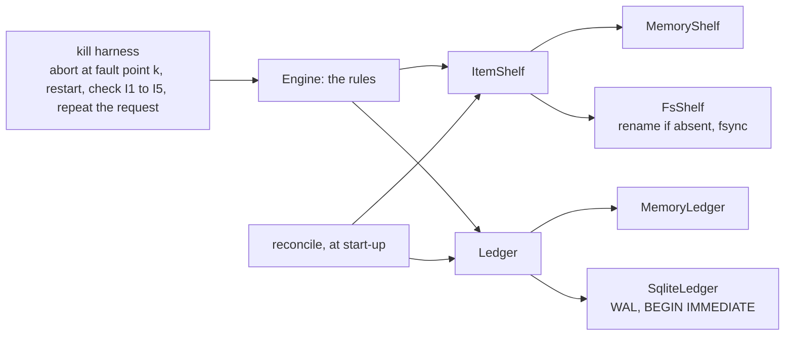

# Delivery Plan 00002: Storage Under The Rules

> [!abstract] Plan status: `draft`
> The first slice of server v0.1.0, and the experiment of IDEA-00001 r04
> §14: a filesystem shelf and a SQLite control database under the rules the
> protocol spike proved, with the process killed at every boundary between
> the two. No HTTP, no API keys, no CLI. Two decisions, D-01 (this plan is
> one slice, not all of v0.1.0) and D-02 (synchronous I/O in the core),
> await the user; approving the plan accepts both.

## 1. Objective and outcome

The protocol spike proved the rules of workspaces, uploads, and rewrite
sessions over memory, reached through `&mut self`. In a server, "one step"
is a rename on a filesystem and a transaction in a database: two steps, in
an order that matters, in a process that can die between them and beside
another process, the operations CLI, that shares both. IDEA-00001-R04-MED-01
is that gap.

This plan closes it. When it is done:

1. An `Engine` runs over a `FsShelf` and a `SqliteLedger` exactly as it
   runs over memory, and the spike's model test passes over them unchanged.
2. A harness kills the process at every boundary between a shelf operation
   and the ledger transaction that records it, restarts, and finds the
   invariants I1 to I5 holding and every interrupted request repeatable.
3. Two processes work on one workspace at once without breaking either.

The outcome is r04 §14's decision: build the HTTP surface on top, or
revisit how items are recorded.

## 2. Source traceability

| Requirement | Source | Source location | Interpretation |
|---|---|---|---|
| PLAN-00002-REQ-01 | Idea; Repository | IDEA-00001-R04-MED-01; `crates/passalong-server-core/src/workspace.rs`, `Engine` | Everything the engine remembers goes behind a `Ledger`, one transaction per operation |
| PLAN-00002-REQ-02 | Idea; Repository | IDEA-00001-R04-LOW-03; `src/shelf.rs`, `ItemShelf::stage_write(.., Vec<u8>)` | The shelf streams; no item is held in memory |
| PLAN-00002-REQ-03 | Idea | r04 §12 "Items"; `docs/architecture.md`, "Storage layout" | The filesystem shelf |
| PLAN-00002-REQ-04 | Idea | IDEA-00001-R04-MED-03; assumption A-04; `docs/architecture.md`, "Failing closed" | The SQLite ledger |
| PLAN-00002-REQ-05 | Idea | IDEA-00001-R04-MED-01, "Mitigation or test" | Order, idempotent commit, reconciliation at start-up |
| PLAN-00002-REQ-06 | Idea | r04 §14, "Method" and "Success threshold" | The kill harness |
| PLAN-00002-REQ-07 | Idea | r04 §14, "Success threshold" | The model test over the real stores |
| PLAN-00002-REQ-08 | Idea | IDEA-00001-R04-MED-03; assumption A-04 | Two processes, one workspace |
| PLAN-00002-REQ-09 | Repository | `AGENTS.md`, "Non-negotiables", "Observability", "Stack" | The repository's standard, now including logging |

## 3. Repository baseline

| Field | Value |
|---|---|
| Repository | `joelee/passalong-server` (from `Cargo.toml`; no Git remote is configured) |
| Branch | `main`; the plan is written on `feature/storage-slice`, created from it |
| HEAD | `aafa329b3f76b70ebd5d36e0a2d7c04255a4974c` |
| Working tree at publication | Clean, apart from this file as allocated |
| Applicable instructions | `AGENTS.md`; `docs/plans/AGENTS.md` |
| Tests at the baseline | 46 unit, 4 model, 8 contract; line coverage 99 % |

## 4. Scope

### In scope

- `passalong-server-core`: a `Ledger` trait with `MemoryLedger` and
  `SqliteLedger`; a streaming `ItemShelf` with `MemoryShelf` and `FsShelf`;
  the `Engine` refactored onto both; reconciliation; logging with `tracing`.
- Tests: conformance suites shared by both shelves and both ledgers; the
  model test over the real stores; a kill harness; a two-process test.
- Documents: `docs/architecture.md`, `docs/configuration.md`,
  `docs/developer-guide.md`, `docs/backlog.md`, `CHANGELOG.md`.

### Out of scope

- HTTP, TLS, authentication, API keys, the operations CLI, configuration
  loading, Docker, systemd. Each is a later slice with its own plan (D-01).
- The API contract. If this slice shows that `docs/api/` must change, that
  is a stop condition, not a task.
- The plaintext content check (IDEA-00001-R04-LOW-05): it needs SHA-256 and
  belongs with the upload route.
- An in-memory id index per workspace. Listing reads the directory; the
  index is an optimisation for the slice that can measure it.
- Power loss. The harness kills a process; it cannot cut power. D-03 says
  what is done about durability and what is not claimed.
- Any change to the client repository.

## 5. Constraints and preserved decisions

- IDEA-00001 r04 as accepted: item-level API, REST + JSON, the envelope,
  the full rewrite session, `REWRITE_ENDED`, `partition=staged`, a fresh
  start as one atomic call, twice the quota during a rewrite.
- `ItemShelf` keeps to operations a POSIX filesystem performs in one step.
  The spike chose them for this plan; adding one needs the same property.
- `content` and `meta.json` on disk stay byte-identical to the client's
  files (r04 §12), so import and export remain a copy.
- The filesystem is the only record of items; the ledger never lists them.
- Every path is built from a workspace id the server minted and ids that
  passed strict parsing. No request text reaches a path otherwise.
- Test first; clock and randomness injected; `unsafe` forbidden; coverage
  of at least 80 %.
- Logs carry workspace ids, item ids, upload ids, sizes, and outcomes;
  never `meta`, content, or a header (`AGENTS.md`, "Observability").

## 6. Assumptions

None. Unresolved matters are recorded as decisions and block approval when
material.

## 7. Decisions and blockers

| ID | Decision or blocker | Resolution | Owner | Status |
|---|---|---|---|---|
| PLAN-00002-D-01 | r04 §18 names PLAN-00002 "server v0.1.0". All of v0.1.0 in one plan would run to some forty steps, and its first slice is an experiment whose failure would change the rest | Proposed: PLAN-00002 is the storage slice only. Later slices get their own plans, written when this one's verdict is known: API keys and the CLI; the HTTP surface and TLS; Docker and systemd | @joelee | **Open.** Approving this plan accepts the proposal |
| PLAN-00002-D-02 | Asynchronous or synchronous I/O in the core | Proposed: synchronous (`std::fs`, `rusqlite`), streams as `std::io::Read`. SQLite is synchronous in any case, the rules are short critical sections under a workspace lock, and the HTTP slice calls them from a blocking pool. The core stays free of a runtime, and the kill harness and the CLI need none | @joelee | **Open.** Approving this plan accepts the proposal |
| PLAN-00002-D-03 | Durability | A published item's `content` is flushed (`sync_all`) before the rename and its parent directory after; SQLite runs with `synchronous = FULL` in WAL mode. This is the ordinary care; it is not tested, because a test cannot cut power, and no claim is made beyond it | Planner | Resolved |
| PLAN-00002-D-04 | The ledger's form: tables, or one document per workspace | Tables: `workspaces`, `generations`, `uploads`, `tombstones`, `ended_rewrites`, and `schema_version`. The CLI of the next slice queries them (`workspace show`, later `key list`), and a document would have to be rewritten whole on every upload | Planner | Resolved |
| PLAN-00002-D-05 | Where the envelope's server-side fields live (`under`, `receivedAt`) | In `server.json` beside `content` and `meta.json`, written before the publish. The filesystem stays the only record of items, and an export is still a copy that may leave one file out | Planner | Resolved |
| PLAN-00002-D-06 | Dependencies | `rusqlite` with `bundled`, `serde`, `serde_json`, `tracing`; `tempfile` for tests. `rusqlite` 0.37 with `bundled` was tried against `deny.toml` on a copy outside the repository on 2026-09-18: advisories, bans, licences, and sources all pass, with no duplicate version. Step 1 repeats the check with the versions it locks | Planner | Resolved |

## 8. Affected architecture and components

Only `passalong-server-core` changes. The rules move onto two traits; the
memory implementations stay, for unit tests and as the reference the real
ones are compared with.

| Path | Change |
|---|---|
| `src/ledger/mod.rs` | New. `Ledger`: `transact(workspace, |record| …)`, all or nothing; `WorkspaceRecord`: encryption state, session, generation pointers, byte counters, ended rewrites, tickets, tombstones |
| `src/ledger/memory.rs` | New. What `Engine` holds in fields today |
| `src/ledger/sqlite.rs` | New. WAL, `synchronous = FULL`, busy timeout, `BEGIN IMMEDIATE`, schema version |
| `src/shelf/mod.rs` | `ItemShelf` streams: content in as `&mut dyn Read`, out as `Box<dyn Read>`; `Envelope` unchanged |
| `src/shelf/memory.rs`, `src/shelf/fs.rs` | The memory shelf moved; the filesystem shelf new |
| `src/workspace.rs`, `upload.rs`, `rewrite.rs` | Each operation becomes: shelf step, then one ledger transaction. `commit_upload` finishes a publish that was made and not recorded |
| `src/reconcile.rs` | New. At start-up: counters from the shelf, staging without a ticket, generations nothing points to |
| `src/error.rs` | `ServiceUnavailable`, already `SERVICE_UNAVAILABLE` in the contract |
| `src/fault.rs` | New, test support: named fault points the kill harness aborts at; compiled to nothing otherwise |
| `tests/shelf_conformance.rs`, `tests/ledger_conformance.rs` | New. One suite, two implementations each |
| `tests/model.rs` | Generic over the ledger too; runs over memory and over the real stores |
| `tests/kill.rs`, `src/bin/` or `examples/kill_child.rs` | New. The harness and the child it kills |
| `tests/two_processes.rs` | New |

## 9. Requirement catalogue

### PLAN-00002-REQ-01 — The ledger

- **Requirement:** Everything an `Engine` remembers between requests lives
  in a `WorkspaceRecord` behind a `Ledger`. Every API operation makes at
  most one ledger transaction, and an operation that is refused leaves the
  record as it was. `MemoryLedger` keeps today's behaviour. One ledger
  serves many workspaces, each under its own id.
- **Rationale:** A rule that mutates fields cannot be made transactional
  afterwards; the boundary has to exist before SQLite goes behind it.
- **Source:** IDEA-00001-R04-MED-01.
- **Acceptance evidence:** The 46 unit tests pass with their assertions
  unchanged; new tests show a refused operation changing nothing.

### PLAN-00002-REQ-02 — A shelf that streams

- **Requirement:** `ItemShelf` takes staged content from a reader and hands
  content out as a reader, enforcing the announced size while it writes:
  one byte too many ends the write with `CONTENT_MISMATCH` and leaves the
  staging place empty. No implementation holds a whole item in memory,
  shown by a test that stages an item larger than a small fixed buffer from
  a reader that counts what was read at once.
- **Rationale:** Item size is unbounded (IDEA-00001-R04-LOW-03).
- **Source:** `src/shelf.rs`.
- **Acceptance evidence:** `tests/shelf_conformance.rs`.

### PLAN-00002-REQ-03 — The filesystem shelf

- **Requirement:** `FsShelf` keeps `gen-<n>/items/<id>/{content, meta.json,
  server.json}` and `staging/<upload id>/` below one workspace directory.
  `publish` is a rename of the staging directory that fails when the target
  exists, never replacing it. Files are created 0600 and directories 0700.
  A workspace's shelf cannot be made to touch a path outside its directory:
  ids are the only path components, and they are the strict types of
  `ids.rs`. `content` and `meta.json` hold exactly the bytes given.
- **Rationale:** r04 §12; the layout the spike's trait was shaped for.
- **Source:** `docs/architecture.md`, "Storage layout".
- **Acceptance evidence:** `tests/shelf_conformance.rs` over `FsShelf`;
  tests of the mode bits and of two publishes racing for one id.

### PLAN-00002-REQ-04 — The SQLite ledger

- **Requirement:** `SqliteLedger` stores the tables of D-04 in one
  database, in WAL mode with `synchronous = FULL`, a busy timeout, and
  `BEGIN IMMEDIATE` for every transaction, so that writers in several
  processes queue instead of failing. It records a schema version and
  refuses a database of a newer one. A database that is locked beyond the
  timeout, unreadable, or corrupt yields `ServiceUnavailable`, never a
  default or a remembered record. The file is created 0600.
- **Rationale:** IDEA-00001-R04-MED-03; "Failing closed".
- **Source:** `docs/architecture.md`.
- **Acceptance evidence:** `tests/ledger_conformance.rs` over both ledgers;
  tests for a truncated database file, a newer schema version, and a lock
  held past the timeout by a second connection.

### PLAN-00002-REQ-05 — Order, idempotent commit, reconciliation

- **Requirement:** Where an operation touches both, the shelf step comes
  first and the ledger transaction second, so that a death between them
  leaves rubbish on disk and never a record of something that is not
  there. `commit_upload`, finding its item already published under the
  ticket's id with the announced size, records it and answers
  `created: true`, as the interrupted commit would have. `reconcile`, run
  when a workspace is opened, recomputes each live generation's bytes from
  the shelf, removes staging places without a ticket and generations
  nothing points to, and logs what it found. After it, I4 holds whatever
  the process was doing when it died.
- **Rationale:** IDEA-00001-R04-MED-01, "Mitigation or test".
- **Source:** r04.
- **Acceptance evidence:** In-process tests with a shelf and a ledger that
  fail at a chosen point; REQ-06.

### PLAN-00002-REQ-06 — The kill harness

- **Requirement:** Every boundary between a shelf operation and the ledger
  transaction that follows it, and between the shelf operations of one API
  operation, is a named fault point. For each scenario (upload; fresh
  start; migrate; rotate; abort; janitor) and each fault point it passes,
  the harness starts a child process that performs the scenario over
  `FsShelf` and `SqliteLedger` in a temporary directory and calls
  `std::process::abort` at that point; then, in the parent, opens the same
  directory, reconciles, checks I1 to I4, sends the interrupted request
  again, checks I5 and I1 to I4, and lets a second key resume or abort an
  open rewrite. The harness fails if any fault point was never reached.
- **Rationale:** r04 §14.
- **Source:** r04 §14.
- **Acceptance evidence:** `cargo test -p passalong-server-core --test kill
  -- --nocapture`, which prints the fault points and how often each fired.

### PLAN-00002-REQ-07 — The model test over the real stores

- **Requirement:** `tests/model.rs` runs its nine scenarios in all variants
  over `FsShelf` with `SqliteLedger`, in temporary directories, beside its
  runs over memory, with the same invariant checker.
- **Rationale:** r04 §14, "the same 210 variants pass".
- **Source:** r04 §14.
- **Acceptance evidence:** The test's printed variant count for each pair
  of stores.

### PLAN-00002-REQ-08 — Two processes, one workspace

- **Requirement:** Two processes open one data directory and work on one
  workspace at once: both upload, with overlapping content; one begins and
  aborts a rewrite while the other uploads. Every request ends in an
  outcome or a refusal the contract names; none ends in a SQLite error or
  a panic. Afterwards I1 to I4 hold and identical content is stored once.
- **Rationale:** The operations CLI will be that second process (A-04).
- **Source:** IDEA-00001-R04-MED-03.
- **Acceptance evidence:** `tests/two_processes.rs`.

### PLAN-00002-REQ-09 — The repository's standard

- **Requirement:** Test first; `just check` with line coverage of at least
  80 %; `just audit`; third-party crates limited to D-06. Shelf, ledger,
  and reconciliation log through `tracing` at the levels `AGENTS.md`
  names, with workspace, item, and upload ids, and a test asserts that no
  log record of a scripted session contains the session's `meta`, content,
  or header bytes.
- **Rationale:** With I/O comes logging, which the spike could defer.
- **Source:** `AGENTS.md`.
- **Acceptance evidence:** AC-01, AC-02, AC-09.

## 10. Delivery strategy

Boundaries before implementations. Steps 2 and 3 refactor onto the two
traits with memory behind them, and the existing tests are the net: they
must pass with their assertions unchanged, which shows the refactor changed
no rule. Only then do real stores go behind the traits, steps 4 and 5, each
proved equal to its memory twin by a conformance suite run over both. Step 6
makes the pair crash-safe in process, where failures are cheap to provoke
and to debug. Step 7 provokes them for real.

The checkpoint is step 7. If an invariant cannot be restored after some
kill by ordering and reconciliation alone, that is r04 §14's failure
threshold: the Builder stops and reports the fault point, the state found,
and the options.

## 11. Detailed implementation steps

### PLAN-00002-STEP-01 — Bookkeeping and dependencies

- **Objective:** Record the work; add the crates of D-06.
- **Requirements:** `PLAN-00002-REQ-09`
- **Depends on:** None
- **Affected components:** `CHANGELOG.md`, `docs/backlog.md`, `Cargo.toml`,
  `Cargo.lock`, `crates/passalong-server-core/Cargo.toml`, `deny.toml`
- **Preconditions:** Plan approved; clean tree; branch
  `feature/storage-slice`.
- **Test or evidence first:** `just audit` on the baseline, recorded.
- **Implementation tasks:**
  1. `CHANGELOG.md` under `Unreleased`; `docs/backlog.md` marks the slice
     active.
  2. Add the crates at their newest versions the toolchain accepts.
- **Documentation/configuration/operations:** None beyond the above.
- **Verification:** `just check`; `just audit`.
- **Completion criteria:** Both exit 0.
- **Rollback or recovery:** Revert the commit.
- **Builder stop conditions:** `just audit` fails and the remedy is more
  than a `skip` entry with its reason, as the client's `deny.toml` has.

### PLAN-00002-STEP-02 — The ledger boundary

- **Objective:** REQ-01.
- **Requirements:** `PLAN-00002-REQ-01`
- **Depends on:** `PLAN-00002-STEP-01`
- **Affected components:** `src/ledger/`, `src/workspace.rs`,
  `src/upload.rs`, `src/rewrite.rs`
- **Preconditions:** D-01 and D-02 settled by the plan's approval.
- **Test or evidence first:** New tests: a refused operation leaves the
  record unchanged, for one refusal of every operation; two workspaces in
  one ledger do not see each other. The existing unit tests stay as they
  are.
- **Implementation tasks:**
  1. `WorkspaceRecord`, `Ledger`, `MemoryLedger`.
  2. Move the engine's fields into the record; wrap each operation in one
     transaction.
- **Documentation/configuration/operations:** Rustdoc.
- **Verification:** `just check`.
- **Completion criteria:** Exit 0; no existing assertion was changed,
  shown by the diff of the test modules.
- **Rollback or recovery:** Revert the step's commits.
- **Builder stop conditions:** A rule needs two transactions to stay
  correct.

### PLAN-00002-STEP-03 — A shelf that streams

- **Objective:** REQ-02.
- **Requirements:** `PLAN-00002-REQ-02`
- **Depends on:** `PLAN-00002-STEP-02`
- **Affected components:** `src/shelf/`, `src/upload.rs`,
  `tests/shelf_conformance.rs`, `tests/model.rs`
- **Preconditions:** Step 2 complete.
- **Test or evidence first:** The conformance suite, written against the
  new trait and failing to compile: every rule of today's shelf tests, and
  the size cap, the counting reader, and reading content back in parts.
- **Implementation tasks:**
  1. The trait; `MemoryShelf` moved and adapted.
  2. `put_upload_content` takes a reader.
- **Documentation/configuration/operations:** Rustdoc.
- **Verification:** `just check`.
- **Completion criteria:** Exit 0.
- **Rollback or recovery:** Revert the step's commits.
- **Builder stop conditions:** None.

### PLAN-00002-STEP-04 — The filesystem shelf

- **Objective:** REQ-03.
- **Requirements:** `PLAN-00002-REQ-03`
- **Depends on:** `PLAN-00002-STEP-03`
- **Affected components:** `src/shelf/fs.rs`, `tests/shelf_conformance.rs`
- **Preconditions:** Step 3 complete.
- **Test or evidence first:** The conformance suite instantiated for
  `FsShelf` in a temporary directory; mode bits; two threads publishing one
  id, of which exactly one wins and the other's staging survives; bytes on
  disk equal to bytes given.
- **Implementation tasks:**
  1. Layout, staging, publish by rename with the flushes of D-03.
  2. Listing newest first from directory names; removal; dropping a
     generation, safe to repeat.
- **Documentation/configuration/operations:** `tracing` events.
- **Verification:** `just check`.
- **Completion criteria:** Exit 0.
- **Rollback or recovery:** Revert the step's commits.
- **Builder stop conditions:** The racing-publishes test shows a second
  publish replacing or merging into the first. Report the alternatives
  (`renameat2` with `RENAME_NOREPLACE` needs `unsafe` or a crate).

### PLAN-00002-STEP-05 — The SQLite ledger

- **Objective:** REQ-04.
- **Requirements:** `PLAN-00002-REQ-04`
- **Depends on:** `PLAN-00002-STEP-02`
- **Affected components:** `src/ledger/sqlite.rs`, `src/error.rs`,
  `tests/ledger_conformance.rs`
- **Preconditions:** Step 2 complete.
- **Test or evidence first:** The conformance suite over both ledgers:
  round trip of every field of the record, rollback on refusal, isolation
  of workspaces. Then: truncated file, newer schema, lock held past the
  timeout, each ending in `ServiceUnavailable`.
- **Implementation tasks:**
  1. Schema and version; pragmas; `BEGIN IMMEDIATE`.
  2. Load and store of the record; error mapping.
- **Documentation/configuration/operations:** `tracing` events; the schema
  in `docs/architecture.md`.
- **Verification:** `just check`.
- **Completion criteria:** Exit 0.
- **Rollback or recovery:** Revert the step's commits.
- **Builder stop conditions:** None.

### PLAN-00002-STEP-06 — Order, idempotent commit, reconciliation

- **Objective:** REQ-05.
- **Requirements:** `PLAN-00002-REQ-05`
- **Depends on:** `PLAN-00002-STEP-04`, `PLAN-00002-STEP-05`
- **Affected components:** `src/upload.rs`, `src/rewrite.rs`,
  `src/workspace.rs`, `src/reconcile.rs`, `src/fault.rs`
- **Preconditions:** Steps 4 and 5 complete.
- **Test or evidence first:** With a shelf and a ledger that return an
  error at a chosen fault point: for every point, the operation fails, a
  fresh engine over the same stores reconciles, I4 holds, and the request
  sent again succeeds with the outcome the first would have had.
- **Implementation tasks:**
  1. Name the fault points; order every operation shelf first.
  2. `commit_upload` finishing a recorded-less publish.
  3. `reconcile`.
- **Documentation/configuration/operations:** `docs/architecture.md`, a
  section "After a crash".
- **Verification:** `just check`.
- **Completion criteria:** Exit 0.
- **Rollback or recovery:** Revert the step's commits.
- **Builder stop conditions:** Some point leaves a state that ordering and
  reconciliation cannot repair. This is r04 §14's failure threshold.

### PLAN-00002-STEP-07 — Real stores under the model, the kills, two processes

- **Objective:** REQ-06, REQ-07, REQ-08.
- **Requirements:** `PLAN-00002-REQ-06`, `PLAN-00002-REQ-07`,
  `PLAN-00002-REQ-08`
- **Depends on:** `PLAN-00002-STEP-06`
- **Affected components:** `tests/model.rs`, `tests/kill.rs`, the child
  binary, `tests/two_processes.rs`
- **Preconditions:** Step 6 complete.
- **Test or evidence first:** These are the tests. The kill harness is
  first shown to fail: with reconciliation switched off in the parent, at
  least one fault point must break I4.
- **Implementation tasks:**
  1. The model test generic over both stores.
  2. The child, the harness, and the check that every point fired.
  3. The two-process test.
- **Documentation/configuration/operations:** `docs/developer-guide.md`:
  how to run them and read their output.
- **Verification:** `cargo test -p passalong-server-core --test model
  --test kill --test two_processes -- --nocapture`; `just check`.
- **Completion criteria:** All pass; every fault point fired at least once.
- **Rollback or recovery:** None needed; tests only.
- **Builder stop conditions:** As step 6; or a failure that points at the
  contract of `docs/api/`.

### PLAN-00002-STEP-08 — Documents and verdict

- **Objective:** The hand-off.
- **Requirements:** `PLAN-00002-REQ-09`
- **Depends on:** `PLAN-00002-STEP-07`
- **Affected components:** `docs/architecture.md`,
  `docs/configuration.md`, `docs/developer-guide.md`, `docs/backlog.md`,
  `CHANGELOG.md`
- **Preconditions:** Steps 1 to 7 complete.
- **Test or evidence first:** `scripts/check-links.sh`.
- **Implementation tasks:**
  1. Architecture: storage layout as built, the ledger's schema, "After a
     crash", durability as D-03 states it.
  2. Backlog: the next slices, per D-01.
  3. The verdict against r04 §14 in the completion summary.
- **Documentation/configuration/operations:** As above.
- **Verification:** `just check`; `just audit`.
- **Completion criteria:** All exit 0; every acceptance criterion checked.
- **Rollback or recovery:** Revert the step's commits.
- **Builder stop conditions:** None.

## 12. Cross-cutting concerns

| Area | Applicability | Planned action or reason not applicable | Step or requirement |
|---|---|---|---|
| Compatibility and APIs | Applicable | The contract must not need to change; if it does, stop | STEP-07 |
| Data and migration | Applicable | A schema version from the first release of the ledger; a newer one is refused | REQ-04 |
| Security and privacy | Applicable | Paths from strict ids only; 0600 and 0700; nothing of an item in logs; fail closed | REQ-03, REQ-04, REQ-09 |
| Performance and scale | Not applicable | Nothing is measured; listing reads the directory until a later slice can measure an index | §4 |
| Reliability and failure handling | Applicable | The subject of the plan | REQ-05 to REQ-08 |
| Observability and operations | Applicable | `tracing` events; what reconciliation found is logged | REQ-09 |
| Dependencies and supply chain | Applicable | D-06; `just audit` | STEP-01 |
| Accessibility and UX | Not applicable | No user interface | — |
| Documentation and release | Applicable | Architecture, configuration, developer guide, backlog, changelog. No release | STEP-08 |
| Deployment and rollback | Not applicable | Nothing is deployed | — |

## 13. Verification strategy

| Level | Evidence or command | When | Required result |
|---|---|---|---|
| Unit and conformance | `cargo test --workspace --all-targets --all-features` | Every step | Pass |
| Model | `cargo test -p passalong-server-core --test model -- --nocapture` | Steps 2, 3, 7 | Pass; variant counts printed for memory and for the real stores |
| Kill | `cargo test -p passalong-server-core --test kill -- --nocapture` | Step 7 | Pass; every fault point fired |
| Two processes | `cargo test -p passalong-server-core --test two_processes` | Step 7 | Pass |
| Gates | `just check` | Every step | Exit 0; coverage at least 80 % |
| Supply chain | `just audit` | Steps 1 and 8 | Exit 0 |

## 14. Acceptance criteria

- [ ] `PLAN-00002-AC-01` `just check` exits 0 on `feature/storage-slice`
      with line coverage of at least 80 %.
- [ ] `PLAN-00002-AC-02` `just audit` exits 0, and the third-party crates
      named in any `Cargo.toml` are those of D-06 and no others.
- [ ] `PLAN-00002-AC-03` The unit tests that existed at the baseline pass
      with their assertions unchanged; the diff of their modules shows
      changes to set-up and calls only.
- [ ] `PLAN-00002-AC-04` One conformance suite passes over `MemoryShelf`
      and `FsShelf`, and one over `MemoryLedger` and `SqliteLedger`.
- [ ] `PLAN-00002-AC-05` A test stages an item several times larger than a
      fixed buffer and shows that no read asked for more than that buffer.
- [ ] `PLAN-00002-AC-06` The model test prints a variant count of at least
      210 for the real stores, equal to its count for memory.
- [ ] `PLAN-00002-AC-07` The kill harness prints every fault point with a
      count of at least one, and passes; with reconciliation switched off
      it fails.
- [ ] `PLAN-00002-AC-08` The two-process test passes, and no request in it
      ends in anything but an outcome or a refusal the contract names.
- [ ] `PLAN-00002-AC-09` A test asserts that the log records of a scripted
      session contain none of its `meta`, content, or header bytes.
- [ ] `PLAN-00002-AC-10` The completion summary states whether r04 §14's
      success and failure thresholds were met, with the evidence, and
      recommends building the HTTP surface or revisiting how items are
      recorded.

## 15. Risks and mitigations

| Risk | Likelihood | Impact | Mitigation or test | Owner/step |
|---|---|---|---|---|
| `rename` onto an existing directory | Low | High | Checked on this system on 2026-09-18: `rename` onto a **non-empty** directory is refused (`Directory not empty`), and onto an **empty** one replaces it. A published item directory always holds `content`, `meta.json`, and `server.json`, so a second publish of an id is refused and the first writer wins, in one step. The exposure is an empty directory under `items/`, which no code path creates, since publishing *is* the rename. The conformance test of two racing publishes, and one that plants an empty directory and expects reconciliation to remove it, guard both | STEP-04 |
| The refactor of step 2 changes a rule unnoticed | Medium | High | Existing assertions unchanged (AC-03); the model test after steps 2 and 3 | STEP-02 |
| The kill harness misses a boundary | Medium | High | Fault points are named where the code crosses from shelf to ledger, and the harness fails if one never fires; with reconciliation off it must fail | STEP-07 |
| SQLite on a bind mount or a network filesystem behaves differently | Medium | Medium | Out of reach of a unit test. Documented: the data directory belongs on a local filesystem; WAL needs shared memory | STEP-08 |
| Process kills say nothing about power loss | Certain | Medium | D-03: ordinary care, no claim | §4 |
| Slower tests: hundreds of temporary directories and databases | Medium | Low | The real-store model run and the kill harness may be marked to run in `just ci` and `just check` alike only if they stay under a minute; otherwise `just check` runs a sample and `just ci` all, as the client does with its Docker tests | STEP-07 |

## 16. Builder hand-off

- **Start condition:** User approval and a clean repository.
- **First step:** `PLAN-00002-STEP-01`.
- **Required sequence:** 1, 2, 3, 4, 6, 7, 8, with 5 anywhere after 2 and
  before 6.
- **Parallel-safe work:** Steps 4 and 5.
- **Do not change:** approved scope, requirements, steps, acceptance
  criteria, or content outside Builder's permitted work-log area; the
  contract in `docs/api/`; the client repository.
- **Escalate when:** a stop condition is met; above all a fault point that
  ordering and reconciliation cannot repair.
- **Completion hand-off:** The verdict of AC-10, the coverage figure, the
  fault points and their counts, and the list of changed files.

<!-- BUILDER_WORK_LOG_START -->
## 17. Builder Work Log

> [!warning] Builder-maintained section
> The planner creates this section. After approval, Builder may update only
> this delimited section and the Builder-maintained front-matter fields.
> Builder must preserve prior entries and use UTC timestamps.

### Step status

| Step | Status | Started (UTC) | Completed (UTC) | Evidence | Builder notes |
|---|---|---|---|---|---|
| PLAN-00002-STEP-01 | not-started | — | — | — | — |
| PLAN-00002-STEP-02 | not-started | — | — | — | — |
| PLAN-00002-STEP-03 | not-started | — | — | — | — |
| PLAN-00002-STEP-04 | not-started | — | — | — | — |
| PLAN-00002-STEP-05 | not-started | — | — | — | — |
| PLAN-00002-STEP-06 | not-started | — | — | — | — |
| PLAN-00002-STEP-07 | not-started | — | — | — | — |
| PLAN-00002-STEP-08 | not-started | — | — | — | — |

Allowed status values: `not-started`, `in-progress`, `blocked`, `completed`,
`skipped`. A skipped step requires explicit user approval recorded in Evidence.

### Execution log

| Timestamp (UTC) | Step | Event | Evidence or reference | Next action |
|---|---|---|---|---|

### Deviations and blockers

| Timestamp (UTC) | Step | Deviation or blocker | Impact | Decision required from |
|---|---|---|---|---|

None.

### Verification results

| Timestamp (UTC) | Step | Command or check | Result | Evidence |
|---|---|---|---|---|

### Completion summary

- **Implementation status:** `not-started`
- **Completed requirements:** None
- **Incomplete requirements:** All
- **Outstanding blockers:** None
- **Review request:** Not ready
<!-- BUILDER_WORK_LOG_END -->

## 18. Planning change log

| Timestamp (UTC) | Plan status | Change | Reason | Requested/approved by |
|---|---|---|---|---|
| 2026-09-18T18:30:07Z | draft | Plan created | "start PLAN-00002" | @joelee |

## 19. External references

None.

## 20. Confidence

**Medium.** The rules and their tests are this repository's own and were
read in full; the dependency that matters most, `rusqlite` with `bundled`,
was tried against `deny.toml`. Two things are known only in outline: how
the engine's operations split into a shelf step and a transaction, which
step 2 discovers, and how much of the kill harness's
running time `just check` can bear.
