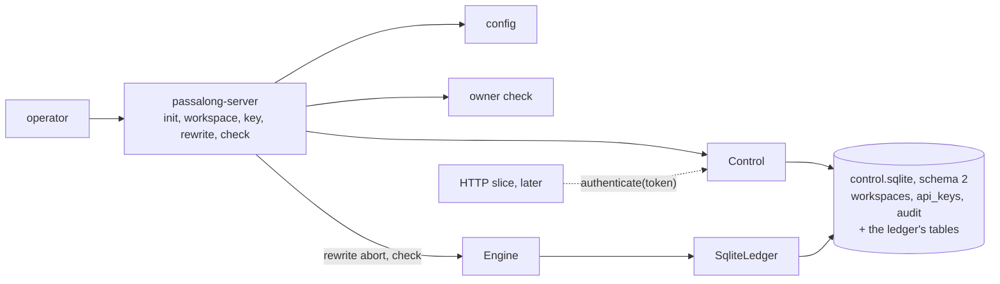

# Delivery Plan 00003: API Keys And Operations CLI

> [!abstract] Plan status: `approved`
> The second slice of server v0.1.0: API keys as the user's requirement 2
> describes them, workspaces an operator can create and inspect, the
> configuration file, logging, and the `passalong-server` commands that
> manage all of it on the host. Still no HTTP. D-02 (a new key expires after
> 90 days unless `--never` is asked for) and D-03 (a lost key cannot be
> shown again) were accepted at approval.

## 1. Objective and outcome

After PLAN-00002 the server can store items safely but has no notion of who
may. This slice gives it one, and gives the operator hands. When it is done,
on a host with nothing but the binary:

```text
passalong-server init
passalong-server workspace create home --quota 20GiB
passalong-server key create --workspace home --label laptop --expires 90d
  pal_3f9a1c07b2e4_…      (shown once)
passalong-server key list
passalong-server key revoke 3f9a1c07b2e4
passalong-server check
```

and in the core, one function the HTTP slice will call on every request:
a bearer token goes in; a workspace and a role come out, or one of
`UNAUTHENTICATED`, `KEY_EXPIRED`, `KEY_REVOKED`, read from the control
database that instant, so a revocation made by the CLI in another process
holds from the next request on (IDEA-00001-R04-MED-03).

## 2. Source traceability

| Requirement | Source | Source location | Interpretation |
|---|---|---|---|
| PLAN-00003-REQ-01 | User; Idea | Requirement 2 of r04 §1; r04 §12 "Authentication" | The key: format, generation, hashing, verification |
| PLAN-00003-REQ-02 | Idea | IDEA-00001-R04-MED-03; `docs/architecture.md`, "Request flow" 3, "Failing closed" | `authenticate`, against the database, every time |
| PLAN-00003-REQ-03 | User; Idea | Requirement 3 of r04 §1; `docs/usage.md` | Workspaces: create, list, show, delete |
| PLAN-00003-REQ-04 | Repository | `crates/passalong-server-core/src/ledger/sqlite.rs`, `SCHEMA_VERSION`; PLAN-00002 REQ-04 | Schema version 2 and the migration from 1 |
| PLAN-00003-REQ-05 | Idea | IDEA-00001-R04-MED-04; `docs/usage.md`, `key` commands | Expiry, extension, revocation, last use, pruning |
| PLAN-00003-REQ-06 | Idea | IDEA-00001-R04-LOW-04 | The operator sees and aborts a dead rewrite session |
| PLAN-00003-REQ-07 | Repository | `AGENTS.md`, "Config and secrets"; `docs/configuration.md`; `config.sample.toml` | The configuration file |
| PLAN-00003-REQ-08 | Repository | `AGENTS.md`, "Observability"; client `crates/passalong-core/src/telemetry.rs` | Logging |
| PLAN-00003-REQ-09 | User; Idea | Requirement 9 of r04 §1; IDEA-00001-R04-MED-03; `docs/usage.md`, "Who may run the commands" | The CLI, and who may run it |
| PLAN-00003-REQ-10 | Repository | `AGENTS.md`, "Non-negotiables" | The repository's standard |

## 3. Repository baseline

| Field | Value |
|---|---|
| Repository | `joelee/passalong-server` (from `Cargo.toml`; no Git remote is configured) |
| Branch | `main`; the plan is written on `feature/keys-and-cli`, created from it |
| HEAD | `a7260adb26bc3c0db5ce802653a890b83d3ed4fd` |
| Working tree at publication | Clean, apart from this file as allocated |
| Applicable instructions | `AGENTS.md`; `docs/plans/AGENTS.md` |
| Tests at the baseline | 59 unit, 9 crash, 2 kill, 1 log, 5 model, 9 contract, 17 shelf, 1 two-process; line coverage 96 % |

## 4. Scope

### In scope

- `passalong-server-core`: `auth` (keys), `control` (workspaces, keys, and
  the audit trail in the control database), `config`, `telemetry`, an
  operating-system `RandomSource`, and three more `ApiError` variants.
- `passalong-server` (the CLI crate): `init`, `workspace`, `key`,
  `rewrite`, `check`, with human and `--json` output.
- Schema version 2 of the control database, migrated in place from 1.
- Documents: `docs/usage.md` (now real), `docs/configuration.md`,
  `docs/architecture.md`, `config.sample.toml`, `.env.sample`,
  `docs/backlog.md`, `CHANGELOG.md`, `README.md`.

### Out of scope

- `serve`, HTTP, TLS, the janitor on a timer, `check --health`, `tls`,
  `service`: the next slices (PLAN-00002 D-01). The CLI names them and says
  they are not in this build.
- Rate limiting of failed authentications: it needs a client address, which
  only HTTP has.
- A "send-only" role (r04 §15): deferred; the roles are `read-write` and
  `read-only`, as the contract has them.
- Remote administration. Keys and workspaces are managed on the host only.
- `workspace import` and `export`.
- The contract in `docs/api/`. `getViewer` needs nothing it does not have.

## 5. Constraints and preserved decisions

- One API key is bound to exactly one workspace (r04 §17). The key selects
  the workspace; nothing else does.
- A key's secret is never stored, never logged, and leaves the process once:
  on the standard output of `key create`.
- Keys are checked against the control database on every request, with no
  cache (r04, MED-03). The database unreadable means
  `SERVICE_UNAVAILABLE`, never a remembered answer.
- The CLI refuses to run as any user but the data directory's owner, root
  included; `init` is the exception, since it creates the directory.
- Unknown configuration keys are rejected, and no secret goes into
  `config.toml` (`AGENTS.md`).
- Test first; clock and randomness injected; `unsafe` forbidden; coverage
  of at least 80 %.

## 6. Assumptions

None. Unresolved matters are recorded as decisions and block approval when
material.

## 7. Decisions and blockers

| ID | Decision or blocker | Resolution | Owner | Status |
|---|---|---|---|---|
| PLAN-00003-D-01 | The key's exact form | `pal_<key id>_<secret>`: the key id 12 lower-case hex digits (48 bits, public, the handle in every command and log line), the secret 64 lower-case hex digits (256 bits). Hex throughout, like every other id here, so one strict parser and no ambiguity of case or padding. The database stores SHA-256 of the secret; a slow hash adds nothing to a full-entropy secret (r04 §12). Comparison in constant time | Planner | Resolved |
| PLAN-00003-D-02 | The default expiry of a new key (r04 §15, open since r01) | Proposed: `key create` without `--expires` gives 90 days and says so; `--never` must be asked for by name. A key that never expires should be a choice, not an omission. `key extend` moves the date without a new secret | @joelee | Resolved 2026-09-18T20:51:44Z: accepted as proposed |
| PLAN-00003-D-03 | Whether a lost key can be recovered | Proposed: no. The secret is shown once and only its hash is kept, so there is nothing to show again; the answer to a lost key is `key create` and `key revoke`. Stated because it is the rule users meet first | @joelee | Resolved 2026-09-18T20:51:44Z: accepted as proposed |
| PLAN-00003-D-04 | Where keys and workspaces live | In `control.sqlite`, beside the ledger's tables, as schema version 2: `workspaces` gains `name`, `quota_bytes`, `created_at`; new tables `api_keys` and `audit`. Migration from version 1 runs at opening, in one transaction; a version-1 workspace gets its id as its name and the configured default quota | Planner | Resolved |
| PLAN-00003-D-05 | `last used` without a write per request | Updated at most once a minute per key. It is for an operator asking "is this key still in use", which a minute answers | Planner | Resolved |
| PLAN-00003-D-06 | Deleting a workspace | `workspace delete <name>` asks for the name to be typed again, or takes `--yes`; refuses while a rewrite session is open unless `--force`; removes the keys and rows in one transaction, then the directory. A directory left by a kill in between is found by `check` | Planner | Resolved |
| PLAN-00003-D-07 | Log levels | The client's mapping: `error`, `warning`, `info` as themselves, `verbose` as `DEBUG`, `debug` as `TRACE`; and the client's safeguard: only an allow-list of field names is written, so a careless `tracing` call cannot leak | Planner | Resolved |
| PLAN-00003-D-08 | Dependencies | `clap` (derive), `toml`, `sha2`, `getrandom`, `subtle`, `tracing-subscriber` (`fmt`, `std` only). Tried together against `deny.toml` on a copy outside the repository on 2026-09-18: advisories, bans, licences, and sources pass, 88 packages, no duplicate version. CLI tests drive the binary with `std::process::Command`, so no test crate is added | Planner | Resolved |

## 8. Affected architecture and components

| Path | Change |
|---|---|
| `core/src/auth.rs` | New. `ApiKey` (parse, generate, display once), `SecretHash`, `verify` in constant time |
| `core/src/control/` | New. `Control`: workspaces, keys, audit, `authenticate`; opens the same file as `SqliteLedger` |
| `core/src/ledger/sqlite.rs` | Schema version 2; `migrate` gains the step from 1; the DDL moves to `control/schema.rs` |
| `core/src/config.rs` | New. Lookup order, parsing, validation, sizes (`"20 GiB"`, `"unlimited"`), durations (`"90d"`) |
| `core/src/telemetry.rs` | New. Levels, allow-listed fields, stderr |
| `core/src/random.rs` | `OsRandom`, on `getrandom` |
| `core/src/error.rs` | `Unauthenticated`, `KeyExpired`, `KeyRevoked`, all already in the contract |
| `cli/src/main.rs`, `cli/src/cli.rs`, `cli/src/commands/` | The commands; `output.rs` for tables and JSON; `owner.rs` for who may run them |
| `cli/tests/` | The binary, driven as an operator drives it |



## 9. Requirement catalogue

### PLAN-00003-REQ-01 — The key

- **Requirement:** A key is `pal_<12 hex>_<64 hex>` (D-01), generated from
  an injected `RandomSource`; the server's is the operating system's.
  Parsing is strict. Only the key id and the SHA-256 of the secret are
  kept. `ApiKey` has no `Debug` or `Display` that shows the secret; the one
  way to text is a method named for what it does, called by `key create`
  alone. Verification compares hashes in constant time.
- **Rationale:** Requirement 2; `AGENTS.md`, "never store one unhashed".
- **Source:** r04 §12.
- **Acceptance evidence:** Unit tests; a test that `format!("{key:?}")`
  contains no part of the secret.

### PLAN-00003-REQ-02 — `authenticate`

- **Requirement:** `Control::authenticate(token, now)` answers the key's
  workspace id, `Caller` (key id and role), and expiry, or
  `UNAUTHENTICATED` (malformed, unknown id, or wrong secret, not told
  apart), `KEY_REVOKED`, `KEY_EXPIRED`, or `SERVICE_UNAVAILABLE`. It reads
  the database every time. A revocation committed by another process is
  seen by the next call. An unknown key id costs the same comparison as a
  known one. `last_used_at` follows D-05.
- **Rationale:** IDEA-00001-R04-MED-03, MED-04.
- **Source:** r04.
- **Acceptance evidence:** Unit tests with a manual clock; a two-connection
  test of revocation; the CLI test of REQ-09.

### PLAN-00003-REQ-03 — Workspaces

- **Requirement:** A workspace has a server-minted id, a unique name
  (lower-case letters, digits, and dashes, 1 to 32, starting with a
  letter), a quota, and a creation time. `create`, `list`, `show` (items,
  bytes used and reserved, quota, encryption state and key id, the rewrite
  session if any, keys by id and label), `delete` (D-06). `show` and `list`
  open an `Engine` and so reconcile, which is the operator's way to repair
  after an unclean stop.
- **Rationale:** Requirement 3.
- **Source:** `docs/usage.md`.
- **Acceptance evidence:** Unit tests of `Control`; CLI tests.

### PLAN-00003-REQ-04 — Schema version 2

- **Requirement:** A version-1 database, as PLAN-00002 writes it, is
  migrated at opening in one transaction, keeping every workspace's record;
  a version-2 database opens unchanged; a newer one is refused; a migration
  cut short leaves version 1 intact. The ledger's conformance suite and the
  kill harness pass over version 2.
- **Rationale:** The first migration sets the pattern for every later one.
- **Source:** `ledger/sqlite.rs`.
- **Acceptance evidence:** A test that builds a version-1 database from the
  DDL of commit `a7260ad`, fills it through the version-1 ledger's rows,
  migrates, and compares every record.

### PLAN-00003-REQ-05 — A key's life

- **Requirement:** `key create` (workspace, label, `--expires <duration>`
  or `--never` per D-02, `--read-only`); `key list` (id, workspace, label,
  role, created, expires, last used, state `active`, `expired`, or
  `revoked`; never a secret or a hash); `key extend`; `key revoke`, which
  keeps the row; `key delete`; `key prune --older-than <duration>`, which
  deletes keys expired or revoked that long. Every change is appended to
  `audit` with the time, the action, and the key id.
- **Rationale:** IDEA-00001-R04-MED-04; requirement 9.
- **Source:** `docs/usage.md`.
- **Acceptance evidence:** Unit and CLI tests.

### PLAN-00003-REQ-06 — A dead rewrite session

- **Requirement:** `rewrite show <workspace>` prints the session: kind,
  holder, lease end and whether it has ended, staged and source counts.
  `rewrite abort <workspace>` aborts it as the operator, which needs no
  words and no API key; it refuses while the lease runs unless `--force`.
  The aborted session's new key id joins `ended_rewrites`, as after any
  abort.
- **Rationale:** IDEA-00001-R04-LOW-04: a session nobody recovers shuts
  writers out for good.
- **Source:** r04.
- **Acceptance evidence:** A core test of the operator's abort; a CLI test.

### PLAN-00003-REQ-07 — Configuration

- **Requirement:** The lookup order of `AGENTS.md`; the keys of
  `docs/configuration.md`; unknown keys and sections rejected with the
  file, the key, and the line; sizes and durations parsed strictly;
  `PASSALONG_SERVER_LOG_LEVEL` over `server.log_level`. `init` writes a
  commented file and creates the data directory 0700. The sections this
  slice does not use (`listen`, `tls`) are parsed and validated all the
  same, so a file written today is valid tomorrow.
- **Rationale:** `AGENTS.md`.
- **Source:** `config.sample.toml`.
- **Acceptance evidence:** Unit tests with an injected environment and
  filesystem root; a test that `config.sample.toml` parses.

### PLAN-00003-REQ-08 — Logging

- **Requirement:** Logs go to standard error with timestamp, level, target,
  message, and allow-listed fields only (D-07). CLI output meant for the
  operator goes to standard output and is not a log. `tests/logs.rs` is
  extended: a session that creates, uses, and revokes a key logs the key
  id and no part of the secret or its hash.
- **Rationale:** `AGENTS.md`, "Observability".
- **Source:** Client `telemetry.rs`.
- **Acceptance evidence:** Unit tests of the formatter; `tests/logs.rs`.

### PLAN-00003-REQ-09 — The CLI, and who may run it

- **Requirement:** The commands of §1, `--config`, `--json` on every
  listing, exit code 2 for usage errors and 1 for failures. Every command
  but `init` compares the effective user with the data directory's owner
  and refuses otherwise, naming the owner and the `sudo -u` line. The
  commands of later slices exist and say so.
- **Rationale:** Requirement 9; IDEA-00001-R04-MED-03.
- **Source:** `docs/usage.md`.
- **Acceptance evidence:** `cli/tests/`: a whole session against a temporary
  directory; the owner check against a directory of another owner, where
  the test can make one, and against a unit-tested pure function otherwise.

### PLAN-00003-REQ-10 — The repository's standard

- **Requirement:** Test first; `just check` with line coverage of at least
  80 %; `just audit`; crates limited to D-08 and those of PLAN-00002.
- **Rationale:** `AGENTS.md`.
- **Source:** `AGENTS.md`.
- **Acceptance evidence:** AC-01, AC-02.

## 10. Delivery strategy

Core first, CLI last, so that the HTTP slice inherits tested functions and
the CLI is thin. The schema comes before anything that uses it, and its
migration is tested against a real version-1 database before a line of
`Control` is written, because a migration bug is the one kind that destroys
an operator's data. The CLI's integration tests then exercise the whole
slice as an operator would, including the owner check and a revocation seen
by a second process.

## 11. Detailed implementation steps

### PLAN-00003-STEP-01 — Bookkeeping and dependencies

- **Objective:** Record the work; add the crates of D-08.
- **Requirements:** `PLAN-00003-REQ-10`
- **Depends on:** None
- **Affected components:** `CHANGELOG.md`, `docs/backlog.md`, `Cargo.toml`,
  `Cargo.lock`, both crates' `Cargo.toml`
- **Preconditions:** Plan approved; clean tree; `feature/keys-and-cli`.
- **Test or evidence first:** `just audit` on the baseline.
- **Implementation tasks:**
  1. Changelog and backlog.
  2. The crates, at their newest versions the toolchain accepts.
- **Documentation/configuration/operations:** None beyond the above.
- **Verification:** `just check`; `just audit`.
- **Completion criteria:** Both exit 0.
- **Rollback or recovery:** Revert the commit.
- **Builder stop conditions:** `just audit` fails and the remedy is more
  than dropping a feature or a justified `skip`.

### PLAN-00003-STEP-02 — The key

- **Objective:** REQ-01.
- **Requirements:** `PLAN-00003-REQ-01`
- **Depends on:** `PLAN-00003-STEP-01`
- **Affected components:** `core/src/auth.rs`, `core/src/random.rs`,
  `core/src/error.rs`
- **Preconditions:** None.
- **Test or evidence first:** Parsing accepts the exact form and nothing
  else; generation from a seeded source is reproducible and from two seeds
  differs; `Debug` shows the key id and no secret; a right secret verifies,
  a wrong one and one of another length do not; the three error codes have
  their statuses and are not retryable.
- **Implementation tasks:**
  1. `ApiKey`, `SecretHash`, `OsRandom`.
  2. The error variants.
- **Documentation/configuration/operations:** Rustdoc.
- **Verification:** `just check`.
- **Completion criteria:** Exit 0.
- **Rollback or recovery:** Revert the step's commits.
- **Builder stop conditions:** None.

### PLAN-00003-STEP-03 — Schema version 2

- **Objective:** REQ-04.
- **Requirements:** `PLAN-00003-REQ-04`
- **Depends on:** `PLAN-00003-STEP-01`
- **Affected components:** `core/src/control/schema.rs`,
  `core/src/ledger/sqlite.rs`
- **Preconditions:** None.
- **Test or evidence first:** The migration test of REQ-04, with the
  version-1 DDL kept in the test as a fixture; version 2 reopens
  unchanged; version 3 is refused; a migration whose last statement fails
  leaves version 1.
- **Implementation tasks:**
  1. The version-2 DDL and the step from 1.
  2. `migrate` as a loop over steps.
- **Documentation/configuration/operations:** The tables in
  `docs/architecture.md`.
- **Verification:** `just check`, which includes the kill harness.
- **Completion criteria:** Exit 0.
- **Rollback or recovery:** Revert the step's commits.
- **Builder stop conditions:** The migration cannot be made one
  transaction.

### PLAN-00003-STEP-04 — `Control`: workspaces and keys

- **Objective:** REQ-02, REQ-03, REQ-05.
- **Requirements:** `PLAN-00003-REQ-02`, `PLAN-00003-REQ-03`,
  `PLAN-00003-REQ-05`
- **Depends on:** `PLAN-00003-STEP-02`, `PLAN-00003-STEP-03`
- **Affected components:** `core/src/control/`
- **Preconditions:** Steps 2 and 3 complete.
- **Test or evidence first:** For each operation its success, each refusal,
  and its audit row; `authenticate` for every outcome of REQ-02, with a
  manual clock at the second before and after expiry; revocation through a
  second connection; `last_used_at` moving at most once a minute; names
  that are not names; a quota that does not parse.
- **Implementation tasks:**
  1. Workspaces. 2. Keys. 3. `authenticate`. 4. The audit trail.
- **Documentation/configuration/operations:** `tracing` events with key and
  workspace ids.
- **Verification:** `just check`.
- **Completion criteria:** Exit 0.
- **Rollback or recovery:** Revert the step's commits.
- **Builder stop conditions:** None.

### PLAN-00003-STEP-05 — The operator's abort

- **Objective:** REQ-06.
- **Requirements:** `PLAN-00003-REQ-06`
- **Depends on:** `PLAN-00003-STEP-04`
- **Affected components:** `core/src/rewrite.rs`, `core/src/workspace.rs`
- **Preconditions:** Step 4 complete.
- **Test or evidence first:** Refused while the lease runs; granted after;
  granted with force; the key id is ended; writers are welcome again; the
  model test's invariants hold after it.
- **Implementation tasks:**
  1. `Rules::operator_abort` and its `Engine` wrapper.
- **Documentation/configuration/operations:** `docs/api/rewrite-session.md`
  gains a paragraph; it is prose about operations, not the contract.
- **Verification:** `just check`.
- **Completion criteria:** Exit 0.
- **Rollback or recovery:** Revert the step's commits.
- **Builder stop conditions:** None.

### PLAN-00003-STEP-06 — Configuration

- **Objective:** REQ-07.
- **Requirements:** `PLAN-00003-REQ-07`
- **Depends on:** `PLAN-00003-STEP-01`
- **Affected components:** `core/src/config.rs`, `config.sample.toml`
- **Preconditions:** None.
- **Test or evidence first:** Each place of the lookup order winning in
  turn; an unknown key refused with its name; sizes (`"20 GiB"`, `"0"`,
  `"unlimited"`, and what is not one); durations; the sample file parsing;
  `mode = "plain"` on a public address refused without `behind_proxy`.
- **Implementation tasks:**
  1. Types with `deny_unknown_fields`. 2. Lookup. 3. Validation.
- **Documentation/configuration/operations:** `docs/configuration.md`.
- **Verification:** `just check`.
- **Completion criteria:** Exit 0.
- **Rollback or recovery:** Revert the step's commits.
- **Builder stop conditions:** None.

### PLAN-00003-STEP-07 — Logging

- **Objective:** REQ-08.
- **Requirements:** `PLAN-00003-REQ-08`
- **Depends on:** `PLAN-00003-STEP-01`
- **Affected components:** `core/src/telemetry.rs`, `core/tests/logs.rs`
- **Preconditions:** None.
- **Test or evidence first:** A field not on the allow-list is not written;
  each level shows what it should; `tests/logs.rs` extended per REQ-08.
- **Implementation tasks:**
  1. Levels. 2. The field filter. 3. `init`.
- **Documentation/configuration/operations:** `docs/configuration.md`.
- **Verification:** `just check`.
- **Completion criteria:** Exit 0.
- **Rollback or recovery:** Revert the step's commits.
- **Builder stop conditions:** The allow-list cannot be had from
  `tracing-subscriber`'s `fmt` without replacing its formatter wholesale;
  report the size of that.

### PLAN-00003-STEP-08 — The CLI

- **Objective:** REQ-09, and the commands of REQ-03, 05, 06, 07.
- **Requirements:** `PLAN-00003-REQ-03`, `PLAN-00003-REQ-05`,
  `PLAN-00003-REQ-06`, `PLAN-00003-REQ-07`, `PLAN-00003-REQ-09`
- **Depends on:** Steps 4 to 7
- **Affected components:** `crates/passalong-server-cli/`
- **Preconditions:** Steps 4 to 7 complete.
- **Test or evidence first:** `cli/tests/session.rs`: `init`, create a
  workspace, create a key and catch it from standard output, authenticate
  with it through the core, list as a table and as JSON, extend, revoke,
  authenticate again and be refused, prune, delete the workspace; usage
  errors exit 2; a secret appears in the output of `key create` and in no
  other output, no log, and no file but none. The owner check as REQ-09.
- **Implementation tasks:**
  1. `clap` definitions. 2. Commands. 3. Output. 4. The owner check, by
     comparing the owner of `/proc/self` with the data directory's, which
     needs no `unsafe`. Checked on this system on 2026-09-18:
     `fs::metadata("/proc/self")`, which follows the link to `/proc/<pid>`,
     gives the process's own uid (1000), while `fs::symlink_metadata` gives
     the link's owner, root. The code must use the first and a test must
     pin it.
- **Documentation/configuration/operations:** `docs/usage.md`.
- **Verification:** `just check`.
- **Completion criteria:** Exit 0.
- **Rollback or recovery:** Revert the step's commits.
- **Builder stop conditions:** None.

### PLAN-00003-STEP-09 — Documents and hand-off

- **Objective:** The hand-off.
- **Requirements:** `PLAN-00003-REQ-10`
- **Depends on:** `PLAN-00003-STEP-08`
- **Affected components:** `docs/`, `README.md`, `config.sample.toml`,
  `.env.sample`, `CHANGELOG.md`
- **Preconditions:** Steps 1 to 8 complete.
- **Test or evidence first:** `scripts/check-links.sh`; every command line
  in `docs/usage.md` is one the CLI tests run.
- **Implementation tasks:**
  1. Usage, configuration, architecture (authentication as built, schema
     2), backlog, changelog, README status.
- **Documentation/configuration/operations:** As above.
- **Verification:** `just check`; `just audit`.
- **Completion criteria:** All exit 0; every acceptance criterion checked.
- **Rollback or recovery:** Revert the step's commits.
- **Builder stop conditions:** None.

## 12. Cross-cutting concerns

| Area | Applicability | Planned action or reason not applicable | Step or requirement |
|---|---|---|---|
| Compatibility and APIs | Applicable | The error codes added are already in the contract; `docs/api/` is not touched | REQ-02 |
| Data and migration | Applicable | The first schema migration, tested against a real version-1 database | REQ-04 |
| Security and privacy | Applicable | The subject of the slice: hashed secrets, constant-time comparison, no cache, the owner check, nothing secret in logs or output | REQ-01, 02, 08, 09 |
| Performance and scale | Applicable | One indexed read per authentication; `last_used_at` written at most once a minute | D-05 |
| Reliability and failure handling | Applicable | Fail closed; the migration is one transaction; the kill harness runs over schema 2 | REQ-02, REQ-04 |
| Observability and operations | Applicable | Logging, the audit trail, `check`, `rewrite show` | REQ-05, 06, 08 |
| Dependencies and supply chain | Applicable | D-08; `just audit` | STEP-01 |
| Accessibility and UX | Applicable | Plain tables, `--json`, refusals that say what to type instead | REQ-09 |
| Documentation and release | Applicable | `docs/usage.md` stops being a draft | STEP-09 |
| Deployment and rollback | Not applicable | Nothing is deployed; a version-2 database does not open in a version-1 build, which is recorded in the changelog | REQ-04 |

## 13. Verification strategy

| Level | Evidence or command | When | Required result |
|---|---|---|---|
| Unit | `cargo test --workspace --all-targets --all-features` | Every step | Pass |
| Migration | The version-1 fixture test | Step 3 on | Pass |
| Storage | The kill harness, the model test, two processes | Step 3 on | Pass, unchanged |
| CLI | `cargo test -p passalong-server --all-features` | Step 8 on | Pass |
| Gates | `just check` | Every step | Exit 0; coverage at least 80 % |
| Supply chain | `just audit` | Steps 1 and 9 | Exit 0 |

## 14. Acceptance criteria

- [ ] `PLAN-00003-AC-01` `just check` exits 0 on `feature/keys-and-cli` with
      line coverage of at least 80 %.
- [ ] `PLAN-00003-AC-02` `just audit` exits 0; the crates named are those of
      PLAN-00002 and D-08.
- [ ] `PLAN-00003-AC-03` A generated key matches
      `^pal_[0-9a-f]{12}_[0-9a-f]{64}$`; its `Debug` text holds no 8
      consecutive characters of its secret; the database holds no part of
      the secret, shown by a test that reads every text and blob column.
- [ ] `PLAN-00003-AC-04` `authenticate` answers each of `UNAUTHENTICATED`,
      `KEY_EXPIRED`, `KEY_REVOKED` in a test of its own, and a revocation
      made through a second connection is seen by the very next call.
- [ ] `PLAN-00003-AC-05` A version-1 database made from the DDL of commit
      `a7260ad` migrates with every record equal before and after; a
      version-3 database is refused; a failed migration leaves version 1.
- [ ] `PLAN-00003-AC-06` The kill harness, the model test over the real
      stores, and the two-process test pass over schema version 2.
- [ ] `PLAN-00003-AC-07` The CLI session test passes, including table and
      JSON listings, and the secret appears in the output of `key create`
      and nowhere else: no other output, no log line, no file.
- [ ] `PLAN-00003-AC-08` A command run by a user who does not own the data
      directory exits 1 and names the owner; shown by a test of the pure
      comparison, and by a CLI test where the environment allows one.
- [ ] `PLAN-00003-AC-09` `rewrite abort` refuses while the lease runs,
      succeeds after it or with `--force`, and afterwards an upload under
      the old state succeeds.
- [ ] `PLAN-00003-AC-10` `config.sample.toml` parses; a file with an unknown
      key is refused with that key's name.
- [ ] `PLAN-00003-AC-11` A log field that is not on the allow-list is not
      written, and `tests/logs.rs` finds no part of a key's secret or hash
      in the logs of a session that creates, uses, and revokes one.
- [ ] `PLAN-00003-AC-12` Every command line shown in `docs/usage.md` is run
      by a CLI test, or is marked there as belonging to a later slice.

## 15. Risks and mitigations

| Risk | Likelihood | Impact | Mitigation or test | Owner/step |
|---|---|---|---|---|
| The migration damages an operator's database | Low | High | One transaction; tested from a real version-1 fixture; a failure leaves version 1; the changelog says to copy `control.sqlite` first | STEP-03 |
| A secret reaches a log, an error message, or `Debug` output | Medium | High | No `Debug` or `Display` of the secret exists to call; the allow-list; AC-03, AC-07, AC-11 search for it | STEP-02, 07, 08 |
| Timing tells a known key id from an unknown one | Medium | Low | The same hash and the same comparison either way; the key id is public by design, so what is hidden is small | STEP-04 |
| The owner check cannot be tested as another user in CI | High | Low | The comparison is a pure function with its own tests; the CLI test runs where it can and says when it cannot | STEP-08 |
| `/proc/self` is absent (a hardened container), or `/proc/<pid>` belongs to root because the process is not dumpable | Low | Medium | Then the check fails closed, with a message naming `/proc` and what it found; documented. A test pins that the followed link, not the link, is read | STEP-08 |
| `tracing-subscriber`'s `fmt` resists a field allow-list | Medium | Low | Stop condition of step 7; the fallback is a small subscriber of our own, as `tests/logs.rs` already has one | STEP-07 |

## 16. Builder hand-off

- **Start condition:** User approval and a clean repository.
- **First step:** `PLAN-00003-STEP-01`.
- **Required sequence:** 1; then 2, 3, 6, 7 in any order; 4 after 2 and 3;
  5 after 4; 8 after 4 to 7; 9 last.
- **Parallel-safe work:** Steps 2, 3, 6, and 7.
- **Do not change:** approved scope, requirements, steps, acceptance
  criteria, or content outside Builder's permitted work-log area; the
  contract in `docs/api/`, except the paragraph step 5 names; the client
  repository.
- **Escalate when:** a stop condition is met, or anything suggests the
  contract must change.
- **Completion hand-off:** Coverage, the list of changed files, the CLI
  session's transcript, and what the next slice (HTTP and TLS) inherits.

<!-- BUILDER_WORK_LOG_START -->
## 17. Builder Work Log

> [!warning] Builder-maintained section
> The planner creates this section. After approval, Builder may update only
> this delimited section and the Builder-maintained front-matter fields.
> Builder must preserve prior entries and use UTC timestamps.

### Step status

| Step | Status | Started (UTC) | Completed (UTC) | Evidence | Builder notes |
|---|---|---|---|---|---|
| PLAN-00003-STEP-01 | completed | 2026-09-18 | 2026-09-18 | `just check`, `just audit` exit 0 | `clap`, `toml`, `sha2`, `getrandom`, `subtle`, `tracing-subscriber` (`fmt`, `std`) |
| PLAN-00003-STEP-02 | completed | 2026-09-18 | 2026-09-18 | 5 unit tests | `ApiKey` has no `Display`; its `Debug` shows the key id. `SecretHash::of_nothing` is what an unknown key id is compared with |
| PLAN-00003-STEP-03 | completed | 2026-09-18 | 2026-09-18 | 3 migration tests; kill harness, model, two processes pass over schema 2 | The schema is an ordered list of steps in `control/schema.rs`; version 1 as committed at `a7260ad` is a fixture, `tests/fixtures/schema_v1.sql`. A failed step rolls the whole migration back |
| PLAN-00003-STEP-04 | completed | 2026-09-18 | 2026-09-18 | 11 unit tests | A finding before writing code: in WAL mode a writer does not block readers, so a test that expected an exclusive lock to fail authentication was wrong, and so would the behaviour have been. A writer elsewhere leaves authentication working and only skips the note of last use; a database that cannot answer fails closed |
| PLAN-00003-STEP-05 | completed | 2026-09-18 | 2026-09-18 | 1 unit test | `operator_abort_rewrite(force)`; every abort now shares `end_aborted` |
| PLAN-00003-STEP-06 | completed | 2026-09-18 | 2026-09-18 | 9 unit tests | TLS mode with no `[tls]` section parses, so that an empty file is all defaults; `check` and, later, `serve` say what is missing |
| PLAN-00003-STEP-07 | completed | 2026-09-18 | 2026-09-18 | 3 unit tests; `tests/logs.rs` extended | The stop condition did not arise: the allow-list is a `FormatFields` on the standard formatter. A test reads this crate's sources and fails if a logged field is not on the list |
| PLAN-00003-STEP-08 | completed | 2026-09-18 | 2026-09-18 | `cli/tests/session.rs`, 3 tests; 5 unit tests | All passed at the first run. The owner check follows `/proc/self`, and a test pins that it answers this user and not root. A CLI test of a refusal as another user is not possible without root, as the plan foresaw; the comparison is unit-tested for root and for a stranger |
| PLAN-00003-STEP-09 | completed | 2026-09-18 | 2026-09-18 | `just check` exit 0, line coverage 96.38 %; `just audit` ok; links ok | `docs/usage.md` is no longer a draft; a script checked that every command in it is run by the session test or belongs to a later slice, and the test checks that those say so |

Allowed status values: `not-started`, `in-progress`, `blocked`, `completed`,
`skipped`. A skipped step requires explicit user approval recorded in Evidence.

### Execution log

| Timestamp (UTC) | Step | Event | Evidence or reference | Next action |
|---|---|---|---|---|
| 2026-09-18T21:11:41Z | STEP-01 to STEP-09 | Every module test first: tests written and seen to fail before the implementation | Test names | Hand-off |

### Deviations and blockers

| Timestamp (UTC) | Step | Deviation or blocker | Impact | Decision required from |
|---|---|---|---|---|
| 2026-09-18T21:11:41Z | STEP-04 | Finding, before any code: a test expected an exclusive lock held elsewhere to make `authenticate` fail closed. In WAL mode a writer does not block readers, and it should not: the CLI in the middle of a transaction must not lock every device out. `authenticate` reads, and treats the note of last use as a note: if it cannot be written, it is skipped. A database that cannot *answer* fails closed, and a test drops the table to show it | REQ-02 as written holds; D-05's note is best-effort by design | None |
| 2026-09-18T21:11:41Z | STEP-06 | Deviation: `listen.mode = "tls"` without a `[tls]` section parses. Otherwise an empty file, which must be all defaults, would be an error. `check` says what `serve` will need | None on this slice; the HTTP slice must refuse to serve without the files | None |
| 2026-09-18T21:11:41Z | STEP-08 | As foreseen in §15: no CLI test runs as another user. AC-08 is met by the unit tests of the comparison and by the test that the followed link, not the link, is read | None | None |

### Verification results

| Timestamp (UTC) | Step | Command or check | Result | Evidence |
|---|---|---|---|---|
| 2026-09-18T21:04:32Z | STEP-07 | `just check` | Exit 0; 91 unit tests, and the storage tests unchanged over schema 2 | Terminal |
| 2026-09-18T21:11:41Z | STEP-08 | `cargo test -p passalong-server --all-features` | 5 unit, 3 session tests pass | Terminal |
| 2026-09-18T21:11:41Z | STEP-09 | `just check` | Exit 0; line coverage 96.38 % (`control` 98 %, `config` 99.5 %, the CLI's commands 91 %) | Terminal |
| 2026-09-18T21:11:41Z | STEP-09 | `just audit` | advisories ok, bans ok, licenses ok, sources ok | Terminal |

### Completion summary

- **Implementation status:** `completed`
- **Completed requirements:** REQ-01 to REQ-10
- **Incomplete requirements:** None
- **Outstanding blockers:** None
- **Acceptance criteria:** AC-01 to AC-12 met; AC-08 as the plan foresaw,
  without a CLI run as another user.
- **What the HTTP slice inherits:** `Control::authenticate(token)`, which
  answers a workspace and a `Caller` or one of four codes and reads the
  database every time; `Config`, with `listen` and `tls` already validated;
  `telemetry::init`; `Engine::open` over `FsShelf` and `SqliteLedger` with
  `Config::limits_for`; and a CLI in which `serve` is a stub that says so.
  It must: refuse to serve in TLS mode without the two files; add rate
  limiting of failed authentications, for which the configuration key
  exists; and run the janitor on a timer.
- **A transcript** of a session on a scratch host is in the hand-off
  message; the session test is its executable form.
- **Review request:** Ready
<!-- BUILDER_WORK_LOG_END -->

## 18. Planning change log

| Timestamp (UTC) | Plan status | Change | Reason | Requested/approved by |
|---|---|---|---|---|
| 2026-09-18T19:42:21Z | draft | Plan created | "start PLAN-00003" | @joelee |
| 2026-09-18T20:51:44Z | approved | Approved ("I approved and you may commit the plan"); D-02 and D-03 accepted as proposed, which the draft said approval would do. The draft was committed by the planner under the rule the user had `docs/plans/AGENTS.md` amended with in the same message | User approval | @joelee |

## 19. External references

None.

## 20. Confidence

**Medium.** The storage this slice builds on is the repository's own and
tested hard; the crates were tried against `deny.toml` together. What is
known only in outline: how much of `tracing-subscriber`'s formatter the
field allow-list replaces (step 7 has a stop condition for it), and whether
the owner check can run as another user in the test environment (the plan
does not depend on it).
