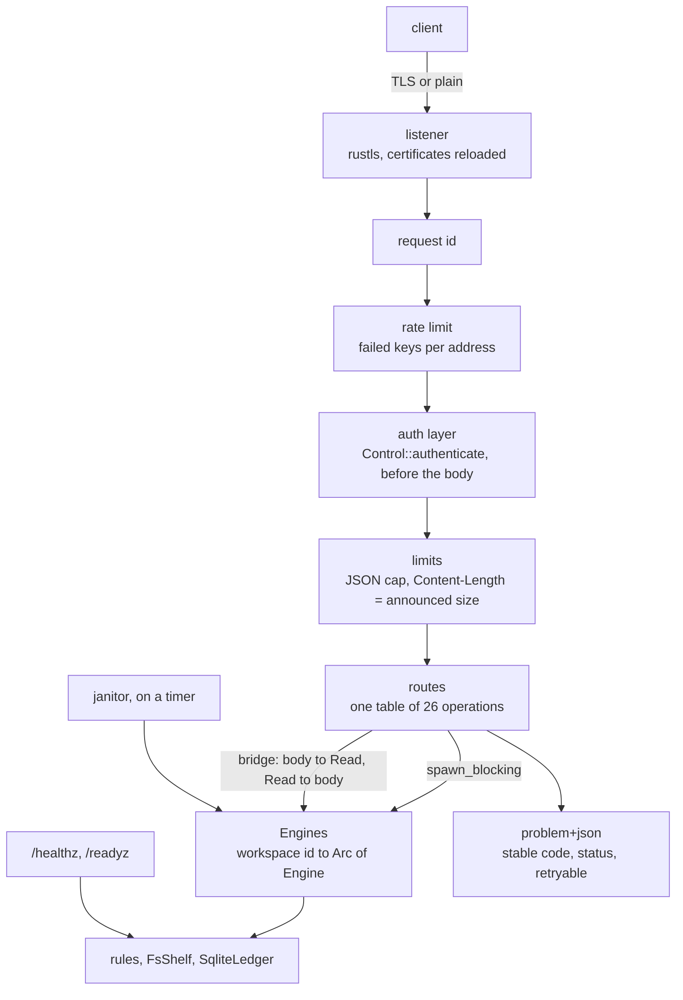

# Delivery Plan 00004: HTTP Surface And TLS

> [!abstract] Plan status: `draft`
> The third slice of server v0.1.0: `passalong-server serve`. Every one of
> the contract's 26 operations becomes a route, behind authentication,
> limits, and TLS, and a client can connect. Docker and systemd are the
> slice after. Two decisions await the user: D-02 (HTTP/1.1 only in v0.1)
> and D-03 (which forwarded address is trusted behind a proxy). Approving
> the plan accepts both proposals.

## 1. Objective and outcome

The rules, the stores, and the keys exist; nothing listens. When this slice
is done:

```text
passalong-server tls self-signed --host pass.home.arpa
passalong-server serve
```

and from another machine, with a key made by `key create`, every operation
of `docs/api/openapi.json` answers as the contract says: an item is
uploaded, listed, downloaded in ranges, and deleted; a workspace is
encrypted, migrated, and rotated through a rewrite session; a second key
takes a dead session over. A wrong key gets `UNAUTHENTICATED`, a revoked one
`KEY_REVOKED` from the next request on, and a flood of wrong keys
`RATE_LIMITED`. `docs/api/openapi.json` stops being hand-kept beside the
code: a test fails when the routes and the document differ.

## 2. Source traceability

| Requirement | Source | Source location | Interpretation |
|---|---|---|---|
| PLAN-00004-REQ-01 | User; Idea | Requirements 1 and 6 of r04 §1, as amended; `docs/api/openapi.json` | Every operation of the contract is a route |
| PLAN-00004-REQ-02 | Idea | `docs/architecture.md`, "Request flow"; IDEA-00001-R04-MED-03 | Authentication before anything else |
| PLAN-00004-REQ-03 | Idea | IDEA-00001-R04-LOW-03; `docs/api/README.md`, "Rules" | Limits, errors as `problem+json`, request ids |
| PLAN-00004-REQ-04 | Idea | IDEA-00001-R04-LOW-03; `docs/api/README.md`, `getItemContent` | Content streams, both ways, with `Range` |
| PLAN-00004-REQ-05 | Idea | IDEA-00001-R04-LOW-05 | The plaintext content check |
| PLAN-00004-REQ-06 | Repository | `docs/api/README.md`, `resolveItem`, `listItems`, `getWorkspace`; `crates/passalong-server-core/src/workspace.rs` | What the core still lacks for the contract |
| PLAN-00004-REQ-07 | User; Idea | The user's TLS decision of r04 §17; IDEA-00001-R04-MED-02; PLAN-00003 work log, STEP-06 deviation | TLS, and the plain mode |
| PLAN-00004-REQ-08 | Idea | IDEA-00001-R04-MED-02; `docs/usage.md`, "Not in this build yet" | `tls self-signed` and `tls fingerprint` |
| PLAN-00004-REQ-09 | Idea | `docs/backlog.md`; `config.sample.toml`, `limits.auth_failures_per_minute` | Rate limiting of failed authentications |
| PLAN-00004-REQ-10 | Idea; Repository | `docs/architecture.md`, "Failing closed"; `Dockerfile`, `HEALTHCHECK` | `serve`: the janitor, health, shutdown; `check --health` |
| PLAN-00004-REQ-11 | Idea | IDEA-00001-R04-LOW-02 | The contract and the code cannot drift |
| PLAN-00004-REQ-12 | Repository | `AGENTS.md` | The repository's standard |

## 3. Repository baseline

| Field | Value |
|---|---|
| Repository | `joelee/passalong-server` (from `Cargo.toml`; no Git remote is configured) |
| Branch | `main`; the plan is written on `feature/http-and-tls`, created from it |
| HEAD | `3017d27979e51ff157e544fad5857da7cf15fab8` |
| Working tree at publication | Clean, apart from this file as allocated |
| Applicable instructions | `AGENTS.md`; `docs/plans/AGENTS.md` |
| The contract | `docs/api/openapi.json`: 26 operations |

## 4. Scope

### In scope

- `passalong-server-api`: the router, the authentication layer, limits,
  errors, the bridge between asynchronous HTTP and the synchronous core,
  TLS with reloading certificates, health, rate limiting, the janitor's
  timer, and a small HTTP client for tests and `check --health`.
- `passalong-server-core`: `resolveItem`, `listItems` with `after`, reading
  content from an offset, the plaintext content check, and an `Engines`
  registry that opens a workspace's engine on first use.
- `passalong-server`: `serve`, `tls self-signed`, `tls fingerprint`,
  `check --health`.
- Documents, including `docs/api/` where a test shows the contract and the
  code to differ (REQ-11; each such change is reported, not slipped in).

### Out of scope

- Docker, systemd, `service install`: the next slice.
- HTTP/2 and HTTP/3 (D-02). ACME. Compression.
- Server-sent events (IDEA-00001-R04-LOW-01), metrics, remote
  administration, a send-only role.
- The client. This slice is tested with its own small client and with
  `curl`-equivalent requests; the passalong client's `https` backend is the
  client repository's plan.

## 5. Constraints and preserved decisions

- The envelope: no response carries a field taken from `meta`
  (IDEA-00001-R04-INFO-02). The one look inside `meta` is REQ-05's, in a
  plaintext workspace, and what it reads is never returned or logged.
- The key is checked before any body is read, against the database, every
  time. `SERVICE_UNAVAILABLE` when the database cannot answer.
- The core stays synchronous (PLAN-00002 D-02). Nothing in it blocks the
  asynchronous runtime: every call into it runs on the blocking pool.
- No workspace's lock is held while content arrives or leaves.
- No switch weakens TLS verification, on either side.
- Test first; clock and randomness injected; `unsafe` forbidden; coverage
  of at least 80 %.

## 6. Assumptions

None. Unresolved matters are recorded as decisions and block approval when
material.

## 7. Decisions and blockers

| ID | Decision or blocker | Resolution | Owner | Status |
|---|---|---|---|---|
| PLAN-00004-D-01 | The stack | `tokio`, `axum` (HTTP/1.1, JSON, query; no default features), `hyper`, `hyper-util`, `rustls` and `tokio-rustls` with `ring`, as the client chose for `russh`, `rustls-pki-types`, `rcgen` for `tls self-signed`. Tried together against `deny.toml` on a copy outside the repository on 2026-09-18: 171 packages; advisories, licences, and sources pass. Bans failed on one duplicate: `ring` uses `getrandom` 0.2 and this repository 0.4. The client carries a `skip` for the same. Here it is avoidable: the repository's one call to `getrandom` is written for 0.2 instead, after which bans pass, and the stack builds | Planner | Resolved |
| PLAN-00004-D-02 | HTTP versions | Proposed: HTTP/1.1 only in v0.1. The API is a few small JSON calls and one stream per item; HTTP/2 buys multiplexing nobody needs yet and costs a second protocol stack on the security boundary. A reverse proxy may speak HTTP/2 to clients and 1.1 to the server. Adding it later breaks nothing | @joelee | **Open.** Approving this plan accepts the proposal |
| PLAN-00004-D-03 | The client address behind a proxy, for rate limiting | Proposed: with `listen.behind_proxy = true`, the **rightmost** entry of `X-Forwarded-For`, which is the one the operator's own proxy wrote; anything to its left is the client's claim. Without the header, or with `behind_proxy = false`, the peer address. Documented with the consequence: one proxy in front is assumed; with two, the limit applies to the outer proxy | @joelee | **Open.** Approving this plan accepts the proposal |
| PLAN-00004-D-04 | The bridge between `axum` and the synchronous core | Every engine call runs in `spawn_blocking`. An upload's body is pumped through a bounded channel into a `std::io::Read` the shelf reads from, so content is never held whole and a slow client slows only its own upload. A download is the reverse. The workspace's engine sits in an `Arc`; reads take `&self`, writes a mutex held for the call and never across an await on the network | Planner | Resolved |
| PLAN-00004-D-05 | `Range` | One range per request: `bytes=a-b`, `a-`, and `-n`, answered 206 with `Content-Range`; several ranges are answered with the whole item, 200, which the HTTP specification allows; an unsatisfiable range is 416. `ItemShelf` gains reading from an offset, which a file does by seeking | Planner | Resolved |
| PLAN-00004-D-06 | Reloading certificates | The certificate and key files are read again when their modification time changes, checked every 30 s; a pair that does not load is logged and the old pair kept. No signal handling to get wrong, and certbot or a proxy's renewal needs no hook | Planner | Resolved |
| PLAN-00004-D-07 | `serve` in TLS mode without the two files (PLAN-00003, STEP-06 deviation) | Refuses to start, naming the files and `passalong-server tls self-signed` | Planner | Resolved |
| PLAN-00004-D-08 | Test and health-check client | One small HTTP/1.1 client over `tokio`, with TLS by pinned certificate, in the API crate: used by the tests, and by `check --health`, which the `Dockerfile`'s `HEALTHCHECK` already names. No test-only HTTP crate | Planner | Resolved |

## 8. Affected architecture and components

| Path | Change |
|---|---|
| `api/src/routes.rs` | New. One table: operation id, method, path, handler. The router and the drift test are both built from it |
| `api/src/handlers/` | New. `items`, `uploads`, `workspace`, `rewrite`, `viewer`, `health` |
| `api/src/auth.rs` | New. The bearer layer: `Control::authenticate` on the blocking pool, before the body |
| `api/src/limits.rs`, `api/src/rate.rs` | New. Body caps; failed authentications per address |
| `api/src/problem.rs` | New. `ApiError` to `application/problem+json` |
| `api/src/bridge.rs` | New. Body to `Read`, `Read` to body |
| `api/src/tls.rs` | New. `rustls` configuration, reloading; the pin of a certificate |
| `api/src/server.rs` | New. Listen, accept, graceful shutdown, the janitor's timer |
| `api/src/client.rs` | New. The small client of D-08 |
| `core/src/engines.rs` | New. `Engines`: workspace id to a shared engine, opened on first use |
| `core/src/workspace.rs`, `shelf/` | `resolve_item`, `items(after)`, content from an offset |
| `core/src/upload.rs` | The plaintext content check at the commit |
| `core/src/random.rs`, `Cargo.toml` | `getrandom` 0.2 (D-01) |
| `cli/src/` | `serve`, `tls`, `check --health` |



## 9. Requirement catalogue

### PLAN-00004-REQ-01 — Every operation is a route

- **Requirement:** Each of the contract's 26 operations is served at its
  method and path, takes what the contract says, and answers what the
  contract says, including its statuses (201 for a ticket, 200 when the
  content is stored already, 204, 206) and every `x-passalong-replay`.
  Byte counts are strings; times RFC 3339; `meta` and headers go in and out
  as the JSON they came as, byte for byte where the contract promises it.
- **Rationale:** Requirement 7: parity is what the contract maps.
- **Source:** `docs/api/openapi.json`.
- **Acceptance evidence:** REQ-11's test; the end-to-end tests of step 9.

### PLAN-00004-REQ-02 — Authentication first

- **Requirement:** Every route but `/healthz` and `/readyz` requires
  `Authorization: Bearer <key>`. The key is checked before the body is
  read; a request without a valid key is answered without its body being
  consumed. The key's workspace is the only workspace the request can
  touch: no parameter names one. The role is enforced by the rules, which
  already refuse a read-only writer.
- **Rationale:** IDEA-00001-R04-MED-03; isolation.
- **Source:** `docs/architecture.md`, "Request flow".
- **Acceptance evidence:** A test that sends a large body with a wrong key
  and is answered before it has sent it; a test with two workspaces and two
  keys in which neither can see, change, or learn of the other's items, for
  every operation.

### PLAN-00004-REQ-03 — Limits, errors, request ids

- **Requirement:** JSON bodies over a fixed cap are refused unread
  (`INVALID_REQUEST`, 413). Every refusal is `application/problem+json` with
  the stable `code`, the contract's status, `retryable`, and
  `leaseExpiresAt` where the contract has it; `Retry-After` on
  `RATE_LIMITED`. A panic in a handler is a 500 without detail, logged.
  `X-Request-Id` is taken from the request when it is a plausible id, made
  otherwise, returned, and on every log line of the request.
- **Rationale:** IDEA-00001-R04-LOW-03.
- **Source:** `docs/api/README.md`, "Rules".
- **Acceptance evidence:** Tests per error code; the log test of REQ-12.

### PLAN-00004-REQ-04 — Content streams

- **Requirement:** `putUploadContent` requires `Content-Length` equal to
  the announced size, refuses another before reading, streams to the shelf
  in pieces, and holds no workspace lock meanwhile. `getItemContent`
  streams from the shelf, honours `Range` per D-05, and sets
  `Content-Length`, `Accept-Ranges`, and `application/octet-stream`. A
  client that goes away mid-upload leaves a staging place the upload can
  be repeated into. A 64 MiB item passes through both ways while the bridge
  holds at most a bounded number of pieces, which the test asserts.
- **Rationale:** Item size is unbounded.
- **Source:** `docs/api/README.md`.
- **Acceptance evidence:** A test that uploads and downloads 64 MiB and
  asserts the bridge's bound; range tests; an interrupted upload.

### PLAN-00004-REQ-05 — The plaintext content check

- **Requirement:** At `commitUpload` in a plaintext workspace, the content's
  SHA-256 and size equal `meta`'s `sha256` and `size`, and the id's content
  key is the first 12 hex digits of that SHA-256; otherwise
  `CONTENT_MISMATCH`, and the upload can be repeated. In an encrypted
  workspace nothing of the kind is attempted. The hash is computed while
  the content arrives, not by reading it again.
- **Rationale:** IDEA-00001-R04-LOW-05.
- **Source:** `docs/architecture.md`, "The envelope".
- **Acceptance evidence:** Core tests; an end-to-end test.

### PLAN-00004-REQ-06 — What the core lacks

- **Requirement:** `resolve_item(input)` by the client's rules (at least 4
  characters; without `-` a prefix of the content key, with `-` of the id;
  case and surrounding spaces ignored; `resolved`, `ambiguous` with
  candidates newest first, `notFound`, `invalidPrefix`); `items(after)` and
  `item_ids(after)`; item count and bytes for `getWorkspace`; `Engines`.
- **Rationale:** The contract names them; the client's `Store` needs them.
- **Source:** Client `docs/architecture.md`, "Users identify an item".
- **Acceptance evidence:** Core unit tests.

### PLAN-00004-REQ-07 — TLS and the plain mode

- **Requirement:** In `tls` mode the server speaks TLS 1.2 and 1.3 with the
  configured pair, reloads it per D-06, and refuses to start without it
  (D-07). In `plain` mode it speaks HTTP, which the configuration already
  refuses on a public address without `behind_proxy`.
- **Rationale:** The user's decision of r04 §17.
- **Source:** `docs/architecture.md`, "Deployment".
- **Acceptance evidence:** Tests in both modes; a reload test that swaps the
  pair and sees the new certificate served; a broken pair keeps the old.

### PLAN-00004-REQ-08 — `tls self-signed` and `tls fingerprint`

- **Requirement:** `tls self-signed --host <name> [--ip <addr>]…` writes a
  certificate and key, the key 0600, to the configured paths, refusing to
  overwrite, and prints the pin. `tls fingerprint` prints the pin of the
  configured certificate: `sha256/` and the base64 of the SHA-256 of its
  SubjectPublicKeyInfo, the form the client's `tls_pin` takes. The small
  client of D-08 connects by that pin and by nothing else.
- **Rationale:** IDEA-00001-R04-MED-02: no skip switch, so pinning must be
  easy.
- **Source:** r04.
- **Acceptance evidence:** A test that makes a pair, serves with it,
  connects by its pin, and is refused with another pin.

### PLAN-00004-REQ-09 — Rate limiting

- **Requirement:** Failed authentications are counted per client address
  (D-03) in a sliding minute; beyond `limits.auth_failures_per_minute` the
  address gets `RATE_LIMITED` with `Retry-After`, for right keys too, until
  the window clears. Successful requests are never counted. The table of
  addresses is bounded.
- **Rationale:** Backlog; `UNAUTHENTICATED` must not be a free oracle.
- **Source:** `config.sample.toml`.
- **Acceptance evidence:** Tests with an injected clock.

### PLAN-00004-REQ-10 — `serve`

- **Requirement:** `serve` loads the configuration, refuses to run as
  anyone but the data directory's owner, opens the control database, logs
  what it listens on, and serves until SIGTERM or Ctrl-C, then stops
  accepting, lets requests in flight finish within a bound, and exits 0. A
  janitor runs `clean_staging` for every workspace on a timer. `/healthz`
  is 204 while the process runs; `/readyz` is 204 only while the control
  database and the data directory can be used, and 503 otherwise. `check
  --health` asks `/readyz` of the configured address and exits 0 or 1.
- **Rationale:** "Failing closed"; the `Dockerfile`'s `HEALTHCHECK`.
- **Source:** `docs/architecture.md`.
- **Acceptance evidence:** A test that starts the binary, waits for ready,
  uses it, signals it, and sees exit 0; a `readyz` test with the database
  made unusable.

### PLAN-00004-REQ-11 — The contract cannot drift

- **Requirement:** A test compares the route table with
  `docs/api/openapi.json`: the same operation ids, methods, and paths. The
  test of `tests/openapi.rs` that compares the document with the README
  stays. Where writing the routes shows the contract to be wrong or
  incomplete, the contract is changed in a commit of its own and listed in
  the hand-off.
- **Rationale:** IDEA-00001-R04-LOW-02.
- **Source:** r04.
- **Acceptance evidence:** The test.

### PLAN-00004-REQ-12 — The repository's standard

- **Requirement:** Test first; `just check` with coverage of at least 80 %;
  `just audit`; crates limited to D-01. Request logs carry the request id,
  the key id, the operation, the status, and the duration, and never the
  `Authorization` header; `tests/logs.rs` is extended over HTTP.
- **Rationale:** `AGENTS.md`.
- **Source:** `AGENTS.md`.
- **Acceptance evidence:** AC-01, AC-02, AC-13.

## 10. Delivery strategy

Core first again: what the contract needs and the core lacks (step 2), then
the HTTP skeleton with authentication and errors and one route (steps 3, 4),
so that the hard parts, which are the bridge and the layers, are proven on
something small. Then the routes in three groups, each with its end-to-end
tests (steps 5 to 7). TLS, rate limiting, and `serve` follow (8 to 10), and
the whole is driven once more from outside the process (11).

The checkpoint is step 5, the content bridge. If content cannot pass
through without a workspace lock held or without being buffered whole, the
Builder stops: that would be a design flaw in D-04, not a bug.

## 11. Detailed implementation steps

### PLAN-00004-STEP-01 — Bookkeeping and dependencies

- **Objective:** Record the work; the crates of D-01; `getrandom` 0.2.
- **Requirements:** `PLAN-00004-REQ-12`
- **Depends on:** None
- **Affected components:** `Cargo.toml`, `Cargo.lock`, the three crates'
  manifests, `core/src/random.rs`, `CHANGELOG.md`, `docs/backlog.md`
- **Preconditions:** Plan approved; clean tree; `feature/http-and-tls`.
- **Test or evidence first:** `just audit` on the baseline; the existing
  test of `OsRandom` must still pass after the change of `getrandom`.
- **Implementation tasks:** 1. Changelog, backlog. 2. The crates. 3.
  `getrandom::getrandom`.
- **Documentation/configuration/operations:** A comment in `Cargo.toml` on
  why `getrandom` is 0.2.
- **Verification:** `just check`; `just audit`.
- **Completion criteria:** Both exit 0, with no `skip` entry.
- **Rollback or recovery:** Revert the commit.
- **Builder stop conditions:** `just audit` fails otherwise than D-01
  foresaw.

### PLAN-00004-STEP-02 — What the core lacks

- **Objective:** REQ-05, REQ-06, and reading from an offset (D-05).
- **Requirements:** `PLAN-00004-REQ-05`, `PLAN-00004-REQ-06`
- **Depends on:** `PLAN-00004-STEP-01`
- **Affected components:** `core/src/workspace.rs`, `upload.rs`, `shelf/`,
  `engines.rs`
- **Preconditions:** None.
- **Test or evidence first:** `resolve_item` for every case of REQ-06;
  listing after an id; the shelf's conformance suite gains "content from an
  offset", over both shelves; the content check: right, wrong SHA-256,
  wrong size in `meta`, wrong content key, `meta` that is not JSON, and an
  encrypted workspace, where none of it is looked at; `Engines` opens once,
  shares, and answers `NOT_FOUND` for a workspace the database does not
  have.
- **Implementation tasks:** As tested. The hash is computed by the shelf's
  `pump` while content arrives and kept beside the staged content.
- **Documentation/configuration/operations:** Rustdoc.
- **Verification:** `just check`, including the kill harness and the model.
- **Completion criteria:** Exit 0.
- **Rollback or recovery:** Revert the step's commits.
- **Builder stop conditions:** Keeping the hash beside the staged content
  needs a change to the staging layout that the kill harness rejects.

### PLAN-00004-STEP-03 — The skeleton: listen, errors, request ids

- **Objective:** REQ-03, and the client of D-08.
- **Requirements:** `PLAN-00004-REQ-03`
- **Depends on:** `PLAN-00004-STEP-01`
- **Affected components:** `api/src/server.rs`, `problem.rs`, `client.rs`,
  `routes.rs`, `handlers/health.rs`
- **Preconditions:** None.
- **Test or evidence first:** A server on `127.0.0.1:0` answers `/healthz`
  204; an unknown path 404 as `problem+json`; every `ApiError` maps to its
  status and code; a request id is echoed, and a made one is a valid id; a
  handler that panics yields 500 and the server lives.
- **Implementation tasks:** As tested.
- **Documentation/configuration/operations:** None.
- **Verification:** `just check`.
- **Completion criteria:** Exit 0.
- **Rollback or recovery:** Revert the step's commits.
- **Builder stop conditions:** None.

### PLAN-00004-STEP-04 — Authentication and the first routes

- **Objective:** REQ-02, with `getViewer` and `getWorkspace`.
- **Requirements:** `PLAN-00004-REQ-01`, `PLAN-00004-REQ-02`
- **Depends on:** `PLAN-00004-STEP-02`, `PLAN-00004-STEP-03`
- **Affected components:** `api/src/auth.rs`, `handlers/viewer.rs`,
  `handlers/workspace.rs`
- **Preconditions:** Steps 2 and 3 complete.
- **Test or evidence first:** No header, a malformed one, a wrong secret:
  401 `UNAUTHENTICATED`, indistinguishable; expired and revoked keys; a
  revocation through `Control` seen by the next request; a large body with
  a wrong key answered before it is sent; the control database made
  unusable: 503.
- **Implementation tasks:** As tested.
- **Documentation/configuration/operations:** None.
- **Verification:** `just check`.
- **Completion criteria:** Exit 0.
- **Rollback or recovery:** Revert the step's commits.
- **Builder stop conditions:** None.

### PLAN-00004-STEP-05 — Items and uploads, with the bridge

- **Objective:** REQ-04; the item and upload routes.
- **Requirements:** `PLAN-00004-REQ-01`, `PLAN-00004-REQ-04`,
  `PLAN-00004-REQ-05`
- **Depends on:** `PLAN-00004-STEP-04`
- **Affected components:** `api/src/bridge.rs`, `handlers/items.rs`,
  `handlers/uploads.rs`, `limits.rs`
- **Preconditions:** Step 4 complete.
- **Test or evidence first:** A whole upload and download; every row of the
  upload replays over HTTP; `Content-Length` other than announced refused
  unread; ranges per D-05; 64 MiB both ways with the bridge's bound
  asserted; an upload cut off, then repeated; a second
  request to the workspace answered while a slow upload is in progress.
- **Implementation tasks:** As tested.
- **Documentation/configuration/operations:** None.
- **Verification:** `just check`.
- **Completion criteria:** Exit 0.
- **Rollback or recovery:** Revert the step's commits.
- **Builder stop conditions:** The checkpoint of §10.

### PLAN-00004-STEP-06 — Encryption and the rewrite session

- **Objective:** The remaining routes.
- **Requirements:** `PLAN-00004-REQ-01`
- **Depends on:** `PLAN-00004-STEP-05`
- **Affected components:** `handlers/workspace.rs`, `handlers/rewrite.rs`
- **Preconditions:** Step 5 complete.
- **Test or evidence first:** Over HTTP: enable, fresh start, change of
  words; a migration and a rotation with read-back through
  `partition=staged`; a take-over by a second key after the lease;
  `REWRITE_INCOMPLETE`, `REWRITE_ENDED`, `LEASE_HELD` with
  `leaseExpiresAt`; every rewrite replay of the contract.
- **Implementation tasks:** As tested.
- **Documentation/configuration/operations:** None.
- **Verification:** `just check`.
- **Completion criteria:** Exit 0.
- **Rollback or recovery:** Revert the step's commits.
- **Builder stop conditions:** A route cannot answer what the contract
  says without the contract changing in a way a client would notice.

### PLAN-00004-STEP-07 — Isolation, and the contract against the code

- **Objective:** REQ-02's isolation test; REQ-11.
- **Requirements:** `PLAN-00004-REQ-02`, `PLAN-00004-REQ-11`
- **Depends on:** `PLAN-00004-STEP-06`
- **Affected components:** `api/tests/`
- **Preconditions:** Step 6 complete.
- **Test or evidence first:** These are the tests: two workspaces, two
  keys, every operation of the route table tried by each key against the
  other's ids; the route table against `openapi.json`.
- **Implementation tasks:** As tested.
- **Documentation/configuration/operations:** `docs/api/`, if REQ-11 finds
  a difference.
- **Verification:** `just check`.
- **Completion criteria:** Exit 0.
- **Rollback or recovery:** Revert the step's commits.
- **Builder stop conditions:** As step 6.

### PLAN-00004-STEP-08 — TLS

- **Objective:** REQ-07, REQ-08.
- **Requirements:** `PLAN-00004-REQ-07`, `PLAN-00004-REQ-08`
- **Depends on:** `PLAN-00004-STEP-03`
- **Affected components:** `api/src/tls.rs`, `client.rs`, `cli/src/`
- **Preconditions:** Step 3 complete.
- **Test or evidence first:** As REQ-07 and REQ-08 list.
- **Implementation tasks:** As tested.
- **Documentation/configuration/operations:** `docs/usage.md`.
- **Verification:** `just check`.
- **Completion criteria:** Exit 0.
- **Rollback or recovery:** Revert the step's commits.
- **Builder stop conditions:** None.

### PLAN-00004-STEP-09 — Rate limiting

- **Objective:** REQ-09.
- **Requirements:** `PLAN-00004-REQ-09`
- **Depends on:** `PLAN-00004-STEP-04`
- **Affected components:** `api/src/rate.rs`, `auth.rs`
- **Preconditions:** Step 4 complete.
- **Test or evidence first:** The limit reached and cleared with an
  injected clock; right keys refused while limited; successes not counted;
  the address per D-03 with and without `behind_proxy`, with a forged
  leftmost entry; the table bounded.
- **Implementation tasks:** As tested.
- **Documentation/configuration/operations:** `docs/configuration.md`.
- **Verification:** `just check`.
- **Completion criteria:** Exit 0.
- **Rollback or recovery:** Revert the step's commits.
- **Builder stop conditions:** None.

### PLAN-00004-STEP-10 — `serve`

- **Objective:** REQ-10.
- **Requirements:** `PLAN-00004-REQ-10`, `PLAN-00004-REQ-12`
- **Depends on:** Steps 7, 8, 9
- **Affected components:** `cli/src/`, `api/src/server.rs`,
  `core/tests/logs.rs` or its API twin
- **Preconditions:** Steps 7 to 9 complete.
- **Test or evidence first:** The binary started on a free port in both
  modes; `check --health` 0 when ready and 1 when not; a session over TLS
  by pin; SIGTERM and exit 0 with a request in flight finished; the
  janitor removing an abandoned upload with the clock moved; the log of
  the session holding request ids and key ids and no token.
- **Implementation tasks:** As tested.
- **Documentation/configuration/operations:** `docs/usage.md`;
  `docs/service/passalong-server.service` checked against how `serve`
  really starts and stops.
- **Verification:** `just check`.
- **Completion criteria:** Exit 0.
- **Rollback or recovery:** Revert the step's commits.
- **Builder stop conditions:** None.

### PLAN-00004-STEP-11 — Documents and hand-off

- **Objective:** The hand-off.
- **Requirements:** `PLAN-00004-REQ-12`
- **Depends on:** `PLAN-00004-STEP-10`
- **Affected components:** `docs/`, `README.md`, `CHANGELOG.md`
- **Preconditions:** Steps 1 to 10 complete.
- **Test or evidence first:** `scripts/check-links.sh`.
- **Implementation tasks:** Architecture as built; usage; configuration;
  the compatibility table; backlog; a transcript of a session with `curl`.
- **Documentation/configuration/operations:** As above.
- **Verification:** `just check`; `just audit`.
- **Completion criteria:** All exit 0; every acceptance criterion checked.
- **Rollback or recovery:** Revert the step's commits.
- **Builder stop conditions:** None.

## 12. Cross-cutting concerns

| Area | Applicability | Planned action or reason not applicable | Step or requirement |
|---|---|---|---|
| Compatibility and APIs | Applicable | The contract is implemented, and from now on tested against the code; any change to it is its own commit and reported | REQ-11 |
| Data and migration | Not applicable | No schema change is foreseen; staging may gain a hash file, which the kill harness must accept | STEP-02 |
| Security and privacy | Applicable | Authentication before the body; isolation tested for every operation; rate limiting; TLS without a skip switch; no token in logs; the envelope | REQ-02, 07, 08, 09, 12 |
| Performance and scale | Applicable | Content is never held whole, measured; no workspace lock across network waits | REQ-04, D-04 |
| Reliability and failure handling | Applicable | `readyz` and fail closed; graceful shutdown; a panic is a 500; an interrupted upload is repeatable | REQ-03, 04, 10 |
| Observability and operations | Applicable | Request logs with ids; `check --health`; the janitor | REQ-10, REQ-12 |
| Dependencies and supply chain | Applicable | D-01, with no `skip` entry | STEP-01 |
| Accessibility and UX | Applicable | Errors a client can act on from the code alone; `serve` says what it listens on and why it will not start | REQ-03, D-07 |
| Documentation and release | Applicable | Architecture, usage, configuration, compatibility. No release | STEP-11 |
| Deployment and rollback | Not applicable | Docker and systemd are the next slice | — |

## 13. Verification strategy

| Level | Evidence or command | When | Required result |
|---|---|---|---|
| Unit | `cargo test --workspace --all-targets --all-features` | Every step | Pass |
| End to end, in process | The API crate's tests against a server on a free port | Step 3 on | Pass |
| Isolation and contract | Step 7's two tests | Step 7 on | Pass |
| End to end, the binary | Step 10's tests | Step 10 on | Pass |
| Storage | The kill harness, the model, two processes | Every step | Pass, unchanged |
| Gates | `just check` | Every step | Exit 0; coverage at least 80 % |
| Supply chain | `just audit` | Steps 1 and 11 | Exit 0; no `skip` entry |

## 14. Acceptance criteria

- [ ] `PLAN-00004-AC-01` `just check` exits 0 on `feature/http-and-tls` with
      line coverage of at least 80 %.
- [ ] `PLAN-00004-AC-02` `just audit` exits 0 with no `skip` entry in
      `deny.toml`; the crates named are those of earlier plans and D-01.
- [ ] `PLAN-00004-AC-03` A test shows the route table and
      `docs/api/openapi.json` to hold the same 26 operation ids, methods,
      and paths.
- [ ] `PLAN-00004-AC-04` Every operation is exercised over HTTP by at least
      one test, shown by a test that collects the operation ids the tests
      called and compares them with the route table.
- [ ] `PLAN-00004-AC-05` With two workspaces and two keys, no operation
      lets one key read, change, or learn the existence of anything of the
      other's.
- [ ] `PLAN-00004-AC-06` A request with a wrong key and a body of 8 MiB is
      answered 401 before the client has sent the body.
- [ ] `PLAN-00004-AC-07` 64 MiB is uploaded and downloaded intact, and the
      test asserts what the bridge held at most at any moment: the bound of
      its channel times its largest piece, which is at most 1 MiB. (The
      allocator's peak is not measured: that needs a global allocator
      wrapper, which is `unsafe`.)
- [ ] `PLAN-00004-AC-08` `Range` requests for the first, a middle, and the
      last part of an item return 206 with those bytes; an unsatisfiable
      one 416.
- [ ] `PLAN-00004-AC-09` A migration and a rotation complete over HTTP with
      read-back through `partition=staged`, and a second key takes over a
      session whose lease ended and commits it.
- [ ] `PLAN-00004-AC-10` In a plaintext workspace, content whose SHA-256
      differs from `meta` is refused with `CONTENT_MISMATCH` at the commit,
      and the same in an encrypted workspace is not looked at.
- [ ] `PLAN-00004-AC-11` A certificate made by `tls self-signed` is served;
      the client connects by the pin `tls fingerprint` prints and is
      refused with another; after the pair is replaced on disk the new
      certificate is served without a restart.
- [ ] `PLAN-00004-AC-12` After `limits.auth_failures_per_minute` wrong keys
      from an address, that address gets `RATE_LIMITED` with `Retry-After`,
      a right key included, and is served again when the window clears; a
      forged leftmost `X-Forwarded-For` entry does not move the count.
- [ ] `PLAN-00004-AC-13` The binary serves in `tls` and in `plain` mode,
      `check --health` exits 0 and 1 as `readyz` says, SIGTERM ends it with
      exit 0, and its log holds request ids and key ids and no part of any
      token.
- [ ] `PLAN-00004-AC-14` `serve` in `tls` mode without the two files exits 1
      naming them and `tls self-signed`.

## 15. Risks and mitigations

| Risk | Likelihood | Impact | Mitigation or test | Owner/step |
|---|---|---|---|---|
| The bridge buffers content, or holds a workspace lock while a client dawdles | Medium | High | AC-07 asserts the bridge's bound; step 5 tests a second request during a slow upload; the checkpoint of §10 | STEP-05 |
| A route leaks across workspaces | Low | Critical | The workspace comes from the key alone; AC-05 tries every operation | STEP-07 |
| The contract, written before any route existed, is wrong in places | High | Medium | Expected: REQ-11 finds them, each change is its own commit and is reported; a change a client would notice is a stop condition | STEP-06, 07 |
| Measuring the allocation peak needs a global allocator wrapper, which is `unsafe` | Medium | Low | `unsafe` is forbidden here. Measure instead what can be measured safely: the largest chunk the bridge ever holds and the channel's bound, asserted in the test, with a 64 MiB transfer through them | STEP-05 |
| A slow-loris client holds connections | Medium | Medium | Header-read and idle timeouts on the listener; documented as the proxy's job in `plain` mode | STEP-03 |
| Tests that start the binary are flaky on ports and timing | Medium | Low | Port 0 and the port read from the server's log; readiness awaited, never slept for | STEP-10 |
| `X-Forwarded-For` trusted wrongly | Medium | Medium | D-03 is conservative and tested with a forged entry; never consulted unless `behind_proxy` | STEP-09 |

## 16. Builder hand-off

- **Start condition:** User approval and a clean repository.
- **First step:** `PLAN-00004-STEP-01`.
- **Required sequence:** 1; 2 and 3; 4; 5; 6; 7; then 8 and 9 in either
  order; 10; 11.
- **Parallel-safe work:** Steps 2 and 3; steps 8 and 9.
- **Do not change:** approved scope, requirements, steps, acceptance
  criteria, or content outside Builder's permitted work-log area; the
  client repository. The contract changes only under REQ-11, each change in
  a commit of its own.
- **Escalate when:** a stop condition is met, above all the checkpoint of
  step 5 and a contract change a client would notice.
- **Completion hand-off:** Coverage; every contract change made, with its
  reason; a `curl` transcript; what the Docker and systemd slice inherits.

<!-- BUILDER_WORK_LOG_START -->
## 17. Builder Work Log

> [!warning] Builder-maintained section
> The planner creates this section. After approval, Builder may update only
> this delimited section and the Builder-maintained front-matter fields.
> Builder must preserve prior entries and use UTC timestamps.

### Step status

| Step | Status | Started (UTC) | Completed (UTC) | Evidence | Builder notes |
|---|---|---|---|---|---|
| PLAN-00004-STEP-01 | not-started | — | — | — | — |
| PLAN-00004-STEP-02 | not-started | — | — | — | — |
| PLAN-00004-STEP-03 | not-started | — | — | — | — |
| PLAN-00004-STEP-04 | not-started | — | — | — | — |
| PLAN-00004-STEP-05 | not-started | — | — | — | — |
| PLAN-00004-STEP-06 | not-started | — | — | — | — |
| PLAN-00004-STEP-07 | not-started | — | — | — | — |
| PLAN-00004-STEP-08 | not-started | — | — | — | — |
| PLAN-00004-STEP-09 | not-started | — | — | — | — |
| PLAN-00004-STEP-10 | not-started | — | — | — | — |
| PLAN-00004-STEP-11 | not-started | — | — | — | — |

Allowed status values: `not-started`, `in-progress`, `blocked`, `completed`,
`skipped`. A skipped step requires explicit user approval recorded in Evidence.

### Execution log

| Timestamp (UTC) | Step | Event | Evidence or reference | Next action |
|---|---|---|---|---|

### Deviations and blockers

| Timestamp (UTC) | Step | Deviation or blocker | Impact | Decision required from |
|---|---|---|---|---|

None.

### Verification results

| Timestamp (UTC) | Step | Command or check | Result | Evidence |
|---|---|---|---|---|

### Completion summary

- **Implementation status:** `not-started`
- **Completed requirements:** None
- **Incomplete requirements:** All
- **Outstanding blockers:** None
- **Review request:** Not ready
<!-- BUILDER_WORK_LOG_END -->

## 18. Planning change log

| Timestamp (UTC) | Plan status | Change | Reason | Requested/approved by |
|---|---|---|---|---|
| 2026-09-18T21:38:46Z | draft | Plan created | "commit and proceed" | @joelee |

## 19. External references

None.

## 20. Confidence

**Medium.** Everything below the HTTP layer exists and is tested, and the
stack was built and audited on a copy. What is known only in outline is the
part with the most ways to go wrong: bridging `axum`'s asynchronous bodies
to a synchronous shelf without buffering or holding a lock, which is why it
is the checkpoint; and how many places the contract, written before any
route existed, will turn out to need correcting.
