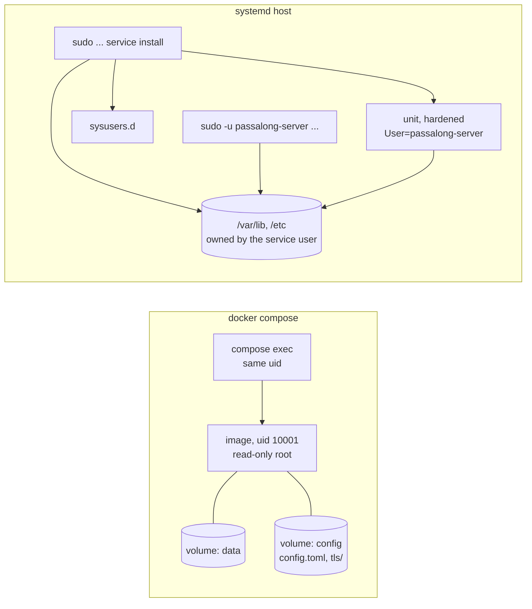

# Delivery Plan 00005: Docker And Systemd

> [!abstract] Plan status: `draft`
> The fourth and last slice of server v0.1.0: the server as something an
> operator installs, with `docker compose up` or with `service install`,
> each tested end to end. Two decisions await the user: D-01 (where a
> container keeps its data) and D-02 (what `service install` may do to a
> host). Approving the plan with them as proposed resolves both.

## 1. Objective and outcome

`serve` works, from a shell. When this slice is done, either of these takes
an empty host to a server that survives a reboot:

```text
cd deploy/docker && docker compose build
docker compose run --rm server init --data-dir /var/lib/passalong-server
docker compose run --rm server tls self-signed --host nas.example
docker compose up -d
```

```text
cargo build --release -p passalong-server
sudo target/release/passalong-server service install --host nas.example
```

and in both the operator then makes workspaces and keys with the commands
of `docs/usage.md`, as the user the server runs as. Both paths are run by a
test, not only described.

The planner found on the way that the first path cannot work today: **the
image does not build** (REQ-01).

## 2. Source traceability

| Requirement | Source | Source location | Interpretation |
|---|---|---|---|
| PLAN-00005-REQ-01 | User; Repository | Requirement 5 of r04 §1; planner's build of 2026-09-18 | The image builds |
| PLAN-00005-REQ-02 | Repository | `Dockerfile`; `cli/src/commands.rs` | `init` works in the image |
| PLAN-00005-REQ-03 | User; Idea | Requirement 5; r04 §4, intended outcome | Compose from an empty directory |
| PLAN-00005-REQ-04 | Idea | r04, assumption A-04 | The deployment is tested end to end |
| PLAN-00005-REQ-05 | Repository | `docs/service/passalong-server.service`, header; PLAN-00004 work log, hand-off | The unit is the template's rendering |
| PLAN-00005-REQ-06 | User; Idea | Requirement 8; r04 §13; r04 open question on the binary | `service install` |
| PLAN-00005-REQ-07 | Planner | — | `service remove` destroys nothing |
| PLAN-00005-REQ-08 | Repository | `docs/service/passalong-server.service`, hardening | It works on a real systemd |
| PLAN-00005-REQ-09 | Repository; Idea | `AGENTS.md`; r04 §8 | The standard, and the idea's measures |

## 3. Repository baseline

| Field | Value |
|---|---|
| Repository | `joelee/passalong-server` (from `Cargo.toml`; no Git remote is configured) |
| Branch | `feature/http-and-tls`, which holds PLAN-00004 completed and is **not merged to `main`** (`main` is at `3017d27`). The plan is written on `feature/docker-and-systemd`, created from it. If the user merges PLAN-00004 to `main` first, this branch is already its descendant and nothing changes |
| HEAD | `ce54f5aaf839bdfee8b61c3a13af4a03925518ee` |
| Working tree at publication | Clean, apart from this file as allocated |
| Applicable instructions | `AGENTS.md`; `docs/plans/AGENTS.md` |
| Tools on the planner's machine | Docker 29.7.2 with a running daemon; systemd 261 with `systemd-analyze`. No root |

## 4. Scope

### In scope

- `Dockerfile`, `.dockerignore`, `deploy/docker/`: an image that builds and
  a compose project an operator can follow from an empty directory.
- `passalong-server`: `service install`, `service remove`; `init` honouring
  `PASSALONG_SERVER_CONFIG_FILE`.
- `docs/service/`: the unit as rendered, and a `sysusers.d` file.
- `scripts/test-deploy.sh`, `scripts/test-service.sh`, and their `just`
  recipes, in `just ci`.
- Documents; the idea's footprint and time-to-first-item measures.

### Out of scope

- Publishing anything: no registry, no binaries, no packages (the user's
  decision of 2026-09-18). The release workflow stays build-only.
- Tagging v0.1.0. This slice makes it possible; whether and when is the
  user's call, and the client cannot use the server before its own v0.3.0.
- Other init systems, rootless Podman, Kubernetes, Windows, macOS.
- A smaller base image (distroless, static musl). Measured here, changed
  only by a later plan if the measure says so.
- ACME, a bundled reverse proxy, backups. `deploy/docker/README.md` says how
  to copy a volume; nothing automates it.
- The client, the contract, and the HTTP surface: untouched. A defect found
  in them is reported and fixed in a commit of its own.

## 5. Constraints and preserved decisions

- The owner rule stands: every command but `init`, `check --health`, and now
  `service` refuses to run as anyone but the data directory's owner, root
  included. The compose file never sets `user:`.
- `service install` runs as root and therefore creates nothing the server
  must later write: never the control database, and every directory it
  makes is handed to the service user before anything is put in it.
- Nothing is overwritten that the command did not write: not a
  configuration, not a pair (clients may have pinned it), not a unit file
  someone else put there.
- No switch weakens TLS. Compose serves TLS by default, like the binary.
- No `unsafe`, no new crate. External commands (`systemctl`,
  `systemd-sysusers`) go through an injected interface and are faked in
  unit tests (`AGENTS.md`, "mock external interfaces").
- Test first; coverage of at least 80 %.

## 6. Assumptions

None. Unresolved matters are recorded as decisions and block approval when
material.

## 7. Decisions and blockers

| ID | Decision or blocker | Resolution | Owner | Status |
|---|---|---|---|---|
| PLAN-00005-D-01 | Where a container keeps its data and configuration | Proposed: **two named volumes**, `data` at `/var/lib/passalong-server` and `config` at `/etc/passalong-server` (configuration and the TLS pair). A fresh named volume takes the ownership the image gave the directory, so uid 10001 owns both with no step for the operator, and the owner rule is satisfied by `compose exec` as it is. The present draft's bind mounts (`./data`, `./config.toml`, `./tls`) are created by the Docker daemon as root: the server could not write its database, and every command would be refused by the owner rule. The alternative is bind mounts plus `user: "${PUID}:${PGID}"`, as the client's SSH deployment does; it keeps files visible on the host, and costs an override of `user:` that r04 said the compose file must never have, plus a pair the operator must make readable to that uid. The README documents bind mounts for those who want them (`chown 10001`), without making them the default | User | Awaiting the user |
| PLAN-00005-D-02 | What `service install` may do to a host, and how a systemd host gets its binary (r04's open question) | Proposed: the operator builds with `cargo build --release` and runs `sudo target/release/passalong-server service install`. The command installs **itself** to `/usr/local/bin/passalong-server`, creates the system user through a `sysusers.d` file, creates the three directories, writes the initial configuration when there is none, makes a self-signed pair only when `--host` or `--ip` is given and there is none, writes and enables the unit, and starts it when it can start. Everything is idempotent and nothing existing is overwritten. The alternative is a command that only writes the unit and prints the rest as instructions: less done to the host as root, and an install that is six manual steps, each a place to get ownership wrong, which is the mistake the owner rule exists to catch | User | Awaiting the user |
| PLAN-00005-D-03 | Creating the service user | `systemd-sysusers` with a file in `/etc/sysusers.d/`, not `useradd`: it is there wherever systemd is, it is idempotent, and its flags do not differ between distributions | Planner | Resolved |
| PLAN-00005-D-04 | Testing `service install` without root on the Builder's machine | A throwaway container with systemd as PID 1 (`just test-service`), which needs Docker and nothing of the host's systemd. STEP-06 carries the stop condition and the fallback | Planner | Resolved |
| PLAN-00005-D-05 | Stop timeouts | 45 seconds in both: `stop_grace_period` and `TimeoutStopSec`. `serve` drains for at most 30; Docker's default of 10 would kill it mid-request | Planner | Resolved |
| PLAN-00005-D-06 | What `service remove` removes | The unit, and nothing else. Data, configuration, pair, user, and binary stay, and the command prints where they are. No `--purge` in v0.1 | Planner | Resolved |
| PLAN-00005-D-07 | What drives the deployment test | A shell script with `docker compose` and `curl --pinnedpubkey`, as the client's `test-deploy` does, because what is under test is the README's commands and not Rust code. `curl` accepts the pins `tls fingerprint` prints, shown in PLAN-00004 | Planner | Resolved |

## 8. Affected architecture and components

| Path | Change |
|---|---|
| `Dockerfile`, `.dockerignore` | Builds; owns its two directories; sets `PASSALONG_SERVER_CONFIG_FILE` |
| `deploy/docker/compose.yaml`, `.env.sample`, `README.md` | Per D-01 and D-05; the README is new and is what the test follows |
| `crates/passalong-server-cli/src/service/` | New: `unit.rs` (rendering), `plan.rs` (actions as data), `system.rs` (the injected interface and the real one), `mod.rs` (the two commands) |
| `crates/passalong-server-cli/src/commands.rs`, `main.rs`, `cli.rs` | `init`'s default path; `service` exempt from the owner rule and from the configuration; the stub goes |
| `docs/service/` | The unit as rendered; `passalong-server.sysusers` |
| `scripts/test-deploy.sh`, `scripts/test-service.sh`, `deploy/test/systemd.Dockerfile`, `justfile` | New; both recipes join `just ci` |
| `docs/`, `README.md`, `CHANGELOG.md` | As built |



## 9. Requirement catalogue

### PLAN-00005-REQ-01 — An image that builds, for amd64 and arm64

- **Requirement:** `docker build` of this repository succeeds. `just ci` includes it. The release workflow's two-platform build is unchanged and still pushes nothing.
- **Rationale:** The image has not built since PLAN-00003: `passalong-server-core` includes `config.sample.toml`, which the `Dockerfile` does not copy. Found by the planner on 2026-09-18 by building it. `just ci` would have shown it; only `just check` was being run.
- **Source:** `Dockerfile`; `crates/passalong-server-core/src/config.rs`, `SAMPLE`.
- **Acceptance evidence:** `just ci` exit 0. arm64 is verified only by the release workflow; the work log says so.

### PLAN-00005-REQ-02 — `init` works where the image puts things

- **Requirement:** `init` writes to `PASSALONG_SERVER_CONFIG_FILE` when that is set and `--config-file` is not. The image sets it, owns `/etc/passalong-server` and `/var/lib/passalong-server` as uid 10001, and keeps a read-only root filesystem.
- **Rationale:** Today `init` in the container would write below `$HOME/.config`, where `serve` finds it only by accident of `HOME`, and `/etc/passalong-server` belongs to root.
- **Source:** `Dockerfile`; `cli/src/commands.rs`, `default_paths`.
- **Acceptance evidence:** Unit tests; `init` then `check` in a fresh container, exit 0.

### PLAN-00005-REQ-03 — Compose from an empty directory

- **Requirement:** `deploy/docker/README.md` takes an operator from a clone to a first key in commands that are all run by a test. Storage per D-01. The container gets 45 seconds to stop, more than `serve`'s 30-second drain. No `user:` override, so `compose exec` runs as the data directory's owner.
- **Rationale:** IDEA-00001 §4's outcome: "one `docker compose up`"; r04 MAJ-era finding on the owner rule; PLAN-00004's hand-off.
- **Source:** `deploy/docker/compose.yaml`.
- **Acceptance evidence:** `just test-deploy`.

### PLAN-00005-REQ-04 — The deployment is tested end to end

- **Requirement:** `just test-deploy` builds the image, follows the README, uses the server over HTTPS by pin from outside the container, administers it by `compose exec` while it serves (assumption A-04), stops it, and checks exit code 0 and a log without any token. It leaves nothing behind.
- **Rationale:** A-04 is untested across `docker exec`; the client has the same recipe for its SSH deployment.
- **Source:** r04, A-04; the client's `justfile`, `test-deploy`.
- **Acceptance evidence:** `just test-deploy` exit 0 twice in a row.

### PLAN-00005-REQ-05 — The unit file is the template's rendering

- **Requirement:** `docs/service/passalong-server.service` is byte for byte what `service install` writes for the default paths; a test keeps it so. It stops within `TimeoutStopSec=45`. The service user comes from a `sysusers.d` file, also kept in `docs/service/`.
- **Rationale:** The unit's own header promises the test; PLAN-00004's hand-off on the stop timeout.
- **Source:** `docs/service/passalong-server.service`.
- **Acceptance evidence:** The test.

### PLAN-00005-REQ-06 — `service install`

- **Requirement:** Per D-02. As root, idempotently: copies the running binary to `/usr/local/bin/passalong-server` unless it is that file; creates the `passalong-server` system user by `systemd-sysusers`; creates `/etc/passalong-server` and `/etc/passalong-server/tls` and `/var/lib/passalong-server` owned by that user and private; writes the initial configuration if there is none; with `--host` or `--ip`, makes a self-signed pair if there is none and prints its pin; writes the unit; reloads systemd; enables the unit; starts it if it can start, and otherwise says exactly what is missing. It never overwrites a configuration, a pair, or a unit file it did not write. Not as root, it refuses and shows the `sudo` command. It never creates the control database: that is `serve`'s, as the service user.
- **Rationale:** Requirement 8 of the idea; the owner rule, which `service` alone must be exempt from, because it runs as root before any data directory exists.
- **Source:** r04 §1, §13.
- **Acceptance evidence:** STEP-05's tests with the fake; STEP-06 on a real systemd.

### PLAN-00005-REQ-07 — `service remove`

- **Requirement:** Stops and disables the unit, removes the unit file, reloads systemd. Leaves the data, the configuration, the pair, the user, and the binary, and prints where they are and how to delete them. Removing twice is not an error.
- **Rationale:** A command that deletes every item of every workspace must not be one flag away from an uninstall.
- **Source:** Planner.
- **Acceptance evidence:** STEP-05, STEP-06.

### PLAN-00005-REQ-08 — It works on a real systemd

- **Requirement:** `service install` on a systemd host yields a running, hardened service that answers over TLS, is administered with `sudo -u passalong-server`, stops cleanly, and is removed cleanly. `systemd-analyze verify` finds nothing in the unit.
- **Rationale:** A fake proves the order of actions, not that systemd accepts them, and not that the hardening lets the server run: `ProtectSystem=strict` with SQLite's WAL files, and `MemoryDenyWriteExecute` with `ring`, are untested.
- **Source:** `docs/service/passalong-server.service`.
- **Acceptance evidence:** `just test-service`; or the fallback of STEP-06's stop condition, reported as such.

### PLAN-00005-REQ-09 — The repository's standard, and the idea's measures

- **Requirement:** Test first; `just ci`; coverage of at least 80 %; no `unsafe`; no new crate. Image size, idle memory, and the minutes from an empty host to a first key are measured and recorded beside the idea's targets (under 60 MiB, under 30 MiB, under 5 minutes). A missed target is reported, not hidden and not a failure of this plan.
- **Rationale:** `AGENTS.md`; r04 §8.
- **Source:** `AGENTS.md`; r04, "Success measures".
- **Acceptance evidence:** The work log.

## 10. Delivery strategy

Docker first, because it is broken and because its end-to-end test is the
cheaper of the two (steps 1 to 3). systemd is built inside out: what the
command will do as data that can be tested anywhere (step 4), then the doing
through an interface that can be faked (step 5), then once for real where
systemd runs (step 6). Steps 1 to 3 and 4 to 5 do not depend on each other.

There is one checkpoint, step 6. Everything before it can be green while the
hardened unit still fails to start; only a real systemd says.

## 11. Detailed implementation steps

### PLAN-00005-STEP-01 — Bookkeeping, and an image that builds

- **Objective:** Bookkeeping, and an image that builds.
- **Requirements:** `PLAN-00005-REQ-01`, `PLAN-00005-REQ-09`
- **Depends on:** None
- **Affected components:** `Dockerfile`, `.dockerignore`, `CHANGELOG.md`, `docs/backlog.md`
- **Preconditions:** None.
- **Test or evidence first:** `just docker-build` fails today, which is the failing test: `couldn't read config.sample.toml`. Run it and record the failure before changing anything.
- **Implementation tasks:** Copy what the build needs into the builder stage, and nothing else; review `.dockerignore` against it. Mark this slice active in `docs/backlog.md`.
- **Documentation/configuration/operations:** With the step; gathered in STEP-07.
- **Verification:** `just ci`, which is `just check`, `just audit`, the workflow lint, and the image build.
- **Completion criteria:** `just ci` exits 0. From this step on the Builder runs `just ci`, not only `just check`, before calling any step complete.
- **Rollback or recovery:** Revert the step's commits. Nothing here migrates data.
- **Builder stop conditions:** `just ci` cannot pass for a reason outside this slice's scope.

### PLAN-00005-STEP-02 — `init` in a container

- **Objective:** `init` in a container.
- **Requirements:** `PLAN-00005-REQ-02`
- **Depends on:** `PLAN-00005-STEP-01`
- **Affected components:** `cli/src/commands.rs`, `Dockerfile`
- **Preconditions:** The steps it depends on are complete.
- **Test or evidence first:** Unit tests of where `init` writes by default, with the environment injected instead of read: `PASSALONG_SERVER_CONFIG_FILE` set, unset, empty; root and not root.
- **Implementation tasks:** `default_paths` takes the `Environment` the configuration loader already has. The image sets `PASSALONG_SERVER_CONFIG_FILE=/etc/passalong-server/config.toml` and owns `/etc/passalong-server` as uid 10001, so that a fresh named volume mounted there is writable by the server's user.
- **Documentation/configuration/operations:** With the step; gathered in STEP-07.
- **Verification:** `just ci`.
- **Completion criteria:** Exit 0; `docker run --rm` of the image with two fresh volumes runs `init --data-dir /var/lib/passalong-server` and then `check` with exit 0.
- **Rollback or recovery:** Revert the step's commits. Nothing here migrates data.
- **Builder stop conditions:** None.

### PLAN-00005-STEP-03 — Compose, and the deployment driven end to end

- **Objective:** Compose, and the deployment driven end to end.
- **Requirements:** `PLAN-00005-REQ-03`, `PLAN-00005-REQ-04`
- **Depends on:** `PLAN-00005-STEP-02`
- **Affected components:** `deploy/docker/compose.yaml`, `deploy/docker/.env.sample`, `deploy/docker/README.md`, `scripts/test-deploy.sh`, `justfile`
- **Preconditions:** The steps it depends on are complete.
- **Test or evidence first:** `scripts/test-deploy.sh` is written first and fails: it follows `deploy/docker/README.md` to the letter on a scratch project directory (build, `init`, `tls self-signed`, `up -d`, wait for `healthy`, `workspace create` and `key create` by `compose exec` while the server runs, then from the host with `curl --pinnedpubkey`: upload, list, download, a revoked key refused), then `compose stop` and asserts exit code 0 of the container and no token in `compose logs`. It always cleans up its containers, volumes, and image tag.
- **Implementation tasks:** Compose per D-01; `stop_grace_period: 45s`; no `user:` override; `.env.sample`, which the compose file's header already names and which does not exist; the header's DRAFT note removed. `just test-deploy`, added to `just ci`.
- **Documentation/configuration/operations:** With the step; gathered in STEP-07.
- **Verification:** `just test-deploy`; `just ci`.
- **Completion criteria:** Both exit 0, twice in a row, the second run proving the clean-up.
- **Rollback or recovery:** Revert the step's commits. Nothing here migrates data.
- **Builder stop conditions:** The A-04 check fails: a command by `compose exec` and the running server do not see each other's writes, or one locks the other out. That is a design matter (IDEA-00001 A-04), not a bug to work around.

### PLAN-00005-STEP-04 — The unit and what `service install` will do, as data

- **Objective:** The unit and what `service install` will do, as data.
- **Requirements:** `PLAN-00005-REQ-05`, `PLAN-00005-REQ-06`
- **Depends on:** `PLAN-00005-STEP-01`
- **Affected components:** `cli/src/service/` (new), `docs/service/passalong-server.service`, `docs/service/passalong-server.sysusers`
- **Preconditions:** The steps it depends on are complete.
- **Test or evidence first:** Tests of pure functions: the unit rendered for given paths equals `docs/service/passalong-server.service` byte for byte; the list of actions for install and for remove, given what exists already (nothing; everything; a pair missing; a foreign file at the unit's path), equals the expected list.
- **Implementation tasks:** `render_unit`, `render_sysusers`, `plan_install`, `plan_remove`: no I/O. The unit gains `TimeoutStopSec=45` and loses its DRAFT note.
- **Documentation/configuration/operations:** With the step; gathered in STEP-07.
- **Verification:** `just check`.
- **Completion criteria:** Exit 0.
- **Rollback or recovery:** Revert the step's commits. Nothing here migrates data.
- **Builder stop conditions:** None.

### PLAN-00005-STEP-05 — `service install` and `service remove`, through an injected system

- **Objective:** `service install` and `service remove`, through an injected system.
- **Requirements:** `PLAN-00005-REQ-06`, `PLAN-00005-REQ-07`
- **Depends on:** `PLAN-00005-STEP-04`
- **Affected components:** `cli/src/service/`, `cli/src/main.rs`, `cli/src/cli.rs`
- **Preconditions:** The steps it depends on are complete.
- **Test or evidence first:** With a fake `System` that records what it is asked: not root is refused with the `sudo` line and nothing done; install on an empty host does the planned actions in order; a second install changes nothing and says so; a failing action stops the rest and names what was done; `--host` makes a pair when there is none and never when there is one; remove stops, disables, removes the unit, and leaves data, configuration, and user, saying where they are.
- **Implementation tasks:** A `System` trait (run a command, write a file with mode and owner, make a directory, ask what exists, who am I), the real one over `std` and `std::process::Command`; no `unsafe`, no libc. `service` is exempt from the owner rule and from loading a configuration, as `init` is. The `service` stub goes.
- **Documentation/configuration/operations:** With the step; gathered in STEP-07.
- **Verification:** `just check`.
- **Completion criteria:** Exit 0; coverage of `service/` at least 80 % without the real `System`'s process calls.
- **Rollback or recovery:** Revert the step's commits. Nothing here migrates data.
- **Builder stop conditions:** Ownership cannot be set without `unsafe` or a new crate. (`std::os::unix::fs::chown` is expected to do.)

### PLAN-00005-STEP-06 — `service install` on a real systemd

- **Objective:** `service install` on a real systemd.
- **Requirements:** `PLAN-00005-REQ-08`
- **Depends on:** `PLAN-00005-STEP-05`
- **Affected components:** `scripts/test-service.sh`, `deploy/test/systemd.Dockerfile`, `justfile`
- **Preconditions:** The steps it depends on are complete.
- **Test or evidence first:** The script is the test: a throwaway container with systemd as PID 1 gets the release binary, runs `service install --host localhost`, waits for `systemctl is-active`, runs `check --health` as the service user, creates a key with `sudo -u passalong-server`, requests `/v1/viewer` by pin, runs `systemctl stop` and sees it take under 45 s with the service's result `success`, runs `service remove`, and sees the unit gone and the data there. Also `systemd-analyze verify` of the installed unit, and `systemd-analyze security`, whose score is recorded.
- **Implementation tasks:** As tested. `just test-service`, in `just ci`.
- **Documentation/configuration/operations:** With the step; gathered in STEP-07.
- **Verification:** `just test-service`.
- **Completion criteria:** Exit 0, twice in a row.
- **Rollback or recovery:** Revert the step's commits. Nothing here migrates data.
- **Builder stop conditions:** systemd will not run as PID 1 in a container on this machine or on a GitHub runner after the documented ways are tried (`--privileged`, host cgroup namespace). Then: keep the recipe out of `just ci`, record exactly what was tried, fall back to `systemd-analyze verify` on the host for the rendered unit, and report that REQ-08 rests on the fake and a walkthrough the user runs.

### PLAN-00005-STEP-07 — Footprint, documents, hand-off

- **Objective:** Footprint, documents, hand-off.
- **Requirements:** `PLAN-00005-REQ-09`
- **Depends on:** `PLAN-00005-STEP-03`, `PLAN-00005-STEP-06`
- **Affected components:** `docs/`, `README.md`, `CHANGELOG.md`, `deploy/docker/README.md`
- **Preconditions:** The steps it depends on are complete.
- **Test or evidence first:** `scripts/check-links.sh`; image size by `docker image inspect`; idle resident memory of `serve` by `docker stats --no-stream` after a minute.
- **Implementation tasks:** `docs/usage.md` (Docker and systemd from an empty host, each timed once), `docs/architecture.md` "Deployment" as built, `docs/configuration.md`, `docs/backlog.md`, `CHANGELOG.md`, `README.md`. The idea's open question on how a systemd host gets its binary is answered in `docs/usage.md`.
- **Documentation/configuration/operations:** With the step; gathered in STEP-07.
- **Verification:** `just ci`; `just test-deploy`; `just test-service`.
- **Completion criteria:** All exit 0; every acceptance criterion checked; the footprint figures and the two timings in the work log beside the idea's targets.
- **Rollback or recovery:** Revert the step's commits. Nothing here migrates data.
- **Builder stop conditions:** None.

## 12. Cross-cutting concerns

| Area | Applicability | Planned action or reason not applicable | Step or requirement |
|---|---|---|---|
| Compatibility and APIs | Not applicable | The contract and the HTTP surface are untouched | — |
| Data and migration | Not applicable | No schema change. A configuration written by an earlier `init` is left alone | — |
| Security and privacy | Applicable | A command that runs as root: it overwrites nothing foreign, hands every directory to the service user, writes the key 0600 owned by that user, and never creates the database. The unit's hardening is checked on a real systemd. No token in container logs | REQ-06, REQ-08, REQ-04 |
| Performance and scale | Applicable | Measured only: image size, idle memory | REQ-09 |
| Reliability and operations | Applicable | Stop timeouts above the drain; health check; restart policy; A-04 across `compose exec` | REQ-03, REQ-04, REQ-05 |
| Accessibility and UX | Applicable | Every refusal says what to run instead; `service install` that cannot start the unit says what is missing; both walkthroughs timed | REQ-06, REQ-09 |
| Documentation and release | Applicable | README, usage, architecture, configuration, the deployment README. No release | STEP-07 |
| Deployment and rollback | Applicable | This slice is the deployment. `service remove` and `compose down` are the rollbacks and destroy no data | REQ-07 |

## 13. Verification strategy

| Level | Evidence or command | When | Required result |
|---|---|---|---|
| Unit | `cargo test --workspace --all-targets --all-features` | Every step | Pass |
| Gates | `just ci` (check, audit, workflow lint, image build, and from steps 3 and 6 the two deployment tests) | Every step | Exit 0; coverage at least 80 % |
| Docker, end to end | `just test-deploy` | Step 3 on | Exit 0, twice in a row |
| systemd, end to end | `just test-service` | Step 6 on | Exit 0, twice in a row, or the recorded fallback |
| Unit file | `systemd-analyze verify`, `systemd-analyze security` | Step 6 | Nothing reported; score recorded |
| Storage | The kill harness, the model, two processes | Every step | Pass, unchanged |

## 14. Acceptance criteria

- [ ] `PLAN-00005-AC-01` `just ci` exits 0 on `feature/docker-and-systemd`, image build included, with line coverage of at least 80 %.
- [ ] `PLAN-00005-AC-02` `just audit` exits 0 with `skip = []`; `Cargo.lock` gains no package.
- [ ] `PLAN-00005-AC-03` In a fresh container with two fresh named volumes, `init --data-dir /var/lib/passalong-server` writes `/etc/passalong-server/config.toml`, and `check` exits 0.
- [ ] `PLAN-00005-AC-04` `just test-deploy` exits 0 twice in a row and leaves no container, volume, or image tag of its own.
- [ ] `PLAN-00005-AC-05` Within `just test-deploy`: a key made by `compose exec` while the server runs is accepted at the next request, and one revoked the same way is refused at the next.
- [ ] `PLAN-00005-AC-06` Within `just test-deploy`: `compose stop` ends the container with exit code 0 in under 45 seconds, and `compose logs` holds no part of any token.
- [ ] `PLAN-00005-AC-07` A test shows `docs/service/passalong-server.service` to be byte for byte the rendered template, and it contains `TimeoutStopSec=45`.
- [ ] `PLAN-00005-AC-08` `service install` and `service remove` as another user than root exit 1, name `sudo`, and do nothing; `service` runs without a configuration file and is not subject to the owner rule.
- [ ] `PLAN-00005-AC-09` With the fake system: a second `service install` performs no action that changes anything; an existing configuration, pair, or foreign unit file is never overwritten.
- [ ] `PLAN-00005-AC-10` `just test-service` exits 0 twice in a row: installed, active, healthy, a request by pin answered, stopped with result `success`, removed, data still there. Or the fallback of STEP-06, recorded as a deviation.
- [ ] `PLAN-00005-AC-11` `systemd-analyze verify` reports nothing for the installed unit; the `systemd-analyze security` score is in the work log.
- [ ] `PLAN-00005-AC-12` Image size, idle memory, and both walkthrough timings are in the work log beside the idea's targets; `docs/usage.md` answers how a systemd host gets its binary.

## 15. Risks and mitigations

| Risk | Likelihood | Impact | Mitigation or test | Owner/step |
|---|---|---|---|---|
| systemd will not run in a container here or on CI | Medium | Medium | D-04; STEP-06's stop condition and fallback, reported and not papered over | STEP-06 |
| The hardening stops the server: `ProtectSystem=strict` against SQLite's WAL files, `MemoryDenyWriteExecute` against `ring`, `SystemCallFilter` against `tokio` | Medium | High | Only a real systemd says; STEP-06. A directive that has to go is removed by name, with the reason, in the unit's comments | STEP-06 |
| A command running as root damages a host | Low | High | Actions are data, tested as lists before anything runs them; nothing foreign is overwritten; refusal when not idempotent; first real run is in a throwaway container | STEP-04, 05, 06 |
| The deployment tests are slow or flaky, and get skipped | Medium | Medium | Each run twice in a row as its completion criterion; readiness awaited, never slept for; clean-up in a trap; image layers cached | STEP-03, 06 |
| A named volume surprises an operator who expects files beside the compose file | Medium | Low | D-01 is the user's; the README shows where the data is, how to copy it out, and the bind-mount variant | STEP-03 |
| The image misses the idea's 60 MiB | Certain | Low | `debian:trixie-slim` alone is 118 MB as `docker image ls` counts it on the planner's machine, so the target cannot be met on this base. Measured and reported; a smaller base is a later plan's, out of scope here | STEP-07 |
| arm64 is never built locally | High | Low | The release workflow builds it on a tag; said in the work log, not claimed | STEP-01 |

## 16. Builder hand-off

- **Start condition:** User approval and a clean repository.
- **First step:** `PLAN-00005-STEP-01`.
- **Required sequence:** 1; then 2, 3 and 4, 5 in either order; 6; 7.
- **Parallel-safe work:** Steps 2 to 3 and steps 4 to 5.
- **Do not change:** approved scope, requirements, steps, acceptance
  criteria, or content outside Builder's permitted work-log area; the
  client repository; the contract.
- **Escalate when:** a stop condition is met, above all A-04 failing in
  step 3 and systemd refusing the hardened unit in step 6.
- **Completion hand-off:** Coverage; the footprint and the two timings
  beside the idea's targets; the `systemd-analyze security` score; what was
  and was not verified for arm64; whether v0.1.0 can be tagged.

<!-- BUILDER_WORK_LOG_START -->
## 17. Builder Work Log

> [!warning] Builder-maintained section
> The planner creates this section. After approval, Builder may update only
> this delimited section and the Builder-maintained front-matter fields.
> Builder must preserve prior entries and use UTC timestamps.

### Step status

| Step | Status | Started (UTC) | Completed (UTC) | Evidence | Builder notes |
|---|---|---|---|---|---|
| PLAN-00005-STEP-01 | not-started | — | — | — | — |
| PLAN-00005-STEP-02 | not-started | — | — | — | — |
| PLAN-00005-STEP-03 | not-started | — | — | — | — |
| PLAN-00005-STEP-04 | not-started | — | — | — | — |
| PLAN-00005-STEP-05 | not-started | — | — | — | — |
| PLAN-00005-STEP-06 | not-started | — | — | — | — |
| PLAN-00005-STEP-07 | not-started | — | — | — | — |

Allowed status values: `not-started`, `in-progress`, `blocked`, `completed`,
`skipped`. A skipped step requires explicit user approval recorded in Evidence.

### Execution log

| Timestamp (UTC) | Step | Event | Evidence or reference | Next action |
|---|---|---|---|---|

### Deviations and blockers

| Timestamp (UTC) | Step | Deviation or blocker | Impact | Decision required from |
|---|---|---|---|---|

None.

### Verification results

| Timestamp (UTC) | Step | Command or check | Result | Evidence |
|---|---|---|---|---|

### Completion summary

- **Implementation status:** `not-started`
- **Completed requirements:** None
- **Incomplete requirements:** All
- **Outstanding blockers:** None
- **Review request:** Not ready
<!-- BUILDER_WORK_LOG_END -->

## 18. Planning change log

| Timestamp (UTC) | Plan status | Change | Reason | Requested/approved by |
|---|---|---|---|---|
| 2026-09-18T22:59:35Z | draft | Plan created | "Please commit work and start planning for the next slice." | @joelee |

## 19. External references

None.

## 20. Confidence

**Medium.** The Docker half is well understood and was probed: the image was
built and seen to fail, and the cause is one missing file. The ownership
problem of the draft compose file follows from how Docker creates bind
mounts and volumes, which is general knowledge and not yet tested here;
step 3's test settles it either way. The systemd half is known in outline.
What is not known is whether the unit's hardening lets this binary run,
and whether systemd can be run in a container on this machine and on CI;
the plan puts that question in one step with a fallback rather than assume
an answer. No web research was done.
