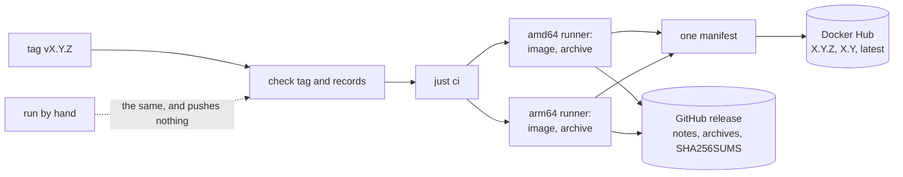

# Delivery Plan 00006: Licence Publishing And Pre Release

> [!abstract] Plan status: `draft`
> Before v0.1.0 is tagged: the server becomes AGPL v3, a tag publishes an
> image to Docker Hub and archives to GitHub, the source URL is shown
> wherever the program speaks, and two small commands arrive (`tls
> letsencrypt`, `audit`). Four decisions await the user: D-01 (which AGPL
> identifier), D-02 (the Docker Hub name and tags), D-03 (binaries on the
> release), D-04 (the source URL in the API).

## 1. Objective and outcome

The server is built and proprietary, and nothing leaves the repository. When
this plan is done, the user can make the repository public, push, tag
`v0.1.0`, and a stranger can:

```text
docker pull joelee/passalong-server:0.1.0
```

with terms they may rely on (AGPL v3), the notices of every dependency
inside, and the source one `--help` away. What only the user can do, because
it needs accounts and credentials, is written down and left to the user.

## 2. Source traceability

| Requirement | Source | Source location | Interpretation |
|---|---|---|---|
| PLAN-00006-REQ-01 | User | Item 2 of the request | AGPL v3 |
| PLAN-00006-REQ-02 | Idea | IDEA-00001-R02-MED-03 | Notices in what is distributed |
| PLAN-00006-REQ-03 | User | Item 4 | The source URL, promoted |
| PLAN-00006-REQ-04 | User | Item 1 | `tls letsencrypt`, guidance |
| PLAN-00006-REQ-05 | Repository | `docs/backlog.md`, agent suggestions | `audit`: the low-effort backlog item |
| PLAN-00006-REQ-06 | User | Item 3 | CI |
| PLAN-00006-REQ-07 | User | Items 2 and 3 | Release, with Docker Hub |
| PLAN-00006-REQ-08 | Repository | `AGENTS.md`, "Release workflow" | Release records drafted |
| PLAN-00006-REQ-09 | Repository | No remote | What only the user can do |
| PLAN-00006-REQ-10 | Repository | `AGENTS.md`; `docs/backlog.md` | Hygiene and the standard |

## 3. Repository baseline

| Field | Value |
|---|---|
| Repository | `joelee/passalong-server` (from `Cargo.toml`). **No Git remote is configured, and no workflow has ever run** |
| Branch | `fix/fault-point-sigkill`, one commit ahead of `main` (`745ca45`) and not merged. The plan is written on `feature/pre-release`, created from it, so that the Builder does not work with a test suite that dumps core hundreds of times a run. If the user merges the fix first, this branch is already its descendant |
| HEAD | `40fec41ff6a0db98c9325f57af8f417ef28a271f` |
| Working tree at publication | Clean, apart from this file as allocated |
| Applicable instructions | `AGENTS.md`; `docs/plans/AGENTS.md` |
| On the planner's machine | The SPDX texts of AGPL-3.0 (`/usr/share/licenses/spdx/`, 34 020 bytes, identical for `-only` and `-or-later`); Docker 29; no `cargo-about`; no GitHub or Docker Hub credentials |

## 4. Scope

### In scope

- The licence, the notices, and every place that states either.
- The source URL in help, README, image labels, and per D-04 the API.
- `tls letsencrypt` and `audit`.
- `ci.yml`, `release.yml`, and the scripts they call.
- The draft release records for v0.1.0, and the list of what only the user
  can do.
- Backlog hygiene.

### Out of scope

- Creating the GitHub or Docker Hub repository, pushing, adding secrets,
  tagging. The user's, listed by REQ-09.
- crates.io. `publish = false` stays in every manifest.
- ACME inside the server; a static musl build; a distroless image; signing
  and provenance attestations. Each is named in the backlog by STEP-01.
- Licence headers in every source file. `LICENSE`, the manifests, and the
  README state the terms; headers can follow if the user wants them.
- A contributor agreement. `CONTRIBUTING.md` says that contributions are
  accepted under the project's licence; see the risk table for what that
  does and does not give the user.
- The client, and any contract change beyond D-04's one additive field.

## 5. Constraints and preserved decisions

- Nothing from this repository is copied into the Apache-2.0 client. The
  reason changes, the rule does not.
- The dependency allow-list of `deny.toml` stays permissive-only. AGPL would
  allow copyleft dependencies; nothing needs one, and the list is the
  user's to widen, not this plan's.
- No credential in the repository, in a log, or on the Builder's machine.
- A contract change is a commit of its own and is reported (PLAN-00004
  REQ-11). D-04 is the only one foreseen.
- Test first; external interfaces mocked; no `unsafe`; no new crate;
  coverage of at least 80 %; `just ci`, not only `just check`.
- No privileged containers, ever ([PLAN-00005](00005-Docker_And_Systemd.md),
  deviations).

## 6. Assumptions

None. Unresolved matters are recorded as decisions and block approval when
material.

## 7. Decisions and blockers

| ID | Decision or blocker | Resolution | Owner | Status |
|---|---|---|---|---|
| PLAN-00006-D-01 | Which AGPL v3: `AGPL-3.0-or-later` or `AGPL-3.0-only` | Proposed: **`AGPL-3.0-or-later`**, the form the FSF recommends and Nextcloud and Mastodon use: a future AGPL can be adopted by anyone without asking every contributor. `-only` (Grafana's choice) keeps the terms fixed until the copyright holders agree to change them. The licence text is the same file either way; the difference is one word in the manifests and the README. This is a legal choice and the planner is not a lawyer | User | Awaiting the user |
| PLAN-00006-D-02 | The Docker Hub repository, and its tags | Proposed: `joelee/passalong-server`, as on GitHub. A tag `vX.Y.Z` pushes `X.Y.Z`, `X.Y`, and `latest`; nothing else ever pushes. `latest` moves only on a release, never on `main` | User | Awaiting the user |
| PLAN-00006-D-03 | Binaries on the GitHub release | Proposed: yes, `passalong-server-vX.Y.Z-linux-{amd64,arm64}.tar.gz` with `SHA256SUMS`, built on `ubuntu-22.04` runners of each architecture so that they run on glibc 2.35 and later. It gives `service install` hosts a way in without a Rust toolchain, which the backlog asks for. Against: a second thing to get right at the first release; the alternative is the image only, and `cargo build` for systemd hosts as today | User | Awaiting the user |
| PLAN-00006-D-04 | The source URL in the API | Proposed: yes, one additive field, `server.sourceUrl` in `getViewer`, a constant of the build. AGPL section 13 obliges whoever runs a **modified** server to offer its users the source; a field that a client can show makes that a one-line change for them, and costs an unmodified server nothing. It is a contract change, the first since the contract was written: additive, ignored by a client that does not know it, in a commit of its own. The alternative is help, README, and image labels only | User | Awaiting the user |
| PLAN-00006-D-05 | How the notices are made | `cargo-about`, the file committed and checked for drift by `just ci`. Not generated in the image build, which would put a `cargo install` in every build | Planner | Resolved |
| PLAN-00006-D-06 | How two architectures are built | Natively, a job per architecture (`ubuntu-22.04` and `ubuntu-22.04-arm`), merged into one manifest. A Rust release build under QEMU takes the better part of an hour; STEP-07 carries the fallback | Planner | Resolved |
| PLAN-00006-D-07 | `tls letsencrypt`: guidance, not automation | It prints and changes nothing. It includes `--reuse-key`, because a renewed key changes the pin and would lock out every device that pinned | Planner | Resolved |
| PLAN-00006-D-08 | Which backlog items | `audit`, and hygiene. The others in the backlog (`backup`, import and export, retention, events, musl) are each a slice, not an afternoon | Planner | Resolved |

## 8. Affected architecture and components

| Path | Change |
|---|---|
| `LICENSE`, `Cargo.toml`, `crates/*/Cargo.toml`, `deny.toml` | AGPL v3 |
| `about.toml`, `about.hbs`, `THIRD-PARTY-NOTICES` | New |
| `README.md`, `AGENTS.md`, `CONTRIBUTING.md`, `Dockerfile` | Terms, source, labels, notices |
| `crates/passalong-server-cli/src/cli.rs` | Help footer; `tls letsencrypt`; `audit` |
| `crates/passalong-server-cli/src/letsencrypt.rs` | New: the walkthrough and the hook, as text from the configuration |
| `crates/passalong-server-api/src/handlers/viewer.rs`, `docs/api/` | D-04 |
| `.github/workflows/ci.yml`, `release.yml` | Every branch; publish on a tag, dry run by hand |
| `scripts/release-archive.sh`, `scripts/check-release-tag.sh`, `justfile` | New; adjusted; `notices`, `notices-check` |
| `docs/release/v0.1.0.md`, `docs/release/first-publication.md` | New |



## 9. Requirement catalogue

### PLAN-00006-REQ-01 — The licence is AGPL v3

- **Requirement:** `LICENSE` is the verbatim text of the GNU Affero General Public License, version 3, taken from the SPDX copy on the Builder's machine and compared byte for byte with it by a test. Every manifest says `license = "<SPDX id of D-01>"` in place of `license-file`. `README.md`, `AGENTS.md`, `CONTRIBUTING.md`, `Dockerfile`, `deny.toml`, `docs/backlog.md`, and both workflows stop saying "proprietary". `publish = false` stays: crates.io is not asked for. `AGENTS.md` keeps the rule that nothing from here is copied into the Apache-2.0 client, with its new reason: AGPL code cannot enter an Apache-2.0 work; the other direction is allowed with the client's `NOTICE`.
- **Rationale:** The user's decision. It reopens and closes IDEA-00001-R02-MED-03.
- **Source:** User; `LICENSE`; `/usr/share/licenses/spdx/`.
- **Acceptance evidence:** A test; `grep -ri proprietary` finds only history (`CHANGELOG.md`, ideas, plans).

### PLAN-00006-REQ-02 — Third-party notices in everything that is distributed

- **Requirement:** `THIRD-PARTY-NOTICES` is generated by `cargo-about` from `Cargo.lock` with an `about.toml` whose accepted licences are those of `deny.toml`, is committed, and is kept current by `just notices-check`, part of `just ci`. The image carries it beside `LICENSE`, and so does every release archive.
- **Rationale:** IDEA-00001-R02-MED-03: a distributed binary must carry the notices of its Apache-2.0, MIT, BSD, and ISC dependencies. Committed rather than generated in the image build, so that the image build needs no extra tool and a reviewer sees the file change with `Cargo.lock`.
- **Source:** r02 MED-03; `deny.toml`.
- **Acceptance evidence:** `just notices-check` fails after a dependency is added and passes after regeneration; the file names every crate of `cargo tree -e normal`.

### PLAN-00006-REQ-03 — The source is one click away

- **Requirement:** `passalong-server --help` and every subcommand's help end with the source URL and the licence; `--version` stays one line for scripts. `README.md` opens with the repository link and says how to get, build, and contribute. The image carries the OCI labels `source`, `url`, `licenses`, `version`, `revision`. Per D-04, `getViewer` answers `server.sourceUrl`.
- **Rationale:** The user's request; AGPL section 13 asks a modified network service to offer its source to its users, and a server that names its source makes that easy to honour.
- **Source:** User.
- **Acceptance evidence:** A CLI test on the help text; `docker inspect` in `scripts/test-deploy.sh`; the contract test.

### PLAN-00006-REQ-04 — `tls letsencrypt`

- **Requirement:** `passalong-server tls letsencrypt --host <name> [--email <addr>]` changes nothing and prints a walkthrough made from this host's configuration: the `certbot` command for a certificate (standalone on port 80, with the webroot and DNS alternatives named), and a deploy hook that installs the renewed pair at `tls.cert_file` and `tls.key_file`, owned by the data directory's owner, key 0600, atomically. It says that the server picks the pair up within half a minute without a restart; that with a publicly trusted certificate devices need no `tls_pin`; and that a device which pins anyway breaks at the first renewal unless `--reuse-key` is used, which the printed command therefore includes. With `--docker` it prints the variant that pipes the pair into the `config` volume as `deploy/docker/README.md` does. `--json` gives the same as fields.
- **Rationale:** The user's request. Guidance and not automation: ACME stays in the backlog, and `certbot` already does it well. The pin and renewal trap is this server's own and no generic guide warns of it.
- **Source:** User; `docs/usage.md`, "TLS".
- **Acceptance evidence:** Unit tests of the text for three configurations; a test that runs the printed hook with `sh` against a fake `RENEWED_LINEAGE` in a temporary directory and finds the pair installed with mode 0600, and the old pair intact when the new one is incomplete.

### PLAN-00006-REQ-05 — `audit`

- **Requirement:** `passalong-server audit [--limit N]` lists the audit trail that has been written since PLAN-00003 and has had no reader: time, action, workspace, key id, detail; newest first; `--json`. Never a secret, which the trail does not hold.
- **Rationale:** Backlog, "`passalong-server audit`": `Control::audit` exists and is tested; only the command is missing.
- **Source:** `docs/backlog.md`.
- **Acceptance evidence:** The session test: after its session, `audit` shows the workspace and key events in order.

### PLAN-00006-REQ-06 — CI runs for every branch and pull request

- **Requirement:** `ci.yml` runs `just ci` on pushes to any branch and on pull requests, cancels superseded runs, and states its needs. `scripts/test-service.sh` says plainly, and fails, when the runner's Docker is older than 28.
- **Rationale:** Today's filter, `main` and `feature/**`, would have skipped `fix/fault-point-sigkill`. No workflow has ever run: the repository has no remote.
- **Source:** `.github/workflows/ci.yml`.
- **Acceptance evidence:** `just lint-workflows`; the first run on GitHub, which is the user's to start (REQ-09).

### PLAN-00006-REQ-07 — A tag publishes

- **Requirement:** On a tag `vX.Y.Z` the release workflow checks the tag and the release records, runs `just ci`, builds the image for amd64 and arm64 on runners of each architecture, pushes it to Docker Hub per D-02 as one multi-architecture manifest, and creates the GitHub release from `docs/release/vX.Y.Z.md` with, per D-03, an archive per architecture (binary, `LICENSE`, `THIRD-PARTY-NOTICES`, `README.md`, the unit file) and `SHA256SUMS`. Run by hand (`workflow_dispatch`) it does all of that except pushing and releasing. Credentials come from the secrets `DOCKERHUB_USERNAME` and `DOCKERHUB_TOKEN` and appear nowhere else. What the jobs do lives in `scripts/`, so that it runs on the Builder's machine too.
- **Rationale:** The user's request; r01's requirement 5, suspended on 2026-09-18 for want of a licence.
- **Source:** User; `.github/workflows/release.yml`.
- **Acceptance evidence:** `just lint-workflows`; `scripts/release-archive.sh` run locally produces an archive whose binary runs and whose checksums verify; a dry run on GitHub (REQ-09).

### PLAN-00006-REQ-08 — The release records for v0.1.0 are drafted

- **Requirement:** `docs/release/v0.1.0.md` exists as a draft, as `AGENTS.md`'s release workflow has the agent write it; `scripts/check-release-tag.sh v0.1.0` fails only on what finalising will change (the draft mark, the `Unreleased` heading, pre-release wording). Deployment documents name the published image beside the local build.
- **Rationale:** So that tagging is one small commit when the user decides to.
- **Source:** `AGENTS.md`, "Release workflow".
- **Acceptance evidence:** The script's output.

### PLAN-00006-REQ-09 — What only the user can do is written down and checked off

- **Requirement:** `docs/release/first-publication.md` lists, in order: make the GitHub repository and whether it is public; push `main`; add the two secrets; start the release workflow by hand and read its dry run; create the Docker Hub repository or let the first push do it. The Builder does none of these. The plan is complete when everything the Builder can verify is verified, and the hand-off says which acceptance criteria wait for the user's first run.
- **Rationale:** There is no remote, and the Builder has no credentials and should have none.
- **Source:** Repository: `git remote -v` is empty.
- **Acceptance evidence:** The document; the hand-off.

### PLAN-00006-REQ-10 — Backlog hygiene, and the repository's standard

- **Requirement:** `docs/backlog.md` loses what is done (rate limiting, the `justfile` recipes, how a systemd host gets its binary, the licence and publishing entries). Test first; `just ci`; coverage of at least 80 %; no `unsafe`; no new crate.
- **Rationale:** `AGENTS.md`.
- **Source:** `AGENTS.md`.
- **Acceptance evidence:** `just ci`; `just audit`.

## 10. Delivery strategy

The licence first and alone (step 2), because everything after it states it.
Then what a distributed artefact must carry (steps 3, 4), the two commands,
which depend on nothing (steps 5, 6), and only then the workflows that
distribute (step 7). Steps 5 and 6 can be done at any point after step 1.

There is no checkpoint inside the plan: the uncertain part, whether the
workflows work on GitHub, cannot be reached from here. The plan answers that
by keeping the workflows thin over scripts that do run here, by a manual run
that publishes nothing, and by saying at hand-off what is unproven.

## 11. Detailed implementation steps

### PLAN-00006-STEP-01 — Bookkeeping and the backlog

- **Objective:** Bookkeeping and the backlog.
- **Requirements:** `PLAN-00006-REQ-10`
- **Depends on:** None
- **Affected components:** `CHANGELOG.md`, `docs/backlog.md`
- **Preconditions:** None.
- **Test or evidence first:** `scripts/check-links.sh`.
- **Implementation tasks:** Mark the slice active; remove what is done.
- **Documentation/configuration/operations:** With the step; gathered in STEP-08.
- **Verification:** `just check`.
- **Completion criteria:** Exit 0.
- **Rollback or recovery:** Revert the step's commits. Nothing here migrates data.
- **Builder stop conditions:** None.

### PLAN-00006-STEP-02 — The licence

- **Objective:** The licence.
- **Requirements:** `PLAN-00006-REQ-01`
- **Depends on:** `PLAN-00006-STEP-01`
- **Affected components:** `LICENSE`, manifests, `deny.toml`, `README.md`, `AGENTS.md`, `CONTRIBUTING.md`, `Dockerfile`
- **Preconditions:** The steps it depends on are complete.
- **Test or evidence first:** A test that `LICENSE` equals the SPDX text, skipped with a message where that file is absent and always run against a SHA-256 recorded in the test; a test that every manifest names the SPDX id and none names `license-file`.
- **Implementation tasks:** As tested. One commit, `chore(licence): AGPL v3`, touching nothing else, so that the moment the terms changed is one hash.
- **Documentation/configuration/operations:** With the step; gathered in STEP-08.
- **Verification:** `just ci`.
- **Completion criteria:** Exit 0; `grep -ri proprietary` outside `CHANGELOG.md`, `docs/ideas/`, `docs/plans/` finds nothing.
- **Rollback or recovery:** Revert the step's commits. Nothing here migrates data.
- **Builder stop conditions:** `cargo deny` refuses the workspace's own licence in a way `[licenses.private]` does not cover.

### PLAN-00006-STEP-03 — Third-party notices

- **Objective:** Third-party notices.
- **Requirements:** `PLAN-00006-REQ-02`
- **Depends on:** `PLAN-00006-STEP-02`
- **Affected components:** `about.toml`, `about.hbs`, `THIRD-PARTY-NOTICES`, `justfile`, `Dockerfile`, `ci.yml`
- **Preconditions:** The steps it depends on are complete.
- **Test or evidence first:** `just notices-check`, written first, fails because there is no file.
- **Implementation tasks:** Install `cargo-about` (`cargo install --locked cargo-about`, a developer tool, not a dependency); generate; commit; copy into the image.
- **Documentation/configuration/operations:** With the step; gathered in STEP-08.
- **Verification:** `just ci`; `scripts/test-deploy.sh` finds the file in the image.
- **Completion criteria:** Exit 0.
- **Rollback or recovery:** Revert the step's commits. Nothing here migrates data.
- **Builder stop conditions:** `cargo-about` cannot be installed or rejects a licence `cargo deny` accepts: report which, change no allow-list to make it pass.

### PLAN-00006-STEP-04 — The source URL

- **Objective:** The source URL.
- **Requirements:** `PLAN-00006-REQ-03`
- **Depends on:** `PLAN-00006-STEP-02`
- **Affected components:** `cli/src/cli.rs`, `README.md`, `Dockerfile`, `release.yml`; per D-04 `docs/api/`, `api/src/handlers/viewer.rs`
- **Preconditions:** The steps it depends on are complete.
- **Test or evidence first:** A CLI test of `--help`, of a subcommand's help, and that `--version` is one line; per D-04 the API test of `getViewer`, and `openapi.json` with the README's table, changed in a commit of their own.
- **Implementation tasks:** As tested.
- **Documentation/configuration/operations:** With the step; gathered in STEP-08.
- **Verification:** `just ci`.
- **Completion criteria:** Exit 0.
- **Rollback or recovery:** Revert the step's commits. Nothing here migrates data.
- **Builder stop conditions:** None.

### PLAN-00006-STEP-05 — `tls letsencrypt`

- **Objective:** `tls letsencrypt`.
- **Requirements:** `PLAN-00006-REQ-04`
- **Depends on:** `PLAN-00006-STEP-01`
- **Affected components:** `cli/src/letsencrypt.rs` (new), `cli.rs`, `main.rs`, `docs/usage.md`
- **Preconditions:** The steps it depends on are complete.
- **Test or evidence first:** As REQ-04 lists: the text for three configurations, and the printed hook run for real in a temporary directory.
- **Implementation tasks:** A pure function from the configuration, the host names, the data directory's owner, and `--docker` to the walkthrough; the hook as a template, checked with `sh -n` as well.
- **Documentation/configuration/operations:** With the step; gathered in STEP-08.
- **Verification:** `just check`.
- **Completion criteria:** Exit 0.
- **Rollback or recovery:** Revert the step's commits. Nothing here migrates data.
- **Builder stop conditions:** None.

### PLAN-00006-STEP-06 — `audit`

- **Objective:** `audit`.
- **Requirements:** `PLAN-00006-REQ-05`
- **Depends on:** `PLAN-00006-STEP-01`
- **Affected components:** `cli/src/commands.rs`, `cli.rs`, `docs/usage.md`
- **Preconditions:** The steps it depends on are complete.
- **Test or evidence first:** The session test, extended first.
- **Implementation tasks:** As tested.
- **Documentation/configuration/operations:** With the step; gathered in STEP-08.
- **Verification:** `just check`.
- **Completion criteria:** Exit 0.
- **Rollback or recovery:** Revert the step's commits. Nothing here migrates data.
- **Builder stop conditions:** None.

### PLAN-00006-STEP-07 — CI and the release workflow

- **Objective:** CI and the release workflow.
- **Requirements:** `PLAN-00006-REQ-06`, `PLAN-00006-REQ-07`
- **Depends on:** `PLAN-00006-STEP-03`, `PLAN-00006-STEP-04`
- **Affected components:** `.github/workflows/`, `scripts/release-archive.sh`, `scripts/check-release-tag.sh`, `justfile`
- **Preconditions:** The steps it depends on are complete.
- **Test or evidence first:** `scripts/release-archive.sh`, written first with a test recipe that unpacks its archive, runs the binary's `--version`, and verifies `SHA256SUMS`; `just lint-workflows`.
- **Implementation tasks:** Workflows as REQ-06 and REQ-07 say, thin over the scripts. Actions pinned as the present workflows pin them. `permissions` minimal per job: `contents: write` only where the release is created.
- **Documentation/configuration/operations:** With the step; gathered in STEP-08.
- **Verification:** `just ci`; `just lint-workflows`.
- **Completion criteria:** Exit 0. What cannot be verified without GitHub is listed for REQ-09, not claimed.
- **Rollback or recovery:** Revert the step's commits. Nothing here migrates data.
- **Builder stop conditions:** The multi-architecture build on native runners cannot be expressed without an action or a secret the plan does not name: fall back to one job with QEMU, as the workflow has today, and report the cost.

### PLAN-00006-STEP-08 — Release records, documents, hand-off

- **Objective:** Release records, documents, hand-off.
- **Requirements:** `PLAN-00006-REQ-08`, `PLAN-00006-REQ-09`, `PLAN-00006-REQ-10`
- **Depends on:** `PLAN-00006-STEP-05`, `PLAN-00006-STEP-06`, `PLAN-00006-STEP-07`
- **Affected components:** `docs/release/`, `docs/usage.md`, `docs/architecture.md`, `deploy/docker/README.md`, `README.md`, `AGENTS.md`
- **Preconditions:** The steps it depends on are complete.
- **Test or evidence first:** `scripts/check-links.sh`; `scripts/check-release-tag.sh v0.1.0` and its expected failures.
- **Implementation tasks:** As REQ-08 and REQ-09 say. `AGENTS.md`'s release workflow, steps 7 and 8, as it now is.
- **Documentation/configuration/operations:** With the step; gathered in STEP-08.
- **Verification:** `just ci`.
- **Completion criteria:** Exit 0; every acceptance criterion checked or named as waiting for the user's first run.
- **Rollback or recovery:** Revert the step's commits. Nothing here migrates data.
- **Builder stop conditions:** None.

## 12. Cross-cutting concerns

| Area | Applicability | Planned action or reason not applicable | Step or requirement |
|---|---|---|---|
| Compatibility and APIs | Applicable | D-04: one additive field, its own commit, reported | REQ-03 |
| Data and migration | Not applicable | No schema or storage change | — |
| Security and privacy | Applicable | Credentials only as GitHub secrets; per-job minimal `permissions`; a manual run cannot publish; `audit` shows no secret; the printed hook writes the key 0600 and atomically | REQ-04, 05, 07 |
| Performance and scale | Not applicable | Nothing on a request's path changes but one constant field | — |
| Reliability and operations | Applicable | The renewal and pin trap; archives with checksums; `latest` moves only on a release | REQ-04, 07 |
| Accessibility and UX | Applicable | Help that says where the source is; a walkthrough made from the operator's own configuration | REQ-03, 04 |
| Documentation and release | Applicable | This plan is mostly that | All |
| Deployment and rollback | Applicable | A bad release is answered by a new patch release; a pushed tag and a pushed image are not taken back. `docs/release/first-publication.md` says so | REQ-09 |
| Legal | Applicable | The terms change for everything in the repository from one commit on. What was proprietary before stays in history under the old notice; the user holds the copyright and may relicense it | REQ-01 |

## 13. Verification strategy

| Level | Evidence or command | When | Required result |
|---|---|---|---|
| Unit and CLI | `cargo test --workspace --all-targets --all-features` | Every step | Pass |
| Gates | `just ci`, with `notices-check` from step 3 | Every step | Exit 0; coverage at least 80 % |
| Workflows | `just lint-workflows` (actionlint) | Step 7 | Exit 0 |
| Release scripts | `scripts/release-archive.sh` and its check, locally | Step 7 | The archive's binary runs; checksums verify |
| On GitHub | A manual run of the release workflow, then the first tag | After the plan, by the user | Listed in `docs/release/first-publication.md`; not claimed by the Builder |

## 14. Acceptance criteria

- [ ] `PLAN-00006-AC-01` `just ci` exits 0 on `feature/pre-release` with line coverage of at least 80 %, and now includes `just notices-check`.
- [ ] `PLAN-00006-AC-02` `just audit` exits 0 with `skip = []`; `Cargo.lock` gains no package.
- [ ] `PLAN-00006-AC-03` A test shows `LICENSE` to be the verbatim AGPL v3 text, and every manifest to name the SPDX id of D-01; the change of terms is one commit that touches nothing else.
- [ ] `PLAN-00006-AC-04` `THIRD-PARTY-NOTICES` names every crate the binary links; `just notices-check` fails when it is stale; the image and the release archive contain it and `LICENSE`.
- [ ] `PLAN-00006-AC-05` `passalong-server --help` and a subcommand's help show `https://github.com/joelee/passalong-server` and the licence; `--version` is one line; the image's OCI labels name source and licence.
- [ ] `PLAN-00006-AC-06` Per D-04: `getViewer` answers `server.sourceUrl`, `openapi.json` and the README's table say so, and that change is a commit of its own.
- [ ] `PLAN-00006-AC-07` `tls letsencrypt --host nas.example` prints a `certbot` command with `--reuse-key` and a deploy hook naming this host's `tls.cert_file`, `tls.key_file`, and the data directory's owner; the hook, run by a test, installs the pair with the key 0600 and leaves the old pair when the new one is incomplete; the command writes nothing.
- [ ] `PLAN-00006-AC-08` `passalong-server audit` lists the session test's events, newest first, as text and as JSON, and no secret.
- [ ] `PLAN-00006-AC-09` `just lint-workflows` passes; `ci.yml` runs on every branch and on pull requests.
- [ ] `PLAN-00006-AC-10` `scripts/release-archive.sh` produces, on the Builder's machine, an archive whose binary runs and a `SHA256SUMS` that verifies; the release workflow calls that script.
- [ ] `PLAN-00006-AC-11` No credential is in the repository: the workflows name `secrets.DOCKERHUB_USERNAME` and `secrets.DOCKERHUB_TOKEN`, and a manual run pushes and releases nothing.
- [ ] `PLAN-00006-AC-12` `docs/release/v0.1.0.md` is drafted, and `docs/release/first-publication.md` lists what only the user can do; the hand-off names the acceptance criteria that wait for the first run on GitHub.

## 15. Risks and mitigations

| Risk | Likelihood | Impact | Mitigation or test | Owner/step |
|---|---|---|---|---|
| The workflows fail at their first real run | High | Medium | Thin over scripts that run locally; actionlint; a manual run that publishes nothing comes first; the agent helps debug, as `AGENTS.md` step 8 says | STEP-07, REQ-09 |
| arm64 has never been built, natively or otherwise | High | Medium | The manual run builds it before any tag does | REQ-09 |
| A credential leaks into a log | Low | High | Secrets only; no `set -x` in the scripts; a Docker Hub access token scoped to one repository, which the user's checklist asks for | REQ-07, 09 |
| A published tag or image cannot be unpublished in any way that reaches those who pulled it | Certain | Medium | Dry run first; release records checked by script before anything builds | REQ-07 |
| AGPL and outside contributions: once others contribute under AGPL, the user can no longer relicense alone | Medium | Medium | Said in `CONTRIBUTING.md` and in the hand-off. A contributor agreement would keep that freedom and is the user's choice, out of scope here | STEP-02 |
| `cargo-about` and `cargo deny` disagree about a crate's licence | Medium | Low | One accepted list, `deny.toml`'s; a disagreement is reported, never settled by widening a list | STEP-03 |
| Operators follow the Let's Encrypt walkthrough, renew, and every pinned device is locked out | Medium | High | `--reuse-key` in the printed command; the text says why, and that a trusted certificate needs no pin | REQ-04 |
| The runner's Docker is too old for `test-service` | Medium | Low | The script says so and fails; the workflow states the need | REQ-06 |

## 16. Builder hand-off

- **Start condition:** User approval and a clean repository.
- **First step:** `PLAN-00006-STEP-01`.
- **Required sequence:** 1; 2; 3 and 4; 7; 8. Steps 5 and 6 anywhere after 1.
- **Parallel-safe work:** Steps 5 and 6 with everything.
- **Do not change:** approved scope, requirements, steps, acceptance
  criteria, or content outside Builder's permitted work-log area; the
  client repository; the contract beyond D-04.
- **Escalate when:** a stop condition is met; anything would need a
  credential, a push, or an account.
- **Completion hand-off:** Coverage; the licence commit's hash; the contract
  change, if D-04; which acceptance criteria wait for the first run on
  GitHub; the user's checklist.

<!-- BUILDER_WORK_LOG_START -->
## 17. Builder Work Log

> [!warning] Builder-maintained section
> The planner creates this section. After approval, Builder may update only
> this delimited section and the Builder-maintained front-matter fields.
> Builder must preserve prior entries and use UTC timestamps.

### Step status

| Step | Status | Started (UTC) | Completed (UTC) | Evidence | Builder notes |
|---|---|---|---|---|---|
| PLAN-00006-STEP-01 | not-started | — | — | — | — |
| PLAN-00006-STEP-02 | not-started | — | — | — | — |
| PLAN-00006-STEP-03 | not-started | — | — | — | — |
| PLAN-00006-STEP-04 | not-started | — | — | — | — |
| PLAN-00006-STEP-05 | not-started | — | — | — | — |
| PLAN-00006-STEP-06 | not-started | — | — | — | — |
| PLAN-00006-STEP-07 | not-started | — | — | — | — |
| PLAN-00006-STEP-08 | not-started | — | — | — | — |

Allowed status values: `not-started`, `in-progress`, `blocked`, `completed`,
`skipped`. A skipped step requires explicit user approval recorded in Evidence.

### Execution log

| Timestamp (UTC) | Step | Event | Evidence or reference | Next action |
|---|---|---|---|---|

### Deviations and blockers

| Timestamp (UTC) | Step | Deviation or blocker | Impact | Decision required from |
|---|---|---|---|---|

None.

### Verification results

| Timestamp (UTC) | Step | Command or check | Result | Evidence |
|---|---|---|---|---|

### Completion summary

- **Implementation status:** `not-started`
- **Completed requirements:** None
- **Incomplete requirements:** All
- **Outstanding blockers:** None
- **Review request:** Not ready
<!-- BUILDER_WORK_LOG_END -->

## 18. Planning change log

| Timestamp (UTC) | Plan status | Change | Reason | Requested/approved by |
|---|---|---|---|---|
| 2026-09-19T11:35:34Z | draft | Plan created | "Let's plan for another pre-release work", with four features named | @joelee |

## 19. External references

None. No web research was done: the licence text is the SPDX copy on the
planner's machine, and what is said of other projects' licence identifiers
and of GitHub's arm64 runners is from the planner's general knowledge and is
for the Builder to confirm where it matters.

## 20. Confidence

**Medium.** The code in this plan is small and well understood. The licence
change is mechanical. What lowers confidence is that the part the user cares
about most, publishing, cannot be exercised from a repository with no remote
by a Builder with no credentials: the plan can make the workflows correct by
inspection, by lint, and by running their scripts, and cannot make them
proven. D-01 is a legal choice, on which the planner offers what projects
commonly do and no advice.
